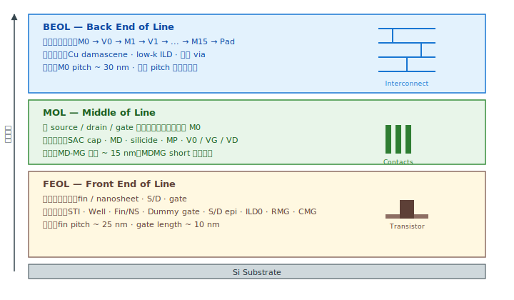

# Chapter 0 — FEOL Overview

## 0.1 你會在這章學到什麼

- 「FEOL / MOL / BEOL」分別是什麼，為什麼這樣切
- FEOL 在現代邏輯製程（FinFET、GAA）裡的整體形狀
- 為什麼 FEOL 是良率工作的主戰場
- 後續章節的閱讀地圖

## 0.2 從一塊石頭到一顆晶片

晶圓廠的工作可以一句話概括：**在一片直徑 300 mm 的矽片上，反覆地長膜、印圖案、挖洞、填材料，最後得到上百億個電晶體互相連接的電路**。

整個流程從「進廠的矽晶圓」走到「出廠的晶粒」，依模組功能分成三個大段：



```
┌─────────────────────────────────────────────────────────────┐
│  FEOL（Front End of Line）                                    │
│  做出電晶體本身：fin / nanosheet、source、drain、gate         │
│  從矽晶圓到「金屬閘極切完、表面磨平」為止                      │
│  約佔總製程步驟的 60%，最複雜                                 │
├─────────────────────────────────────────────────────────────┤
│  MOL（Middle of Line）                                        │
│  把電晶體的端點拉出來：接 source/drain 的 MD、接 gate 的 MP    │
│  銜接 FEOL 的「半成品電晶體」與 BEOL 的「金屬連線網路」         │
│  雖然步驟少，但缺陷殺傷力極高（MDMG short 就是這裡發生）       │
├─────────────────────────────────────────────────────────────┤
│  BEOL（Back End of Line）                                     │
│  M0 → V0 → M1 → V1 → ... → M15 → Pad                         │
│  一層層把電晶體接成完整電路，最後接到 bond pad                 │
│  Cu damascene 製程，每層相似但材料/設計規則略不同             │
└─────────────────────────────────────────────────────────────┘
```

## 0.3 FEOL 的整體形狀

FEOL 內部又可以分成幾個子模組。下圖把整個 FEOL 按照「先做什麼、再做什麼」展開：

```
[1] Substrate              ← 矽晶圓進廠
       ↓
[2] STI（淺溝槽隔離）        ← 把每顆電晶體用氧化矽牆隔開
       ↓
[3] Well Implant            ← 摻雜：N-well 給 PMOS、P-well 給 NMOS
       ↓
[4] Fin / Nanosheet         ← 把矽刻成 3D 結構（FinFET / GAA）
       ↓
[5] Dummy Gate & Spacer     ← 用 poly 先佔位當「假閘極」+ 做側壁
       ↓
[6] Source / Drain Epi      ← 在 S/D 區長磊晶（SiGe / SiP）
       ↓
[7] ILD0 + Dummy Removal    ← 蓋氧化矽、磨平、挖掉假閘極
       ↓
[8] Replacement Metal Gate  ← 在凹槽裡長 high-k → 填金屬 → CMP
       ↓                       並做 gate recess + SAC cap（SiN 蓋）
       ↓                       這層 cap 是 MOL Self-Aligned Contact 的命門
[9] Cut Metal Gate          ← 把橫跨的 metal gate 切斷
       ↓
   FEOL 結束 → 進入 MOL
```

每一格都會在後面章節展開講解。請先記住這個骨架 —— 你之後聽到的所有站點縮寫，都會落在這 9 格裡面的某一格。

## 0.4 為什麼 FEOL 是良率主戰場

幾個原因：

1. **物理尺寸最小**。FEOL 的 critical dimension（CD）動輒小於 20 nm，比後段的金屬線細一個量級。任何粒子、殘留、形變都會直接破壞元件。
2. **無法事後修補**。BEOL 出問題還可能 redundancy / repair（記憶體常用），FEOL 一個電晶體壞了基本上整顆 die 報銷。
3. **缺陷會被深埋**。FEOL 的問題往往要到電性測試（CP）才被發現，但根因發生在幾個月前的某一站。RCA 的逆推距離很遠。
4. **新製程的學習曲線**。每個 node（N7 → N5 → N3 → N2）的 FEOL 都會大改（材料、結構、步驟），MOL/BEOL 相對沿用。

這就是為什麼良率精進工作的縮寫多半集中在 FEOL 後段。

## 0.5 兩個你必須知道的關鍵詞

讀後續章節之前，先把這兩個觀念植入：

### Replacement Metal Gate（RMG）/ Gate-Last

現代邏輯製程的閘極**不是一次做到位的**。流程是：

1. 先用多晶矽（poly-Si）做一個「假閘極（dummy gate）」佔住位置。
2. 完成所有需要高溫的步驟（S/D activation anneal 之類）。
3. 最後才把 dummy 挖掉，換成真正的「high-k 介電 + 金屬閘極」。

為什麼？因為高溫會破壞金屬閘極的功函數，所以金屬必須最後才放進去。這個「最後才放閘極」的策略叫 **gate-last** 或 **RMG (Replacement Metal Gate)**。

→ 這也是為什麼後續會有「在挖開的凹槽裡用 ALD 長 high-k」這道專屬製程步驟。

### High-K Metal Gate（HKMG）

傳統 gate 用 SiO2 + poly-Si。當 SiO2 薄到 1 nm 以下時會漏電（tunneling），所以業界改用：

- **High-k 介電**：HfO2 等等。介電常數高，能用較厚的物理厚度達到等效更薄的電性厚度（EOT）。
- **Metal gate**：取代 poly-Si，避免 poly depletion，並可分別調 NMOS/PMOS 的 work function。

這個組合叫 **HKMG (High-K Metal Gate)**，從 45 nm 之後成為主流。

→ High-k ALD 沉積、WFM（work function metal）、Cut Metal Gate 全部都是 HKMG 框架下的產物。

## 0.6 一句話總結

> FEOL 的本質是：**在矽晶圓上反覆地長膜、印圖案、挖、填、磨，最終做出 source / drain / gate 三個端點都接好的電晶體。** 後段（MOL/BEOL）只是把這些端點拉出來、接成電路。

## 0.7 接下來

下一章 [Chapter 1: Substrate](./01-substrate.md) 會回到最起點：那片從 supplier 進來的矽晶圓，到底是怎麼做出來的，規格上有哪些參數，為什麼這些參數對良率重要。
