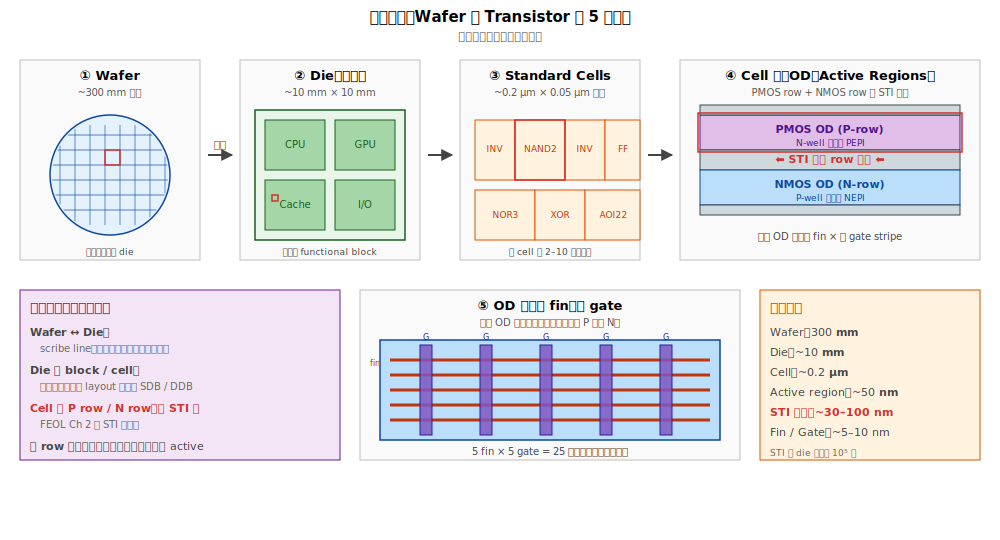
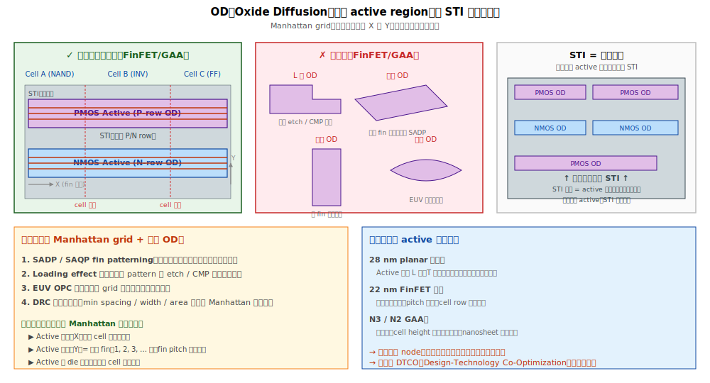

# Chapter 2 — STI（Shallow Trench Isolation，淺溝槽隔離）

## 2.1 你會在這章學到什麼

- 為什麼電晶體之間需要「絕緣牆」
- STI 的完整製程流程，每一步在做什麼
- HDP / HARP / FCVD 等 fill 技術的差別
- STI CMP 為什麼是 fab 第一個 CMP，難度為什麼高
- STI 階段的典型缺陷：void、divot、unfill
- 這些缺陷會怎麼在後段爆發

## 2.2 STI 在哪一層 — Wafer 到 Transistor 的尺度階層

讀本章前先建立尺度直覺：STI 是位於「**OD 之間**」的隔離結構，比 die 邊界（mm 級）細 10⁵ 倍。

> **名詞定義：OD（Oxide Diffusion）** = 半導體文獻常稱的「active region」。OD 是 foundry 設計與生產對話的標準術語（TSMC PDK、DRC 手冊等），本書採 OD 為主要稱法。本章其他地方的「OD」與「active region」可視為同義，但以 OD 為準。



### 五層階層 + 各層分隔機制

| 階層 | 典型尺寸 | 分隔機制 |
|---|---|---|
| Wafer | 300 mm | — |
| Die（晶粒） | ~10 mm × 10 mm | **Scribe line**（切割道，wafer 製造完成後機械切開） |
| Functional block（CPU / GPU / cache） | mm 以下級 | 無物理分隔，靠 layout 與 power grid |
| Standard cell（NAND / INV / FF） | ~0.2 µm × 0.05 µm | 無物理分隔，靠 SDB / DDB（cell 邊界 fin cut 或 dummy gate） |
| **OD（PMOS row / NMOS row）** | ~50 nm × 數 µm | **⭐ STI ⭐** |
| 同 OD 內的多顆電晶體 | ~10 nm 級 | 無需分隔，共用 OD |

### STI 不是「一顆電晶體一個」

常見誤解：「STI 之間夾一顆 MOS」**錯誤**。

正確：**STI 圍住的是 OD，內含多顆同型電晶體**：
- 一個 OD 內可有數條 fin（沿 Y 方向）
- 每條 fin 上可有多顆電晶體（沿 X 方向，多 gate stripe 跨過）
- **同一 OD 內所有電晶體型別必須一致**（要嘛全 PMOS、要嘛全 NMOS，因為共用同一 well）

典型 standard cell 配置：
- 上半 = PMOS OD（一塊）
- 中間 STI 隔離
- 下半 = NMOS OD（一塊）
- 一個 NAND2 cell（4 顆電晶體）只有 2 個 OD

→ **STI 的工作是「把不同 well 的電晶體區隔開」、防止 latch-up 與寄生干擾**，而不是把每顆電晶體獨立。

### Active region 的形狀規則：Manhattan grid

在 FinFET / GAA 製程，OD 有嚴格的形狀限制：



**規則**：
- 只能是**水平矩形**（沿 fin 方向 X）
- 不能 L 形、T 形、斜形、曲線
- 寬度（Y 方向）= fin pitch 的整數倍
- 全部 active 與 STI 邊界必須沿 X 或 Y 軸（Manhattan grid）

**為什麼這麼嚴**：
1. **Fin pattern 由 SADP / SAQP 做出**，只能產生等距單向平行直線
2. **Loading effect**：規律 pattern 的 etch / CMP 才好控制
3. **EUV OPC 模型**：規則 grid 修正最準
4. **DRC 規則**：可量化的距離規則只在 Manhattan 下好定義

**設計師可以調整的（在 Manhattan 限制下）**：
- Active 的長度（X 方向）
- Active 的寬度 = 幾條 fin（1, 2, 3 ... 條，fin pitch 整數倍）
- Active 在 cell / die 中的位置
- 何時用 SDB / DDB 切斷 active

**STI = active 的「負空間」**：設計師只畫 active，STI 自動補上 active 沒佔的所有區域。

> **觀念釐清：「背景 / 負空間」與「trench」並不矛盾**
> 
> 「Trench」是物理製程的描述 —— STI 真的是「**挖出來再填 SiO₂ 的溝**」。
> 
> 開始時 wafer 是一整片 Si。STI 製程把 **OD 以外** 的 Si 挖掉、再用 SiO₂ 填回去：
> - **OD 是「保留下來的 Si 島」**（未被挖掉的原始矽）
> - **STI 是「挖開填了氧化矽的溝」**
> 
> 「**負空間 / 背景**」是從 **layout 設計視角** 看：設計師只畫 OD，沒畫到的地方就會被 STI 製程處理掉。所以：
> - 設計圖上：STI 是「沒畫的」區域（負空間）
> - 物理上：STI 是真實存在的填料溝
> 
> **兩種說法都對，描述的是同一件事的不同切面**。

**世代比較**：
- 28 nm planar 之前：active 可 L 形、T 形、不規則矩形
- 22 nm FinFET 起：嚴格水平矩形
- N3 / N2 GAA：更嚴，連 cell height 都鎖定

→ 愈先進 node，設計彈性愈低、製程一致性要求愈高。這正是 **DTCO（Design-Technology Co-Optimization）** 興起的背景。

## 2.3 為什麼需要 STI

晶圓上要塞幾百億個電晶體。每個電晶體都是一個獨立的開關，**它們不能彼此導通**，否則整顆晶片就是一團導線。

STI 的工作就是：**在每顆電晶體周圍挖一條溝，填滿絕緣材料（SiO2），形成一道氧化矽牆**，把鄰居隔開。

```
   ┌────┐  SiO2 ┌────┐  SiO2 ┌────┐
   │ Si │ ████  │ Si │ ████  │ Si │     ← 上視
   │    │ ████  │    │ ████  │    │
   └────┘       └────┘       └────┘
   (active)   (isolation)   (active)
```

「Active region（主動區）」就是真正會做電晶體的矽，剩下都是絕緣的 STI。

## 2.4 為什麼是「淺」溝槽

早期（0.5 µm 以前）用的是 **LOCOS（Local Oxidation of Silicon）**：在矽表面長厚厚一層熱氧化。但 LOCOS 有兩個致命缺點：
1. **Bird's beak**：氧化會橫向擴張，吃掉 active 邊緣，使元件實際尺寸縮小、形狀不可控。
2. **體積膨脹**：氧化矽比矽大，造成表面不平。

當技術節點縮到 0.25 µm 以下，bird's beak 已經吃掉太大比例的 active，LOCOS 就被淘汰，改用 STI：**先挖溝，再填絕緣**，邊界由蝕刻定義，乾淨俐落。

「淺」是相對於更早期的 deep trench（DRAM 用），STI 一般 200–400 nm 深。

## 2.5 STI 完整流程

```
[1] Pad Oxide                ← 在矽表面長一層薄熱氧化（~10 nm）緩衝
       ↓
[2] Pad Nitride（SiN）       ← 沉積 SiN（~100 nm），當作 CMP stop & 氧化阻擋
       ↓
[3] Active Photolithography  ← 微影定義 OD 的 mask（站名常稱 Active Photo / OD Photo）
       ↓
[4] STI Etch                 ← 蝕刻穿過 SiN/Pad Ox，再向下挖矽（~250 nm 深）
       ↓
[5] Liner Oxidation          ← 在溝槽內表面長一層薄熱氧化（修補蝕刻損傷）
       ↓
[6] STI Fill                 ← 用 CVD 把溝槽填滿 SiO2（HDP / HARP / FCVD）
       ↓
[7] Densification Anneal     ← 高溫退火，讓填入的氧化矽緻密化
       ↓
[8] STI CMP                  ← 化學機械研磨，磨平表面，停在 SiN 上
       ↓
[9] Pad Nitride Strip        ← 用熱磷酸把 SiN 拿掉
       ↓
[10] Pad Oxide Strip         ← 用稀 HF 把 pad oxide 拿掉
       ↓
   表面剩下：active 矽 + 周圍 STI 氧化矽，齊平
```

每一步的細節：

### [1] Pad Oxide

熱氧化（thermal oxidation）長一層 ~10 nm 的 SiO2。功能：
- 緩衝 SiN 與 Si 之間的應力（SiN 直接接 Si 會有應力造成位錯）
- 後面 SiN strip 時保護矽表面

### [2] Pad Nitride

LPCVD 長一層 ~100 nm 的 Si3N4。功能：
- 當 STI Etch 的 hard mask
- 當 STI CMP 的 stop layer（SiN 比 SiO2 硬，CMP 選擇比可達 30:1）
- 後續 well implant 時的阻擋層

### [3] Active Photo

用微影把 OD 的 mask 印在光阻上。然後再把圖案轉到 SiN/pad ox。

### [4] STI Etch

用 plasma 乾蝕刻，從上到下吃穿 SiN → Pad Ox → Si。Si 蝕刻通常用 HBr / Cl2 化學，要追求：
- **垂直側壁**（trench profile 接近 90°），但實務上會留 **~85° taper**（負斜，上寬下窄）幫助後面填充
- **底部圓滑**（避免應力集中）
- **表面光滑**（避免 leakage）

### [5] Liner Oxidation

蝕刻後的矽表面有 plasma damage（晶格缺陷、不飽和鍵）。長一層 ~5 nm 的熱氧化把它修掉，並把溝槽轉角圓滑化。

### [6] STI Fill ⭐ 關鍵步驟

把 SiO2 填入溝槽。難度在於：溝槽 aspect ratio（深/寬比）很高（先進製程可達 10:1），要填滿不留 void 非常困難。

主流技術演進：

| 技術 | 機制 | 適用 AR | 特點 |
|---|---|---|---|
| **HDP-CVD** | 高密度電漿，邊長邊濺射（sputter） | < 5:1 | 老派，再進階就填不下去 |
| **HARP**（O3-TEOS Sub-Atmospheric CVD） | 利用 O3 與 TEOS 的高填充能力 | 5–8:1 | 28 nm 主力 |
| **FCVD（Flowable CVD）** | 先沉積流動性的中間態，再轉化為 SiO2 | > 10:1 | N7 以下主流 |
| **Spin-on Dielectric (SOD)** | 旋塗液態氧化物前驅物 | > 10:1 | 部分 fab 採用 |

→ 「STI fill 不下去」是先進製程的長期難題，每個 node 都需要新的填充技術。

### [7] Densification Anneal

填完的 SiO2 還很「鬆」，密度低、含 Si-OH 鍵。用 ~1000 °C 退火趕走水分、緻密化、降低濕蝕刻速率。

### [8] STI CMP ⭐ 關鍵步驟

用研磨墊 + 含磨料的漿料（slurry）把表面多餘的 SiO2 磨掉，停在 SiN 上。
- Slurry 通常是 ceria（CeO2）系，對 SiO2 / SiN 有 30:1 以上的選擇比
- 終點偵測（endpoint detection）由摩擦力或光學變化判斷

CMP 是個「化學 + 機械」的精密過程，後面每個 module 都會用到（gate CMP、ILD CMP、Cu CMP），這裡是第一次接觸。

### [9][10] Strip

熱磷酸（H3PO4 @ 165 °C）拿掉 SiN（SiN 在熱磷酸有極高選擇比）；稀 HF 拿掉 pad oxide。剩下：
- **Active 區**：露出乾淨的矽表面，準備做電晶體
- **Isolation 區**：填滿 SiO2，與 active 表面齊平

## 2.6 STI 階段的典型缺陷

| 缺陷 | 物理樣貌 | 成因 | 後果 |
|---|---|---|---|
| **STI Void** | 溝槽內部有空洞 | Fill 不滿（AR 太高、material flow 不夠） | 後段 implant 從 void 鑽過、wet 化學品殘留、leakage |
| **STI Divot** | STI 邊緣凹陷低於 active | Wet etch 過頭、CMP 過磨、densification 不夠 | Gate poly/metal 落入 divot → corner 漏電、Vt shift |
| **STI Hump** | STI 高於 active 太多 | CMP 不足 | 後面 fin / gate patterning 不平、微影 focus 飄 |
| **Active Loss** | Active 區邊角被磨掉 | CMP 過磨 + dishing | 元件實際寬度變小、性能漂移 |
| **Particle / Scratch** | CMP 留下的粒子或刮痕 | Slurry 異常、pad 髒 | 後面 mask defect、pattern fail |
| **Liner Crack** | Liner oxide 有裂縫 | 應力 / 退火條件不對 | 漏電、可靠度劣化 |

## 2.7 Divot：一個值得記住的 yield killer

**Divot 在 yield 工作上會反覆出現，建議特別記住。**

當 STI 邊緣凹陷低於 active 表面時，下一步在 active 上長 gate 的時候，gate 材料會「掉進」divot 裡，形成一個**沿著 active 邊緣繞一圈的金屬延伸**。這個延伸：
- 在電性上製造出一個「corner transistor」（角落電晶體）
- 在低 Vg 時就先導通 → **sub-threshold leakage 飆高**
- 在 Iddq 測試上會被抓到、bin 掉

這是 28 nm 之前 planar 製程經典的 yield 殺手。FinFET 之後幾何結構改變，divot 的影響型態也跟著變，但**「STI 邊緣不能凹下去」的原則一直成立**。

## 2.8 與 yield 的關係

STI 出問題很「沉默」—— 不會在 STI 站立刻看出來，要到後段才會以下面這些症狀爆發：
- Iddq fail（站到 CP 才測）
- Vt 飄移（CP 參數量測）
- Soft fail（特定 pattern 才會敗，例如 SRAM 角落 cell）

→ 在 RCA 上，當你看到 wafer signature 是「邊緣同心圓」或「特定 die 位置」的 leakage fail，回頭查 STI CMP 的 dishing / erosion map 是常見的第一手。

## 2.9 站點對應

| 縮寫 | 全名 | 對應流程 |
|---|---|---|
| **PADOX** | Pad Oxide | [1] |
| **PADSiN / PADNIT** | Pad Nitride deposition | [2] |
| **ACT PHOTO** | Active photolithography | [3] |
| **STIETCH** | STI etch | [4] |
| **STILIN** | STI liner oxidation | [5] |
| **STIDEP / STIFILL** | STI fill deposition | [6] |
| **STIANL** | STI densification anneal | [7] |
| **STICMP** | STI CMP | [8] |
| **NITSTRIP** | Nitride strip | [9] |
| **POXSTRIP** | Pad oxide strip | [10] |

實際命名各家 fab 不同，但「模組_動作_層次」的結構大致一致。

## 2.10 接下來

STI 做完之後，每塊 active 就被氧化矽牆獨立包圍。下一步是把 NMOS / PMOS 區域定義出來，並用離子佈植調整摻雜濃度 —— 這就是 [Chapter 3: Well Formation](./03-well-formation.md) 的內容。
