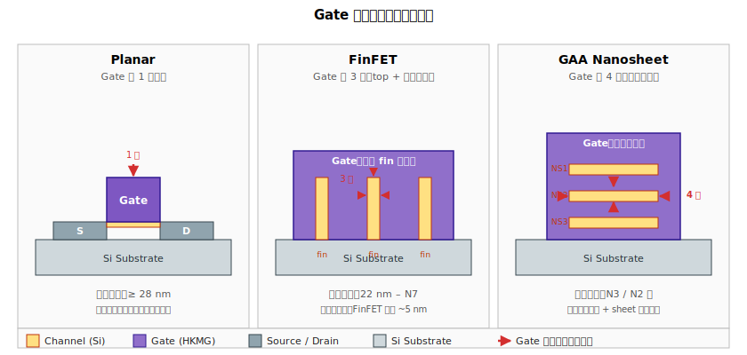

# Chapter 4 — Fin / Nanosheet（三維通道形成）

## 4.1 你會在這章學到什麼

- 為什麼要從 planar 走到 FinFET、再走到 GAA
- Fin 是怎麼從一片矽表面「立起來」的
- SADP / SAQP（多重圖形化）在做什麼，為什麼非用不可
- GAA Nanosheet 的 epi stack 與後續 release
- 這個階段的典型缺陷：fin bending、fin loss、pattern fail
- 為什麼 fin/sheet 的幾何品質直接決定元件性能

## 4.2 從 Planar 到 FinFET 到 GAA：一段被迫的演化

電晶體本質是一個三端開關：gate 控制 source 與 drain 之間的電流。控制力夠強，就是個好開關。



> **關於剖面方向的提醒**
> 
> 上圖三個 panel 不是用同一個視角畫的：
> - **Planar** 是**沿通道方向的側視**：左→右依序是 source、channel、drain。三個端點全部出現在圖中。
> - **FinFET / GAA** 是**垂直通道方向**（沿 fin / nanosheet 的橫斷面）：只看得到 fin 或 nanosheet 的「斷面」，以及包覆它的 gate。**source 與 drain 在圖面前後方（Z 方向），把整個 gate 區域夾在中間，因此沒畫出來**。
> 
> 因此對於 FinFET / GAA：沿通道走一遍是 **source → 〔上圖剖面〕→ drain**；剖面裡看到的 fin / sheet 與 gate 的環繞幾何，是電晶體**通道區的橫切片**。S/D 與 gate 的夾層關係沒有改變，只是換了觀察視角。

### Planar（22 nm 之前）

通道躺在矽表面，gate 從上方蓋下來，**只有一面控制**。

```
            Gate
           ┌───┐
   ────────┴───┴────────       ← gate 只蓋住通道的「頂部」
   Source │ ch  │ Drain
   ──────────────────
       Si substrate
```

當 channel length 縮到 30 nm 以下，gate 對通道的控制力撐不住，**short-channel effect (SCE)** 爆發：
- 漏電（Ioff 飆高）
- DIBL（Drain-Induced Barrier Lowering）
- Vt roll-off

→ planar 走到 22 nm 大致見底。

### FinFET（22 nm – N7）

把通道**立起來**做成一片「鰭（fin）」，gate 從**三面**包住通道（左、右、頂）：

```
        Gate
       ┌─────┐
       │  ▲  │       ← gate 從三面包住 fin
       │  ║  │       fin
       │  ║  │
       └──╨──┘
        Si substrate
```

控制力大幅提升 → 短通道效應壓得住 → 可以繼續微縮。Intel 22 nm（2011）首發，TSMC 16 nm 跟上。

### GAA（Gate-All-Around，N3 以下）

更進一步，把通道做成**水平堆疊的奈米片（nanosheet）**，gate **完全包住**通道四面：

```
        Gate（完整環繞）
       ┌──────┐
       │ ──── │   ← nanosheet 1
       │ ──── │   ← nanosheet 2
       │ ──── │   ← nanosheet 3
       └──────┘
        Si substrate
```

優點：
- 四面控制，SCE 進一步壓制
- Sheet 寬度可調（不像 fin 寬度被製程綁住），給 layout 更多自由

代表製程：Samsung 3GAE（2022）、TSMC N2（2025–2026）、Intel 20A/18A。

→ FinFET 與 GAA 在 fab 內常合稱 **「3D device」** 或 **「non-planar」**。

## 4.3 Fin Patterning：怎麼把 fin 立起來

關鍵挑戰：fin 寬度大約 5–10 nm，**遠小於微影機本身能解析的最小尺寸（EUV 約 18 nm half-pitch）**。怎麼做出來？

答案：**Self-Aligned Multiple Patterning（SAMP）**。

### Self-Aligned Double Patterning（SADP）

```
[1] 微影印一個粗的 mandrel 圖形（pitch P）
       ↓
[2] 在 mandrel 兩側長 spacer
       ↓
[3] 拿掉 mandrel
       ↓
[4] 剩下的 spacer 數量是原 mandrel 的兩倍 → pitch 變成 P/2
       ↓
[5] 用這些 spacer 當 hard mask 蝕刻底下的矽
```

### Self-Aligned Quadruple Patterning（SAQP）

把 SADP 再做一次，pitch 變 P/4。N7 的 fin 就是 SAQP 做出來的。

→ 這也是為什麼 fin 的 pitch 看起來像「機械規律」，因為它是 spacer width 決定的，不是微影直接畫的。微影只負責畫粗的 mandrel + 「cut mask」決定哪些 fin 要留、哪些要切掉。

### EUV 之後

N5 / N3 開始大量用 EUV，部分層次回歸 single-pattern，但 fin 這層仍多用 SADP（因為 pitch 還是太細）。

## 4.4 Fin 蝕刻

Spacer hard mask 定義好之後，用乾蝕刻把矽刻成 fin。

關鍵要求：
- **垂直側壁**：fin 不能上寬下窄或上窄下寬，否則 Vt 不均
- **均勻高度**：fin 高度（HFin）決定通道寬度（Weff = HFin × 2 + WFin）
- **平滑側壁**：粗糙度直接影響電子遷移率（line edge roughness, LER）
- **無 footing**：底部不能有殘留矽相連

## 4.5 GAA 的 Nanosheet Stack

GAA 做法不同：不是把矽刻成 fin，而是先在表面**長一疊磊晶**：

```
[1] Epi 一層 SiGe（犧牲層）
[2] Epi 一層 Si（通道層）
[3] Epi 一層 SiGe
[4] Epi 一層 Si
[5] Epi 一層 SiGe
[6] Epi 一層 Si
   → 形成 Si/SiGe 交替堆疊
       ↓
[7] Pattern + Etch 把整疊 stack 刻成「fin-like 的多層三明治」
```

後面在 RMG 時，會用對 SiGe 高選擇比的 etchant 把 SiGe 抽掉，留下懸空的 Si nanosheet → 用 gate 把它包起來。

**Si/SiGe stack 的關鍵**：每層厚度（Si 5–8 nm、SiGe 8–10 nm）、Ge 濃度、晶格相容性。任何一層不對，後面 release 就會出問題。

## 4.6 典型缺陷

| 缺陷 | 物理樣貌 | 成因 | 後果 |
|---|---|---|---|
| **Fin Bending** | Fin 倒向一邊 / 變形 | Fin 高 AR、毛細應力（wet 過程）、清洗 | 元件幾何不對、CP fail |
| **Fin Loss / Missing** | 整條 fin 消失 | Pattern 不完整、過蝕刻 | 元件全壞 |
| **Fin Height 不均** | HFin 變動 | Etch loading effect、CMP 變動 | Weff 飄移、Idsat 不均 |
| **Fin LER（粗糙度）** | 側壁不平滑 | Etch 化學、plasma 條件 | 載子散射、Vt 變異 |
| **Fin Tilt** | Fin 整體歪斜 | Etch 機台 chamber matching | Gate 包覆不對稱 |
| **Pattern Fail** | Fin 斷掉 / 橋接 | SADP spacer 失效、cut mask 不準 | 整顆 die fail |
| **NS Stack 缺陷**（GAA） | Si/SiGe 介面差、組成偏離 | Epi 機台條件 | Release 後 sheet 變形或斷裂 |

## 4.7 與 yield 的關係

Fin/sheet 是現代元件的**幾何骨架**，這層的所有缺陷都會直接打到電性：
- **Idsat / Vt 飄移**：HFin、WFin 變動造成。CP 上很容易看到。
- **Match pair 異常**：兩個本應相同的 NMOS 因為 fin 形狀差異而失配。SRAM 的 Vmin / 類比設計很敏感。
- **Catastrophic fail**：fin missing / pattern fail 會直接把幾顆 fin 內所有的電晶體 kill。

→ Fin 階段的缺陷在 wafer map 上常以 **線狀（line）或方向性（streak）** 出現，因為 SADP/SAQP 是有方向性的，缺陷會沿 mandrel 方向延伸。看到方向性 wafer signature，第一個懷疑通常就是 fin 模組。

## 4.8 站點對應

| 縮寫 | 全名 | 對應流程 |
|---|---|---|
| **MAND PHO / FINPHO** | Mandrel photo（粗 pitch） | SADP/SAQP 第一步 |
| **SPCRDEP** | Spacer deposition | SADP 第二步 |
| **MANDETCH** | Mandrel removal | SADP 第三步 |
| **FINETCH** | Fin etch | 把 spacer pattern 轉到矽 |
| **CUTPHO / FINCUT** | Fin cut photo | 切掉不要的 fin |
| **NSEPI** | Nanosheet epi stack（GAA 才有） | Si/SiGe 交替長膜 |
| **NSPHO / NSETCH** | Nanosheet patterning | GAA 結構成形 |

## 4.9 接下來

Fin（或 nanosheet stack）做好之後，下一步是放上「假閘極」並做側壁，為後續的 source/drain 做準備 —— [Chapter 5: Dummy Gate & Spacer](./05-dummy-gate-spacer.md)。
