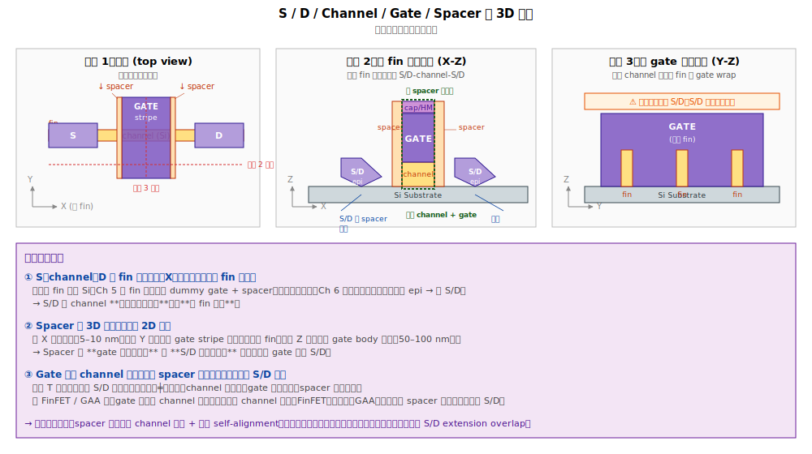

# Chapter 5 — Dummy Gate & Spacer（假閘極與側壁）

## 5.1 你會在這章學到什麼

- 為什麼要先做「假閘極（dummy gate）」而不是直接做金屬閘極
- Gate-first vs. gate-last 兩種策略，業界為什麼選 gate-last
- Dummy gate 的製程細節
- Spacer 是什麼，為什麼它對 self-alignment 至關重要
- 這個階段的典型缺陷

## 5.2 整章的角色：建立「位置定義模板」

Ch 5 在 FEOL 中的角色比較反直覺 —— **它做出的大部分結構，最終都會被拆掉**。

| Ch 5 做的東西 | 最終命運 |
|---|---|
| Dummy gate（poly-Si） | Ch 7 拆掉 |
| Hard mask | Ch 7 CMP 磨掉 |
| Sacrificial gate oxide | Ch 7 strip 洗掉 |
| **Spacer（SiN）** | **留下來，當最終 gate 的側壁** |

三樣會被拆。為什麼還要做？

答案：**Ch 5 的真正功能不是製造電晶體，而是「劃線定位」** —— 告訴後續製程：S/D 該長在哪、最終 metal gate 該放在哪。dummy gate + spacer 就是一個**臨時模板**，後續 Ch 6–8 都依賴這個模板。

### 木板模板（Formwork）比喻

蓋鋼筋混凝土建築時，要先用木板搭模板，混凝土倒進去才會變成設計形狀；凝固後木板拆掉。Ch 5 與 Ch 6–8 的關係就是這樣：

```
Ch 5 = 立模板
       ├─ Dummy gate = 中央那塊「未來 gate 形狀」的位置佔用者
       ├─ Hard mask  = 釘模板用的施工工具
       └─ Spacer     = 兩側擋牆，告訴混凝土「這裡不能溢過來」

Ch 6 = 「混凝土」流入 spacer 外側 → 形成 S/D epi
Ch 7 = 拆模板（dummy gate + hard mask + sac.ox 都拆掉）
Ch 8 = 在拆掉 dummy 的位置填入真正的 gate（HKMG）
```

### Ch 5 結束時 wafer 的物理結構

```
                hard mask
                 ┌─┴─┐
                 │HM │  ← Ch 7 CMP 磨掉
        spacer   │   │   spacer
         ▓▓▓▓   │   │   ▓▓▓▓
         ▓▓▓▓   │poly│   ▓▓▓▓     ← spacer 留下；poly 在 Ch 7 拆掉
         ▓▓▓▓   │dummy│  ▓▓▓▓
   ════════════│════│════════════
        ↑       ↑    ↑       ↑
   未來 S 區   未來 gate 區   未來 D 區
   ════════════════════════════════
                Si substrate
```

每顆 fin 上有一個 poly 柱子跨過，兩側各有 SiN 牆。柱子的位置 = 未來 metal gate 的位置；牆外的 fin = 未來 S/D 的位置。**現在還什麼都沒長，只有位置標記**。

### 串到 Ch 6–8 的連動關係

| Ch | 做什麼 | 依賴 Ch 5 的什麼 |
|---|---|---|
| Ch 5 | 建模板 | — |
| Ch 6 | 在 spacer 外側長 S/D epi | **Spacer 的邊界**作為 S/D 邊界 |
| Ch 7 | 拆 dummy → 留下 trench | dummy 的「位置」決定 trench 位置 |
| Ch 8 | trench 裡填 HKMG | **Trench 形狀 = 原 dummy 形狀** = 最終 gate 形狀 |

→ **Ch 8 最終 metal gate 的位置與形狀，是由 Ch 5 的 dummy gate 直接複製過去的**。這也是為什麼 dummy gate CD 控制這麼重要：它的尺寸是最終真實閘極的尺寸。

## 5.3 為什麼用 Poly-Si 當 Dummy

> 我們知道最終的閘極是 high-k + metal（HKMG），那為什麼不直接做？

因為**金屬閘極熱不起來**。

後續還有許多步驟需要 ~1000 °C 的退火（最重要的是 S/D activation anneal）。在這種溫度下：
- Metal 會和 dielectric 反應
- WFM 的功函數會飄
- Gate stack 的可靠度會崩潰

所以業界採用 **gate-last（RMG）** 策略：
1. 先用**多晶矽（poly-Si）**做一個假閘極佔住位置
2. 把所有高溫步驟做完（spacer、S/D epi、activation anneal）
3. **最後**再把 dummy 拿掉，換成真正的 HKMG

Poly-Si 的好處：耐高溫、和矽相容、現成的成熟製程。

> 註：歷史上 IBM 曾推 **gate-first** HKMG（用熱穩定的金屬一開始就做），但最終業界主流還是收斂到 gate-last。原因是 Vt 控制比較好、模組整合比較乾淨。

## 5.4 Dummy Gate 流程

```
[1] Sacrificial Gate Oxide ← 在 fin 上長薄熱氧化（~2 nm），保護 fin
       ↓
[2] Poly-Si Deposition     ← LPCVD 長一層多晶矽（~50–100 nm）
       ↓
[3] Hard Mask Stack        ← 上面再蓋 SiN / SiO2 hard mask
       ↓
[4] Gate Photo             ← EUV 或 multi-patterning 印 gate 圖案
       ↓
[5] Gate Etch              ← 把 hard mask + poly 蝕刻成 gate stripe，跨在 fin 上
       ↓
[6] Post-etch Clean        ← 移除蝕刻殘留 + 修復 fin
```

### Gate Etch 的難度

Gate 跨在 fin 上，呈「橋」的形狀：

```
  ┌─────────────┐ ← gate stripe
  │             │
══╩══════╦══════╩══   ← fin
   │     │     │
   │     │     │     ← 電晶體區
══════════════════
       Si
```

蝕刻時必須：
- **完全蝕刻乾淨 fin 兩側**（包含 fin 之間的「腳踝」位置），否則 source-drain 會短路
- **不能把 fin 蝕刻掉**：用對 fin / poly 高選擇比的化學
- **保留垂直側壁**

這在 fin pitch 收得很緊的時候非常困難 —— 業界稱這現象為 **gate footing**（蝕刻底部殘留多晶矽）。

## 5.5 Spacer：自我對準的關鍵

Gate 蝕刻完之後，立刻要在兩側做一道**側壁絕緣層（spacer）**，材料通常是 SiN 或 low-k SiCN / SiOCN。

### 先建立 3D 結構直覺

Spacer 是一道**立體的薄牆**，不是 2D 圖案。在了解它做什麼之前，需要先看清楚 S / channel / D / gate / spacer 的 3D 空間關係。



**最容易誤解的觀念**：「spacer 與 spacer 之間是 S - Channel - D 排列」是錯的。實際上：

- **S、channel、D 沿 fin 長度方向（X）排列**，是同一根 fin 的三段。原本整根都是 Si；Ch 5 在中段放 dummy gate + spacer 保護中段；Ch 6 把保護外的兩端挖掉、長 epi → 變成 S/D。
- **兩個 spacer 之間夾的是 channel + 上方 gate**，不是 S-Channel-D。
- **S/D 在 spacer 的外側**，不是裡面。

Spacer 的 3D 尺寸：

| 方向 | 大小 | 意義 |
|---|---|---|
| 厚度（X，沿 fin） | 5–10 nm | 決定 gate 與 S/D 的水平距離 |
| 高度（Z） | 50–100 nm | 跟 gate body 同高 |
| 長度（Y，沿 gate stripe） | 跨越所有 fin | 跟 gate stripe 一起延伸 |

從 3D 角度看：spacer 是「**沿 gate stripe 兩側、把 gate 夾起來的兩道長牆**」。


```
       Spacer  ┌─────┐  Spacer
       ▓▓▓▓   │poly│   ▓▓▓▓
       ▓▓▓▓   │gate│   ▓▓▓▓
   ════▓▓▓▓═══╧═════╧═══▓▓▓▓════
              ↑         ↑
       fin (S 區)   fin (D 區)
```

### Spacer 的功能

1. **Self-alignment**：後面 S/D epi、S/D implant 都是「不需要 mask、自動對準 gate」的 —— 因為 spacer 把 S/D 和 gate 在物理上隔開了。
2. **電性絕緣**：把 gate 與 S/D 分開，避免 gate-to-S/D 短路。
3. **電容控制**：spacer 介電常數低，可以降低 gate-to-S/D 寄生電容（fringe cap）。
4. **保護 fin**：後續清洗、蝕刻不會傷到 spacer 下方的 fin。

### Spacer 製程

```
[1] Conformal SiN Deposition（ALD 或 PEALD）
       ↓ 在所有表面都長一層均勻的 SiN
[2] Anisotropic Etch（垂直方向蝕刻）
       ↓ 把水平表面的 SiN 蝕刻掉，只保留垂直側壁的部分
   結果：gate 兩側留下「L 形」spacer
```

關鍵：**保形（conformal）長膜 + 異向（anisotropic）蝕刻**，這是 spacer 工程的核心。

### 多層 Spacer

先進製程常用「複合 spacer」：
- **Inner spacer**（內側）：可能是 SiOCN，介電常數低
- **Outer spacer**（外側）：可能是 SiN，蝕刻阻擋

GAA 元件還有額外的 **inner spacer**，做在 nanosheet 兩端、藏在 nanosheet 之間，用來絕緣 gate 與 S/D（這是 GAA 比 FinFET 多出來的關鍵步驟）。

## 5.6 LDD / Halo Implant（Spacer 前的細節）

在 spacer 還沒做之前，會先做一些淺的 implant：
- **LDD（Lightly Doped Drain）**：在 S/D 還沒長之前，先在通道兩端打一層淺 N+/P+，緩和 S/D 與通道的場強。
- **Halo / Pocket Implant**：在 LDD 反向打少量摻質，抑制 short-channel effect。

不過在 FinFET 之後，LDD/Halo 的角色被 S/D epi 與 dopant diffusion 部分取代，部分先進製程已經省略或弱化。

## 5.7 典型缺陷

| 缺陷 | 物理樣貌 | 成因 | 後果 |
|---|---|---|---|
| **Gate Footing** | Gate 蝕刻底部殘留 poly | 蝕刻 endpoint 不夠 | S-D short |
| **Gate CD 飄** | Gate 寬度偏離規格 | Photo focus / dose、etch loading | Vt shift、Idsat 飄 |
| **Gate Bending** | Gate stripe 倒塌 | AR 太高、清洗應力 | Open / short |
| **Spacer Pinch-off** | Fin 之間的 spacer 把空間填滿 | Fin pitch 太緊、ALD 過厚 | S/D epi 長不出來、Idsat 掉 |
| **Spacer Loss** | Spacer 太薄或被打穿 | Etch 過頭 | Gate-to-S/D leakage |
| **Spacer Footing** | Spacer 底部殘留延伸 | Anisotropic etch 不夠 | S/D contact 落地不對 |
| **Inner Spacer Defect**（GAA） | Nanosheet 之間的內 spacer 缺失 / 不均 | SiGe recess + spacer fill 製程偏 | Gate-to-S/D leakage、可靠度差 |

## 5.8 與 yield 的關係

Dummy gate 與 spacer 是 FEOL **「最關鍵幾何特徵」的最後一步**。從這之後的所有後段製程都是建立在 dummy gate + spacer 的形狀上。所以：

- **Gate CD 飄** → Vt shift 直接表現在 CP，是 SPC 第一線監控對象。
- **Spacer 厚度不均** → S/D extension overlap 變動 → Idsat / Vt 同時飄，且兩者相關性可區分。
- **Spacer pinch-off** → 後面 S/D epi 缺失，wafer 邊緣常見。

→ 在 RCA 上，看到「整片 Vt 偏移」+「同一 gate photo lot」 → 懷疑 gate photo；看到「Idsat 掉但 Vt 沒動」 → 懷疑 spacer / S/D 模組。

## 5.9 站點對應

| 縮寫 | 全名 | 對應流程 |
|---|---|---|
| **GOX / SACOX** | Sacrificial gate oxide | [1] |
| **POLYDEP / POLYGATE** | Poly-Si deposition | [2] |
| **GHM / GTHM** | Gate hard mask | [3] |
| **GPHO / GTPHO** | Gate photo | [4] |
| **GETCH / GTETCH** | Gate etch | [5] |
| **LDDPHO / LDDIMP** | LDD photo + implant | LDD 步驟 |
| **HALOIMP** | Halo implant | Halo 步驟 |
| **SPCRDEP / SPADEP** | Spacer deposition | Spacer 第一步 |
| **SPAETCH / SPETCH** | Spacer etch | Spacer 第二步 |
| **ISPCR**（GAA 特有） | Inner spacer | nanosheet 之間的 spacer |

## 5.10 接下來

Dummy gate 立好、spacer 圍好之後，下一步是在 spacer 兩側挖出 S/D 凹槽並長磊晶 —— 這就是製造**應力（strain）**並形成電晶體 source/drain 的關鍵步驟，也是 epi merge 缺陷的發源地。請接 [Chapter 6: Source/Drain Epi](./06-source-drain-epi.md)。
