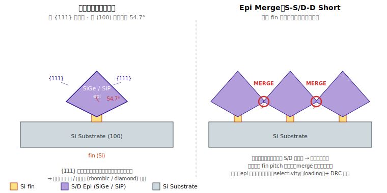
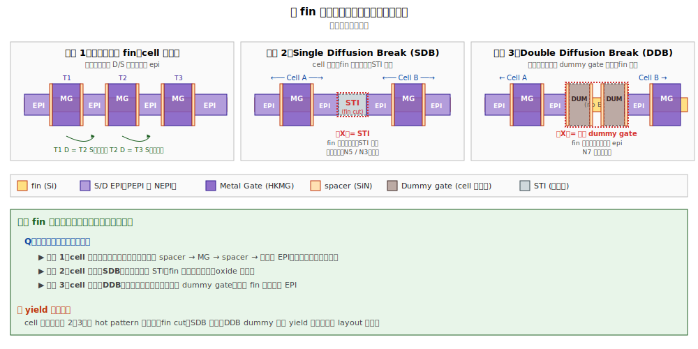
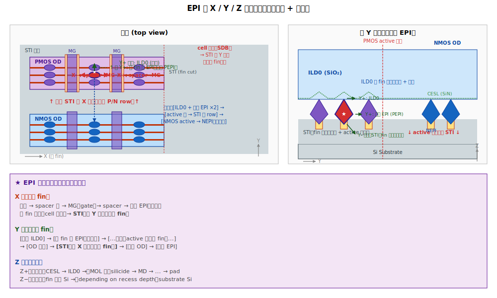
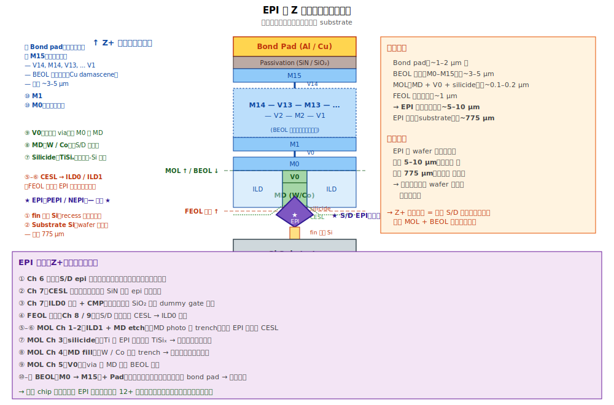

# Chapter 6 — Source/Drain Epi（磊晶與應力工程）

## 6.1 你會在這章學到什麼

- 為什麼要把 S/D 區先「挖掉」再用磊晶長回來
- Strain engineering：SiGe 給 PMOS、SiP 給 NMOS 的物理原因
- 磊晶（epi）製程的原理與機台特性
- Epi 形貌：菱形（diamond）、刻面（facet）、merge
- ⭐ Epi merge：先進製程中最常見的 yield killer 之一，本章徹底拆解
- 為什麼 epi 階段是 yield 戰場最熱的一塊

## 6.2 為什麼要重做 S/D

> **背景速習**（給未讀附錄 A 的讀者）：
> - **Source / Drain** = MOSFET 通道兩端的載子供應端 / 收集端，必須重摻雜。
> - **Epi（磊晶）** = 在單晶矽上有規則地長出新的單晶層的技術。
> - **S/D Epi** = 把 fin（FinFET）或 nanosheet stack（GAA）兩端的矽挖掉，用 epi 長 SiGe 或 SiP 形成 source 與 drain。**FinFET 與 GAA 兩種元件都使用 S/D epi**，差別在 epi 起點位置與形貌。
> 
> 詳細概念見 [附錄 A.0](./A-qa.md#a0-source--drain--gate-是什麼) 與 [A.0b](./A-qa.md#a0b-epi磊晶是什麼)。


最直覺的做法：在 fin 兩側直接 implant N+ / P+，當 source 和 drain。但現代製程不這樣做，原因：

1. **應力工程（Strain Engineering）**：用一個**晶格常數不同**的材料當 S/D，會把通道的矽晶格「拉」或「壓」，提升載子遷移率：
   - **SiGe**（晶格比 Si 大）→ PMOS 通道被「壓縮（compressive strain）」→ 電洞遷移率 ↑
   - **SiP / SiC**（晶格比 Si 小）→ NMOS 通道被「拉伸（tensile strain）」→ 電子遷移率 ↑
2. **In-situ doping**：磊晶長膜時直接摻雜，達到 ~10²¹ /cm³，比 implant 的 ~10²⁰ 還高一個量級 → S/D 電阻更低。
3. **Junction sharpness**：epi 的 dopant profile 比 implant 更陡 → 短通道效應更好。
4. **Fin 太薄**：如果直接 implant，薄薄的 fin 會被打散；改成挖掉再長回來反而結構穩定。

## 6.3 製程流程

```
[1] S/D Recess Etch        ← 把 spacer 兩側、fin 暴露區域的矽挖掉
       ↓
[2] Pre-Epi Clean          ← 用 wet 化學洗掉表面氧化、雜質、蝕刻殘留
       ↓
[3] In-situ Bake           ← Reactor 內 H2 高溫烘乾，去除原生氧化層
       ↓
[4] Selective Epi Growth   ← 通入 SiH4/GeH4/PH3 等氣體，選擇性長磊晶
       ↓
   結果：fin 兩端冒出菱形 SiGe / SiP 結晶
```

### Recess Etch

形狀很關鍵：
- **Box recess**：垂直挖，矩形剖面 → epi 生長好控制
- **Sigma recess（Σ-shape）**：用各向異性 wet etch（TMAH）挖出 Σ 形 → epi 更接近通道，應力傳遞效率最高（PMOS 常見）

### Selective Epi

「選擇性」的意思：**只在矽（fin 暴露面）上長，不在介電（spacer、STI、SiN）上長**。實現方法：通入適量的 HCl 同時通 silane 系氣體 —— HCl 會即時把長在介電上的成核點蝕刻掉，留下乾淨的選擇性。

→ 這是個微妙的化學平衡，氣體流量、溫度、壓力一個變數動了，selectivity 就會掉，造成 **non-selective growth**（介電上長出多晶矽小島，後段會被當成缺陷）。

### Reactor 類型

- **RP-CVD（Reduced Pressure CVD）**：主流邏輯廠
- **UHV-CVD（Ultra High Vacuum）**：研究機 / 部分先進製程
- **MOCVD**：化合物半導體（GaN/InP）才用，邏輯製程不用

## 6.4 應力工程的物理直覺

| 通道材料 | S/D 材料 | 晶格大小比 | 通道感受到的應力 | 載子遷移率影響 |
|---|---|---|---|---|
| Si | SiGe（Ge ~30%） | S/D > Si | **壓縮（compressive）** | 電洞 ↑ ~50% |
| Si | SiP（P 摻雜重） | S/D < Si | **拉伸（tensile）** | 電子 ↑ ~10–20% |

PMOS 從 SiGe 受益更大，所以 SiGe 的 Ge 濃度長年是優化重點（22 nm: 25%, 7 nm: 50%+）。

NMOS 過去用 SiC（碳濃度提高來縮小晶格），但碳的整合困難，現在主流改為「重摻 SiP」（高 P 濃度本身會引入 tensile strain）。

## 6.5 Epi 形貌：菱形與 Facet



選擇性磊晶在 fin 上長出來時，會沿著矽的低能面（{111}、{100}）生長，形成**菱形剖面**：

```
     俯視（top）              側視（cross-section）
       ┌───┐
       │   │                    ╱╲     ← {111} facet
       │   │                   ╱  ╲
       │   │                  ╱fin ╲
       │   │                 ──══──
       └───┘
```

**這個菱形的「角」會橫向延伸出 fin 之外**。fin pitch 越緊，相鄰 fin 的菱形越容易碰到。

## 6.6 ⭐ Epi Merge：S/D Epi 的核心 yield Killer

### 是什麼

兩個本應獨立的 fin，它們的 S/D epi 長太大、橫向碰到、**長到黏在一起**：

```
   正常（separated）           Merge（短路）
   ╱╲    ╱╲    ╱╲              ╱╲╱╲╱╲╱╲
  ╱  ╲  ╱  ╲  ╱  ╲            ╱        ╲
 ╱fin ╲╱fin ╲╱fin ╲          ╱fin fin fin╲
 ──══─── ══─── ══──         ──════════──
```

### 為什麼是缺陷

1. **Source-to-Source / Drain-to-Drain short**：兩個 fin 的 S/D 變相連在一起。
2. 對於應該獨立的兩個電晶體：**整顆元件失效**（兩個 NMOS 變成一個共用 S/D 的怪物）。
3. 對於電性上本應共用 S/D 的多 fin 元件（同 device 內的多 fin）：merge 是好事 —— 但對於跨 device 的 merge 就是 killer。

### 設計怎麼避免

EDA 工具會根據 fin pitch 與 epi 規格做 **DRC（Design Rule Check）**，禁止跨 device 的 fin 距離小於某個臨界值。但製程參數 drift 會讓本來合法的設計在某些 wafer 上 merge —— 這就是 yield 工作的對象。

### Merge 的型別細分：PP / NN / NP

「Epi merge」依據 merge 的兩塊 epi 是哪種型別，可細分成三種，**嚴重程度天差地別**：

| 縮寫 | 哪兩塊 epi merge | 性質 |
|---|---|---|
| **PP merge** | PEPI–PEPI（兩塊 PMOS 的 S/D） | 同型 |
| **NN merge** | NEPI–NEPI（兩塊 NMOS 的 S/D） | 同型 |
| **NP merge** | PEPI–NEPI（跨 row） | 跨型 |

#### PP / NN merge（同型）

發生位置：**同一 OD 內，相鄰 fin 的 epi 黏在一起**。

是否為缺陷視 layout 設計：

- **刻意設計**（multi-finger transistor 共用 S/D）：PP / NN merge 是**設計目的**，增加驅動電流、降 Rs。**不是缺陷**。
- **意外**（本應分開的兩顆同型 device 被 epi 長過頭黏住）：訊號短路 → **缺陷**。

判斷依據：對照 layout net list 與 epi 位置，看兩塊 epi 是不是同一條訊號 net。

#### NP merge（跨型）

發生位置：**跨 row（PMOS row ↔ NMOS row）**。inter-row STI 距離應該足夠遠，但實務上仍可能因下列因素發生：

- PEPI / NEPI 過度生長（epi 厚度超過設計）
- Selective growth 失效（epi 跑到 STI 上長 poly-Si 異物）
- Cell height 設計太緊，距離不足
- Photo overlay 飄

**永遠是缺陷，嚴重程度最高**：
- 把 PMOS 與 NMOS 的 S/D 直接連起來 → **VDD 短路到 GND**（power short）
- 整 die 報廢
- 通常 Iddq fail 抓到

#### 三者嚴重程度比較

| Merge 類型 | 性質 | 嚴重程度 | 偵測方式 |
|---|---|---|---|
| PP / NN merge（刻意 multi-finger） | 設計目的 | 不是缺陷 | — |
| PP / NN merge（意外，跨 device） | 訊號短路 | 中–高 | 某條訊號 stuck-at-fail |
| **NP merge** | 跨型短路（電源軌短路） | **極高** ⚡ | Iddq fail，整 die 報廢 |

→ 在 Pareto 上看到 epi merge 要立刻問「**PP / NN / NP 哪一種**」。先進 node（N3 / N2）因 cell height 持續壓縮，NP merge 風險上升，是 DTCO 的重要議題。

### Epi 過厚 vs. 過薄

| 狀況 | 影響 |
|---|---|
| **Epi 過厚 / 過大** | Merge → short |
| **Epi 過薄** | Contact resistance ↑、應力不足 → Idsat ↓ |
| **Epi 形狀不對稱** | NMOS / PMOS match 差 → SRAM Vmin、analog 拉不齊 |

→ Epi 工程是個**極窄的 process window**，必須剛剛好。

## 6.7 命名澄清：PEPI / NEPI 是依電晶體型別，不是 source / drain

> 常見誤解：「PEPI = source、NEPI = drain」**錯誤**。

**「P」與「N」指的是 PMOS / NMOS（電晶體型別），不是端點角色。**

| 縮寫 | 全名 | 對應 |
|---|---|---|
| **PEPI**（或 EPIP） | **P**MOS 的 epi 站 | PMOS 的 source 與 drain，**兩端都是 PEPI（SiGe:B）** |
| **NEPI**（或 EPIN） | **N**MOS 的 epi 站 | NMOS 的 source 與 drain，**兩端都是 NEPI（Si:P）** |

### 為什麼一顆電晶體 source 與 drain 是同一種材料

MOSFET 的 source 與 drain **物理上是對稱的**。哪一端是 source、哪一端是 drain，**取決於電路使用情境**（電壓高低決定）：

- NMOS：電壓低端 = source、電壓高端 = drain
- PMOS：電壓高端 = source、電壓低端 = drain

製造時還不知道實際電路怎麼用，所以**兩端做成相同結構**。誰當 source 誰當 drain 由電路決定，與製造無關。

→ 因此 fab 內部 S/D epi 站只有 PEPI 與 NEPI 兩種（依電晶體型別），不分 source 站 / drain 站。

## 6.8 「沿 fin 走過去下一個是什麼？」 — Cell Boundary Layout

S/D epi 兩端「再過去是什麼」取決於 layout。三種典型情境：



### 情況 1：Cell 內部，多閘極共用 fin

最常見。一條 fin 上有好幾顆電晶體，相鄰兩顆共用同一塊 epi（前一顆的 D = 後一顆的 S）。常見於 SRAM cell、邏輯閘的 stack（NAND 的 N-stack）、analog 的 multi-finger transistor。

```
... | EPI | sp | MG | sp | EPI | sp | MG | sp | EPI | ...
       ↑共用       ↑共用       ↑共用
```

### 情況 2：Cell 邊界 — Single Diffusion Break (SDB)

當電晶體位於 cell 末端，再過去就是另一個 cell。**fin 在這裡被切斷**（Ch 4 的 fin cut 步驟在指定位置切），切口被 STI 填滿。

→ 沿 fin 走過去下一個是 **STI**。
→ 先進製程（N5 / N3）主流，省面積。

### 情況 3：Cell 邊界 — Double Diffusion Break (DDB，舊製程)

不切 fin，而是用「兩個不接電的 dummy gate」當隔離。fin 連續，但兩個 dummy gate 之間不長 epi。

→ 沿 fin 走過去下一個是 **dummy gate + ILD0**。
→ N7 之前較常見，先進 node 多改用 SDB。

### 對 yield 的意義

**Cell boundary 區域（fin cut、SDB、DDB）是 yield hot pattern 的高發地帶**：
- Fin cut 處的 STI 填充缺陷
- SDB 邊緣的 epi 形貌異常
- DDB dummy gate 的 leakage

「特定 cell 邊界 hot pattern」是 yield analysis 的常客名稱。

## 6.9 S/D 的鄰居清單（end of FEOL 時）

把 S/D（PEPI 或 NEPI）放在 3D 座標系中：X = 沿 fin、Y = 沿 gate stripe（穿過 fin）、Z = 垂直晶圓。S/D 各方向的鄰居如下：

| 方向 | 緊鄰 | 第二鄰居 | 第三鄰居 |
|---|---|---|---|
| **X±**（沿 fin） | spacer 牆（5–10 nm SiN） | channel（Si）+ gate | 下個 spacer → 下個 S/D 或 fin cut |
| **Y±**（穿過 fin） | ILD0（SiO₂） | 同型鄰居 fin 的 S/D（同 row）| 跨 row 後為對型 S/D（PEPI ↔ NEPI 之間有大塊 STI + ILD0 隔絕） |
| **Z+**（上方） | CESL（薄 SiN） | ILD0（SiO₂） | （MOL 才有金屬：silicide → MD → V0 → M0 ...） |
| **Z−**（下方） | fin 殘餘 Si（recess 沒挖到底） | Si substrate | — |

### 詳細的層層鄰居（俯視 + 剖面）



### 關於 STI 「方向」的觀念釐清

STI 沒有單一方向。物理上，STI 是「**挖出來再填 SiO₂ 的溝**」（見 Ch 2.2）。從 layout 角度看，它佔據了 OD 之外的全部位置（負空間），視位置呈現不同方向：

- 隔開 P / N row 的 STI → 沿 X 延伸（**平行** fin）
- 隔開 OD 之間的 STI（cell 邊界 fin cut）→ 沿 Y 延伸（**垂直** fin）
- Active region 同時上下、左右四面都被 STI 包圍

→「沿 fin 走到末端的 STI」與「跨 row 過去的 STI」雖然都叫 STI，但是不同方向的兩塊。

### Z 方向的完整堆疊（從 substrate 到 bond pad）

EPI 在 Z 方向的鄰居有個特性：**Z- 幾乎不變、Z+ 隨製程一直長新東西**。



#### Z- 鄰居（穩定）

最常見：fin 殘餘 Si（淺 recess 沒挖到底）→ Si Substrate。STI 在兩側（Y 方向），不在正下方。

#### Z+ 鄰居（依製程進度演化）

| 階段 | Z+ 緊鄰 |
|---|---|
| Ch 6 結束 | （空） |
| Ch 7（CESL 沉積） | CESL（薄 SiN） |
| Ch 7（ILD0 + CMP） | CESL → ILD0 |
| FEOL 結束 | 同上（S/D 區未變） |
| MOL Ch 2–4（MD 完成） | silicide → MD（W/Co） |
| MOL Ch 5（V0） | silicide → MD → V0 |
| BEOL 結束 | silicide → MD → V0 → M0 → ... → M15 → bond pad |

從 EPI 到 bond pad 的總厚度約 **5–10 µm**（包含 MOL ~0.2 µm、BEOL ~3–5 µm、passivation + pad ~1–2 µm）。
EPI 之下的 substrate 厚度 ~775 µm。

→ **EPI 是「電路（薄薄頂層）」與「基底（厚厚下層）」的交界**。元件全部擠在 wafer 最頂部 5–10 µm 內。

→ Z+ 整條路徑就是 **「把 S/D 訊號帶出晶片」** —— 整個 MOL + BEOL 都在做這件事。

### Active region 內 fin 之間下方仍是 STI

容易誤解的觀念：OD 不是「一整塊矽」。實際上：

```
   俯視 OD 內：
   ┌─────── 邊界 ───────┐
   │ ─── fin 1 (Si) ───│
   │ ▒▒▒ STI ▒▒▒        │ ← fin 之間下半部仍是 STI
   │ ─── fin 2 (Si) ───│   （只是「比 fin 矮」）
   │ ▒▒▒ STI ▒▒▒        │
   └────────────────────┘
```

Fin 從 STI 上面長出來像小山丘。所以 EPI 的 Y+ 鄰居「上半部」是 ILD0（介電）、「下半部」是 STI。

### 菱形周圍的「空隙」由誰填

EPI 是菱形剖面，菱形與周圍結構之間有四種空隙位置。理解這些空隙的填充對應到 ILD0 / STI 兩個模組：

```
   XZ 剖面（沿 fin 方向）：              YZ 剖面（穿過 fin 方向）：
   
        ┌HM┐                                ╱╲  ②  ╱╲
   ┌────┤MG├────┐                          ╱SD╲    ╱SD╲
   │ SP │  │ SP │                          ╲ ╱     ╲ ╱
   │ ▓▓ │  │ ▓▓ │                           ╲╱      ╲╱
   │ ▓▓ ① │ ▓▓ │ ← ① 菱形上方三角區     ════│════════│═══
   │ ╱╲ │  │ ╱╲ │                       ▒▒▒│▒▒STI▒▒│▒▒▒  ← ③ STI 在
   │╱SD╲│  │╱SD╲│                            │        │       fin 之間下半部
   │╲ ╱│  │╲ ╱│                              fin1   fin2
   ════│════│════════
       │chnl│        ← ④ 菱形下方：fin 殘餘 Si
```

| 位置 | 由誰填 | 何時填 |
|---|---|---|
| ① 菱形上方三角空隙（XZ） | **ILD0**（SiO₂） | Ch 7（先 CESL，再 ILD0） |
| ② Fin 之間菱形側壁山谷（YZ） | **ILD0**（或刻意設計時 epi merge） | 同上 |
| ③ Fin 之間下半部（STI top 以下） | **STI**（早就在這，從 Ch 2 留下） | Ch 2 |
| ④ 菱形底部下方（recess 下方） | 不是空隙，是 fin 殘餘 Si / substrate | — |

→ **菱形周圍空隙的主要填充者是 ILD0**（Ch 7 的 CESL + ILD0 沉積）。Ch 6 結束時這些空隙還是空氣，必須儘快進 Ch 7 封起來（QT 控制重要）。

#### ILD0 Void：經典缺陷

當這些空隙太窄太深，ILD0 沉積填不下去 → 留下空腔（**ILD0 void**）：

- 後續 wet 殘留、MD contact etch 失常、可靠度問題都可能源自這裡
- 先進製程從 HARP 走到 FCVD（flowable CVD）就是為了強化窄空隙的填充能力
- ILD0 void 的 wafer signature 通常與 fin pitch、epi 厚度、ILD CVD chamber 直接相關

→ 「**菱形 + ILD0 fill 能力**」這個搭配是 yield 工程師理解 ILD0 缺陷的物理基礎。

### 三個衍生觀察

1. **沿 fin（X）走一條 fin 是反覆的節奏**：`S/D | sp | gate-chnl | sp | S/D | sp | gate-chnl | sp | S/D | …`。一條 fin 上有多顆電晶體共用，相鄰電晶體的 D 與 S 可能是同一塊 epi（multi-finger transistor 的常見配置）。
2. **Y 方向最危險的鄰居：太近的同型 S/D** → 引發 epi merge（見 6.6）。
3. **Z+ 隨時間改變**：Ch 6 結束時 S/D 上方還沒任何覆蓋；Ch 7 加上 CESL + ILD0；MOL 才把它接到金屬層；BEOL 一路接到 pad。S/D 是元件對外世界的接口，整個後段製程的工作就是「**怎麼把它連出來**」。

## 6.10 其他典型缺陷

| 缺陷 | 物理樣貌 | 成因 | 後果 |
|---|---|---|---|
| **Epi Missing** | 某些 fin 的 epi 沒長出來 | 表面污染、selectivity 飄、recess 太深 | Open device |
| **Epi Stacking Fault** | 磊晶內部有堆疊缺陷 | 介面雜質、temperature spike | 漏電、可靠度差 |
| **Non-selective Growth** | 介電（spacer / STI）上長出多晶矽 | HCl / silane 比例失衡 | 後段 contact short、wafer killer |
| **Epi Faceting 異常** | 菱形不規則、過大、過小 | 反應器條件、表面前處理 | Strain 不對、形狀失控 |
| **Loading Effect** | 不同 pattern 密度的 epi 長厚不均 | Local 氣體耗盡 | Wafer 上不同區域 device performance 不同 |
| **Particle / Spike** | 磊晶內部有顆粒或局部突起 | Reactor 髒、gas line 污染 | Killer defect |

## 6.11 與 yield 的關係

Epi 模組是**少數同時影響 short-fail（merge）和 parametric-fail（strain 不夠 / 厚度不對）的工序**，所以它在 yield 圖表上同時占據兩條 Pareto bar。

典型 RCA 連結：
- **Epi merge → S-D short → CP open/short fail**：直接、明顯。
- **Epi 厚度不均 → Idsat 飄 → SRAM Vmin / SoC speed bin 變動**：間接，需要 SPC 才能看出。
- **Non-selective growth → 後段 contact short**：要到 MOL 才爆發，逆推回 epi 是經典案例。

→ Wafer signature：epi 缺陷常出現在 **edge die**（氣體 loading 不均）或 **chamber-fingerprint**（特定 reactor chamber 的特定位置）。「edge fail + chamber commonality」是 epi 問題的典型 signature。

## 6.12 站點對應

| 縮寫 | 全名 | 對應流程 |
|---|---|---|
| **SDETCH / SDREC** | S/D recess etch | [1] |
| **SDCLN / PRECLN** | Pre-epi clean | [2] |
| **NEPI / EPIN** | NMOS epi（SiP）| [4] for NMOS |
| **PEPI / EPIP** | PMOS epi（SiGe）| [4] for PMOS |
| **SDEPI** | 通稱 S/D epi |  |
| **NWEPI / PWEPI** | 部分 fab 用 well 區分命名 |  |

NMOS 與 PMOS 的 epi 是**分兩次做**的（先 mask 一邊、做完再換另一邊），所以 lot history 上會看到 NEPI 和 PEPI 兩個獨立站。

## 6.13 接下來

S/D epi 長好之後，整片晶圓上佈滿了菱形磊晶結構。下一步是把整個區域用厚厚的氧化矽蓋住、磨平，然後再回過頭把當初的 dummy gate 挖掉，準備換成真正的金屬閘極 —— [Chapter 7: ILD0 & Dummy Removal](./07-ild0-dummy-removal.md)。
