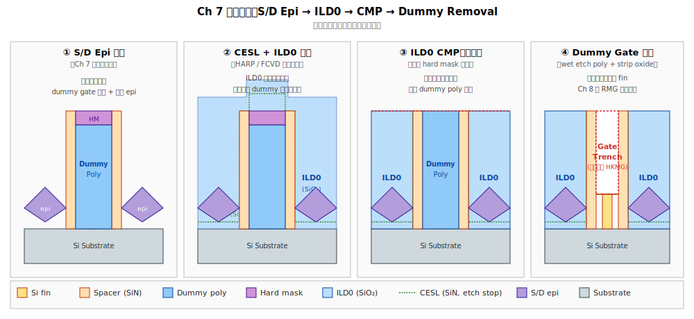
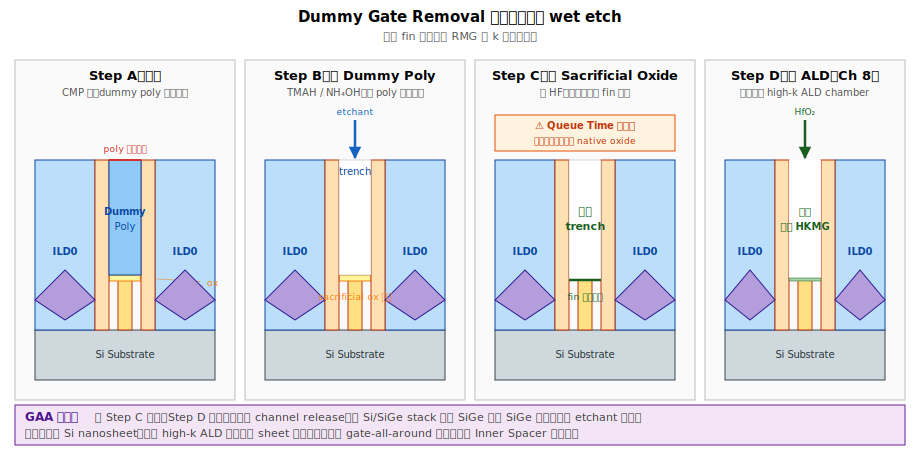

# Chapter 7 — ILD0 & Dummy Gate Removal

## 7.1 你會在這章學到什麼

- ILD0 是什麼，為什麼叫「0」
- 把整片表面填平、磨平的工序
- 怎麼把當初的 poly dummy gate 「挖掉」而不傷到周圍
- Gate trench：替換金屬閘極前的中間態
- 這個階段的典型缺陷

## 7.2 場景：S/D epi 之後的表面長什麼樣

下圖把本章四個關鍵狀態並列，方便對照：




S/D epi 做完後，wafer 表面是這樣的：

```
        ┌─poly──┐               ┌─poly──┐
   ▓▓▓▓│dummy│▓▓▓▓        ▓▓▓▓│dummy│▓▓▓▓
   ▓▓▓▓│gate │▓▓▓▓        ▓▓▓▓│gate │▓▓▓▓
   ╱╲══╧═════╧══╱╲══════╱╲══╧═════╧══╱╲
  ╱  ╲ fin fin ╱  ╲    ╱  ╲ fin fin ╱  ╲
   epi          epi      epi          epi
═════════════════════════════════════════
                Si substrate
```

問題：
- 表面凹凸不平（dummy gate 突出、epi 有菱形）
- Dummy gate 還在上面，阻擋我們做真正的金屬閘極

接下來的工作就是：**先填平 → 磨平 → 挖開 dummy → 換成金屬**。本章涵蓋前三步，金屬閘極在下一章。

## 7.3 ILD0：第一層介電層

「ILD」= **Inter-Layer Dielectric**（層間介電層）。「ILD0」是 FEOL 結束後 **第 0 層**金屬之前的介電層 —— 也就是最底下那層。

### ILD0 的功能

1. **填滿 dummy gate 之間的空間**：把 epi、fin、空腔都填滿。
2. **電性絕緣**：把 S/D contact 與其他結構分開。
3. **支撐**：後面挖 dummy gate 時不會塌。

### 製程選擇

材料通常是 **SiO2 系**，具體選擇：
- **HARP（O3-TEOS Sub-Atmospheric CVD）**：傳統選擇，gap-fill 能力好
- **FCVD（Flowable CVD）**：先進製程主流，能填極窄縫
- **Spin-on Glass（SOG）**：部分 fab 採用

挑戰：fin 之間、gate 之間的 gap 都很窄（< 30 nm），AR 高，**填充能力（gap-fill capability）** 是 ILD0 工程的核心議題。

## 7.4 ILD0 流程

```
[1] Contact Etch Stop Layer（CESL）  ← 先長一層 SiN（~10–20 nm），後面 contact 蝕刻會停在這
       ↓
[2] ILD0 Deposition                  ← 用 HARP / FCVD 把整個表面填滿
       ↓
[3] Densification Anneal             ← 高溫退火，緻密化、趕水分
       ↓
[4] ILD0 CMP                         ← 化學機械研磨，把表面磨平到 dummy gate 頭部露出
```

### CESL 的角色

CESL 是一層薄 SiN，鋪在 epi / spacer / STI 上面，再蓋 ILD0。它的兩個功能：
1. **Etch stop**：後面 MOL 階段在做 contact 時，contact etch 會停在 SiN 上，避免穿過頭去傷到 epi。
2. **應力源**：tensile SiN（給 NMOS）或 compressive SiN（給 PMOS）可以再附加應力到通道。叫 **dual stress liner（DSL）**，是早期 strain engineering 的常見手法，現在仍在用。

### ILD0 CMP 的「終點」

CMP 不能磨太多也不能磨太少：
- 磨太少 → dummy gate 頭沒露出，後面挖不到
- 磨太多 → 把 dummy gate 也磨掉、傷到 spacer

通常的策略：先磨到 **hard mask 頂部**（poly dummy 上面那層 SiN/SiO2 mask），再用選擇性化學去除 hard mask，就會露出 poly。

## 7.5 拿掉 Dummy Gate

ILD0 磨平之後，dummy gate 的多晶矽就「裸露」在表面。下一步是把 poly 整個挖掉，留下一個凹槽（gate trench）。

```
ILD0  spacer poly spacer  ILD0
████  ▓▓▓▓ │   │ ▓▓▓▓     ████
████  ▓▓▓▓ │   │ ▓▓▓▓     ████
████  ▓▓▓▓ │poly │ ▓▓▓▓   ████
═══════════════════════════════
        fin / epi
```

挖完之後：

```
ILD0  spacer       spacer   ILD0
████  ▓▓▓▓ ┌─────┐ ▓▓▓▓     ████
████  ▓▓▓▓ │     │ ▓▓▓▓     ████
████  ▓▓▓▓ │trench│ ▓▓▓▓    ████
═══════════════════════════════
        fin（露出 channel 區）
```

凹槽（gate trench）就是後面要填 high-k + metal gate 的地方。

### 挖法：兩階段蝕刻

```
[1] Wet Etch（TMAH 或 NH4OH 系）
       ↓ 對 poly-Si 高選擇比，對 SiO2/SiN 不太傷
       ↓ 把絕大部分 poly 拿掉
[2] 殘留 poly + sacrificial gate ox 用 dry / wet 仔細清乾淨
       ↓
[3] Pre-RMG Clean
```

四個細部步驟（含 sacrificial oxide strip 與 queue time 警戒區）並列如下：




### Sacrificial Gate Oxide Strip

當初 dummy gate 下方還有一層 sacrificial gate oxide（保護 fin 用的）。挖完 poly 後也要把這層用 HF 拿掉，露出**乾淨、沒有任何氧化的 fin 表面**，準備長真正的 high-k 介電。

→ 這一步非常敏感：fin 一暴露在大氣或水中就會立刻長一層原生氧化（native oxide），所以 strip 完之後要立刻送進 ALD 機台、不能停留太久。

## 7.6 GAA 的額外步驟：Channel Release 與 Inner Spacer

GAA 元件在這個階段還多一步 —— **把 SiGe 犧牲層抽掉，留下懸空的 Si nanosheet**，並在此之前先做 **inner spacer**（負責隔離 gate 與 S/D）。流程如下：


詳見附錄 [A.11 Nanosheet 邊緣](./A-qa.md#a11-nanosheet-邊緣有什麼特別的)。

```
                ┌─────┐                       ┌─────┐
   Release 前    │     │   挖完 dummy + SiGe   │     │
   stack:       │ Si  │ ─────────────────→    │ Si  │ ← 懸空
   Si/SiGe...   │SiGe │                       │     │ ← 中間是空的
                │ Si  │                       │ Si  │
                │SiGe │                       │     │
                └─────┘                       └─────┘
```

Etchant 對 SiGe 高選擇比（HCl 或 vapor-phase 化學），把 SiGe 抽掉、Si 保留。後續 RMG 的 high-k ALD 沉積會把這些懸空 sheet 全包起來。

這一步叫 **Channel Release** 或 **Sheet Release**，是 GAA 比 FinFET 多出來的關鍵特徵。

## 7.7 典型缺陷

| 缺陷 | 物理樣貌 | 成因 | 後果 |
|---|---|---|---|
| **ILD0 Void** | ILD0 內部有空洞 | Gap-fill 能力不足、AR 太高 | Wet 化學品殘留、後段 contact short |
| **CMP Dishing** | ILD0 表面凹陷 | CMP 過磨、pattern density 變動 | 凹陷區後面填材料不對 |
| **CMP Erosion** | 大面積 dense pattern 整體被磨低 | 同上 | Step height 不均 |
| **Poly 殘留** | Dummy gate 沒挖乾淨 | Wet etch 不夠、pattern 死角 | RMG 後 Vt 飄、可靠度差 |
| **Spacer Damage** | Spacer 在 poly removal 時被傷到 | 化學 selectivity 不夠 | Gate-S/D leakage |
| **Gate Trench Footing** | Trench 底部還有 poly / 殘留 | 蝕刻不徹底 | High-k 長不上 fin、device fail |
| **Native Oxide Regrowth** | Strip 完到 ALD 之間長了氧化 | Queue time 太長 | Vt shift、可靠度變差 |
| **Fin Damage** | 拆 dummy 時把 fin 傷到 | 過蝕刻、應力 | Channel 缺陷、Idsat 掉 |
| **NS Release 失敗**（GAA） | SiGe 沒抽乾淨 / Si 被傷到 | Etchant selectivity、stack 缺陷 | Gate 包不到通道、整顆 fail |

## 7.8 與 yield 的關係

這個模組是「**承先啟後**」：承接 dummy gate / S/D epi 的成果，啟動 RMG 的關鍵介面準備。它的問題往往**到 RMG 之後才爆發**：
- ILD0 void → contact wet 殘留 → MDMG short
- Poly 殘留 → high-k 接觸不到矽 → Vt 失控
- Native oxide → Vt 飄 + reliability fail

→ Queue time（QT）控制在這裡是 SPC 的重點：strip 後到 high-k ALD 之間每多一小時、defect rate 上升的曲線是可量化的。許多 fab 把 **QT < 1 hr** 寫進 process spec。

## 7.9 站點對應

| 縮寫 | 全名 | 對應流程 |
|---|---|---|
| **CESL / CETL** | Contact Etch Stop Liner | [1] |
| **ILD0DEP** | ILD0 deposition | [2] |
| **ILD0ANL** | ILD0 anneal | [3] |
| **ILD0CMP / ILDCMP** | ILD0 CMP | [4] |
| **HMSTRIP** | Hard mask strip | 露出 dummy poly |
| **DGRMV / DUMRMV** | Dummy gate removal | 拆 poly |
| **POX STRIP / SACOX RMV** | Sacrificial oxide strip | 拆下方薄氧化 |
| **NSREL / SHEETREL**（GAA） | Nanosheet release | SiGe 抽掉 |
| **PRERMG** | Pre-RMG clean | 進 ALD 之前的清洗 |

## 7.10 接下來

凹槽準備好了，下一章進入整個 FEOL 最精緻、最容易壞的核心模組：**Replacement Metal Gate**。這個模組涵蓋 high-k 沉積、WFM、gate fill 等步驟 —— [Chapter 8: Replacement Metal Gate](./08-replacement-metal-gate.md)。
