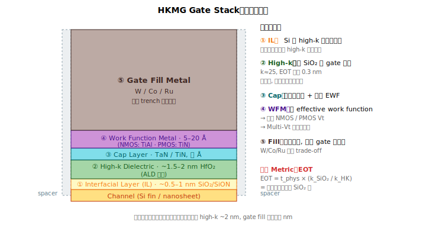
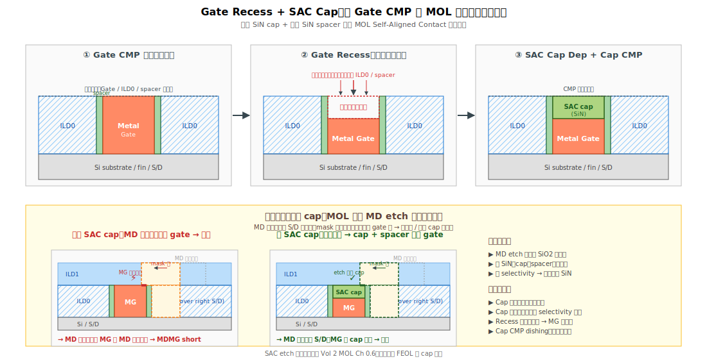

# Chapter 8 — Replacement Metal Gate（HKMG 核心）

## 8.1 你會在這章學到什麼

- High-k Metal Gate（HKMG）的物理動機
- ALD（Atomic Layer Deposition）的原理：為什麼是「原子層」沉積
- High-k 介電（HfO2）的 ALD 沉積流程
- Work Function Metal（WFM）：怎麼用金屬調 Vt
- Multi-Vt 工程：同一片 wafer 上做出多種 Vt 的元件
- Gate fill 與 gate CMP
- **Gate recess + SAC cap**：為 MOL Self-Aligned Contact 鋪好頂端保護層
- 這個模組的典型缺陷與 yield 影響

## 8.2 為什麼需要 HKMG

從 130 nm 到 65 nm，gate stack 一直都是 **SiO2 + poly-Si**。但隨著節點縮小，gate oxide 必須更薄（要維持 gate 對通道的控制）：
- 130 nm: SiO2 約 2.5 nm
- 90 nm: SiO2 約 1.6 nm
- 65 nm: SiO2 約 1.2 nm
- **45 nm: SiO2 < 1 nm → 直接量子穿隧、漏電爆表**

物理極限到了。解法：**用介電常數更高的材料，達到同樣的「等效電性厚度」，但物理上更厚**。

```
等效氧化矽厚度（EOT）= t_dielectric × (k_SiO2 / k_dielectric)
                     = t_dielectric × 3.9 / k_dielectric
```

例如 HfO2（k ≈ 25），物理厚度 2 nm 的 HfO2 ≈ 0.3 nm 的 EOT。物理上夠厚，量子穿隧大幅降低。

→ 從 45 nm 開始，業界引入 **High-K + Metal Gate**：
- **High-K 介電**：HfO2 為主（後續摻 Si、La、Al 等微調）
- **Metal Gate**：取代 poly-Si，避免 poly depletion、可分別調 NMOS/PMOS Vt

這個組合就叫 **HKMG**，沿用至今。

## 8.3 ALD：Atomic Layer Deposition

要在 gate trench（深窄、有時 nanosheet 之間還要鑽）裡長一層 1–2 nm 的均勻、無孔洞的 HfO2，**只有 ALD 做得到**。

### ALD 的基本原理

ALD 是一種**自我限制（self-limiting）的化學反應**：

```
[1] 通入 Precursor A（例如 HfCl4）
       ↓ A 在表面化學吸附一層後，剩下的不再反應 → 飽和
[2] 用惰性氣體 purge 掉多餘的 A
       ↓
[3] 通入 Precursor B（例如 H2O）
       ↓ B 與表面的 A 反應，生成 HfO2，並還原表面活化基
[4] Purge 掉 B
       ↓
   完成「一個原子層循環（cycle）」，厚度 ~0.1 nm
       ↓
   重複 N 次直到目標厚度
```

關鍵特性：
- **每個 cycle 厚度固定**（self-limiting）→ 厚度精準（誤差 < 1 Å）
- **保形（conformal）**：在 3D 結構上每個面長出來都一樣厚
- **均勻（uniform）**：wafer 內、wafer 間幾乎沒有變動

代價：**慢**。長 2 nm 要約 20 cycles，每個 cycle 數秒，所以 ALD throughput 比 CVD 低很多。但對於關鍵層的厚度控制，這是無可取代的。

### PEALD（Plasma-Enhanced ALD）

在 B step 用電漿輔助反應，可降低 deposition temperature、加快反應、改變膜性質。常見於 spacer SiN、SiOCN。

## 8.4 High-k 介電沉積

RMG 模組裡，第一個關鍵的 ALD 步驟是 **high-k 介電層的沉積**：在 dummy gate 拿掉後的凹槽底部與側壁，用 ALD 長一層 1.5–2 nm 的 HfO2，要求保形於 3D 結構（fin 或 nanosheet）上，厚度誤差 < 1 Å。

### Gate Stack 的層次

從 fin 表面往上：



```
1. Interfacial Layer (IL)        ← ~0.5–1 nm SiO2 / SiON，由化學氧化或 RTO 形成
2. High-k Dielectric             ← ~1.5–2 nm HfO2（ALD 沉積）
3. Cap Layer                      ← TaN / TiN，幾 Å，調節 Vt 並阻擋 metal 反應
4. Work Function Metal (WFM)     ← 5–20 Å，分別給 NMOS / PMOS
5. Gate Fill Metal               ← W / Co，填滿剩下空間
```

### Interfacial Layer（IL）

直接把 high-k 長在矽上不行 —— 介面態密度太高，會嚴重影響 mobility 和可靠度。所以中間夾一層極薄的 SiO2 / SiON 當「過渡層」：
- 化學氧化（IPA + 臭氧）或 RTO（Rapid Thermal Oxidation）形成
- 厚度 0.5–1 nm，要剛剛好（太厚 EOT 增加，太薄介面差）

→ IL 的厚度與品質是 HKMG 的命門。

### High-k 摻雜

純 HfO2 有兩個問題：
1. 結晶（從 amorphous 變 polycrystalline）會在膜內形成晶界 → 漏電通路
2. 對 NMOS / PMOS 的 effective work function 不能各自最優化

業界做法：**摻入 Si、La、Al** 改變晶體穩定性與功函數：
- 摻 La / Mg：降低 NMOS Vt
- 摻 Al：降低 PMOS Vt
- 摻 Si：提高熱穩定性

這些 dopant 通常做在 high-k 上方的 cap layer，再用 anneal 「驅入」high-k。

## 8.5 Work Function Metal（WFM）：怎麼用金屬調 Vt

### Threshold Voltage 的物理

Vt 由 metal 的 **effective work function (EWF)** 決定。EWF 高（接近價帶 5.2 eV） → PMOS 用；EWF 低（接近導帶 4.05 eV） → NMOS 用。

### 常用 WFM

| 用途 | 材料 | 大致 EWF |
|---|---|---|
| **PMOS** | TiN（厚）、TaN | 4.6–5.0 eV |
| **NMOS** | TiAl、TiAlC | 4.1–4.4 eV |

### Multi-Vt 工程

實務上，同一顆 SoC 需要多種 Vt 的元件：
- LVT（Low Vt）：高速電路
- SVT（Standard Vt）：一般邏輯
- HVT（High Vt）：低功耗
- ULVT（Ultra-Low Vt）：critical path

做法：**對不同元件區，沉積不同厚度 / 組合的 WFM 堆疊**。

```
   PMOS LVT   PMOS HVT   NMOS LVT   NMOS HVT
   ┌────┐    ┌────┐     ┌────┐    ┌────┐
   │WFM │    │WFM │     │WFM │    │WFM │
   │THIN│    │THICK│    │THIN│    │THICK│
   └────┘    └────┘     └────┘    └────┘
```

每個 Vt 都是一道 **mask + selective etch** 工序。一顆現代 SoC 可能有 6–10 種 Vt，等於 6–10 道 mask。**這是現代 RMG 模組複雜度爆炸的主因**。

## 8.6 Gate Fill：填滿剩下的空間

WFM 只是一層薄薄的金屬，填不滿整個 trench。剩下的空間用低阻金屬填滿：

| 材料 | 沉積方法 | 特點 |
|---|---|---|
| **W（鎢）** | CVD（WF6 + H2） | 老主力，整合容易，電阻較高 |
| **Co（鈷）** | CVD / electroless | N7 開始，電阻較低，但有 EM、整合風險 |
| **Ru（釕）** | CVD / ALD | N3 / N2 開始考慮，barrier-less，但成本高 |

填完之後：

```
┌─────────────────┐
│ Gate Fill (W)   │
│  ┌───────────┐  │
│  │  WFM      │  │
│  │ ┌───────┐ │  │
│  │ │  HK   │ │  │
│  │ │ ┌───┐ │ │  │
│  │ │ │IL │ │ │  │
│  │ │ │   │ │ │  │
└──┴─┴─┴───┴─┴─┴──┘
       fin
```

## 8.7 Gate CMP

把表面多餘的金屬磨掉，只留 trench 裡面的部分。挑戰：
- 多種金屬（Hf 系 + Ti 系 + W）的選擇比要平衡
- Dishing 控制（gate 比 ILD0 凹下去會影響後續 contact）
- Erosion 控制（dense gate 區域不能整體被磨低）

→ **Gate CMP 是 RMG 模組裡最容易產生 wafer 級不均的單站**。

## 8.8 Gate Recess + SAC Cap：先進製程的關鍵一步



Gate CMP 完成後，gate 與 ILD0 在表面是齊平的。但這還不是 FEOL 的終點 —— 還少了一個關鍵保護層：**gate 頂端的 SiN 蓋子**，業界稱為 **SAC cap**（**Self-Aligned Contact cap**）。

### 為什麼需要這個 cap：先說功能再說製程

在 FEOL 結束、進入 MOL 之後，下一個關鍵動作是挖 **MD contact**（在 source / drain 上方開洞，填金屬接出來）。但 MD contact 與 metal gate 之間的水平距離只有十幾奈米：

```
   MD ←~25→ MG ←~25→ MD
   │         │         │
   │  ~15 nm │  ~15 nm │   ← 中間絕緣寬度只剩十幾 nm
```

如果 MD contact 仰賴**光罩對位**（mask alignment）來避開 gate，那麼光罩 overlay 只要偏 5 nm，contact 就會落到 gate 上 → 短路。先進製程的 overlay 容差**根本撐不住**這種要求。

業界的解法：**用結構自動避讓 gate，不靠 mask 精準**。具體做法 ——

- **Gate 兩側**：在 Ch 5 dummy gate 階段就做好的 SiN spacer
- **Gate 頂端**：在 RMG / CMP 完成後**加上一層 SiN cap**（就是 SAC cap）
- **後續 MD etch 化學**：對 SiN 的蝕刻速率遠低於對 SiO2 / low-k 介電的速率

當 MD 開窗時，蝕刻穿透 ILD（SiO2 系）很快，**遇到 SiN（cap 或 spacer）就被擋住**——contact 自動「避開」gate，只能落到 source / drain 區。這個策略就叫 **Self-Aligned Contact（SAC，自我對齊接點）**。

```
            ┌─────┐ MD 光罩開口（mask 可能稍微歪）
            ▼     ▼
   ════════════════════
     ILD0（SiO2，蝕刻快）
            ╪═════╪
   ┌────────┘     └────────┐
   │ SAC cap（SiN，擋住）   │
   │ ┌─────────────────┐   │
   │ │   Metal Gate    │   │
   │ │ (HK + WFM + W)  │   │
   │ └─────────────────┘   │
   │ spacer（SiN，擋住）   │
   └────────────────────────┘
       fin
```

→ 即使 MD photo 對位有幾 nm 誤差，contact 依然停在 source/drain 上，不會傷到 gate。SAC cap 是這個哲學能成立的**頂端保護**，spacer 是**側壁保護**，兩者缺一不可。

完整的 SAC etch 機制與失效模式留到 [Vol 2 MOL Ch 0.6](../02-mol/00-overview.md#self-aligned-contactsac) 與 [MOL Ch 1](../02-mol/01-dielectric-stack.md) 詳述。在 FEOL 階段先把「**gate 頂端會被蓋上一層 SiN，這是後續 MOL 的命門**」記下來。

### 完整流程：Gate Recess + Cap Dep + Cap CMP

回到製程本身，要在 gate 頂端加上 SiN cap，步驟是：

```
[1] Gate Recess（金屬閘回蝕）
       ↓ 把 Gate CMP 完的金屬閘頂往下蝕刻幾十 nm，騰出空間
       ↓ 蝕刻化學要對金屬有高選擇比、不傷 ILD0
[2] SAC Cap Deposition
       ↓ 在凹下去的空間填入 SiN（也可能是 SiCN）
       ↓ 多用 ALD / PEALD 確保 conformal、填滿、無 void
[3] SAC Cap CMP
       ↓ 把多餘的 cap 材料磨掉，與 ILD0 齊平
       ↓ 完成後表面是「ILD0 平面 + 中間鑲嵌 SAC cap」
```

完成後的橫截面：

```
   ════════════════════════════════
       ILD0                ILD0
   ════════ ┌────────┐ ════════
            │ SAC cap│            ← 新長的 SiN cap
            │ (SiN)  │
            ├────────┤
            │ Metal  │
            │ Gate   │
   spacer ──┤        ├── spacer
            │ HK     │
   ════════════════════════════════
              fin
```

### 各家整合的順序差異

SAC cap 形成步驟與 [Ch 9 CMG](./09-cut-metal-gate.md)（Cut Metal Gate）的相對順序，**各家 fab 整合不同**：

- 部分流程：RMG → Gate CMP → **SAC Cap** → CMG（cap 形成後再切）
- 部分流程：RMG → Gate CMP → CMG → **SAC Cap**（先切再蓋）
- 部分流程：CMG 的 fill 與 SAC cap 共用同一道介電 dep

不論順序，**FEOL 結束時的最終狀態是一致的**：metal gate 頂端有 SiN cap、兩側有 SiN spacer、其餘表面是 ILD0。MOL 就從這個狀態接手。

### 為什麼這站要關注

| 變因 | 影響 |
|---|---|
| **Gate recess 深度** | 太淺 → cap 太薄 → SAC etch 容錯不足 → MDMG short<br>太深 → 金屬閘有效高度不夠 → Vt / 電阻飄 |
| **SAC cap 厚度** | 太薄 → MOL 的 MD etch 把 cap 打穿 → 露出 gate 金屬<br>太厚 → 後續 MP（gate contact）開窗困難 |
| **SiN 品質 / 緻密度** | 疏鬆 / 含氫多 → 對 MD etch 選擇比差 → 容易被穿 |
| **Cap CMP dishing** | 中央凹陷 → 該處 cap 偏薄 → 局部 MDMG short |
| **Cap CMP 殘留** | 表面殘留 SiN → 影響後續 photo 對位 / contact CD |

→ **SAC cap 的厚度與完整性，直接決定 MOL 的 MDMG short 機率**。Ch 9 提到的「ox residue → MDMG short」因果鏈，本質上是相鄰處的 cap / cut fill 異常；本節提到的 cap 厚度 / 品質問題則直接決定 SAC 的 etch budget。

### 典型缺陷

| 缺陷 | 機制 | 後果 |
|---|---|---|
| **Recess 過深** | Recess etch 過頭、selectivity 差 | Gate 有效高度不足、Vt 飄 |
| **Recess 不足** | Endpoint 失準 | Cap 偏薄、SAC 容錯減少 |
| **Cap Void / Seam** | Cap dep step coverage 差 | 局部絕緣不足、SAC etch 穿透 |
| **Cap Pinhole** | Precursor / 表面污染 | 局部短路風險 |
| **Cap CMP Dishing** | Selectivity 不對、pattern density 影響 | Cap 中央薄 → MDMG short |
| **Cap CMP Residue** | Slurry / pad / endpoint | Photo 對位飄、表面汙染 |

## 8.9 典型缺陷

| 缺陷 | 物理樣貌 | 成因 | 後果 |
|---|---|---|---|
| **HK Thickness 飄** | 整片或局部 high-k 偏厚 / 偏薄 | ALD 機台 cycle 數、precursor flow | EOT 飄 → Vt 失控 |
| **HK Pinhole** | 介電有微孔 | Precursor 純度差、表面污染 | Gate leakage、TDDB 早夭 |
| **HK Crystallization** | 部分 HK 結晶 | 後續熱預算過高 | 漏電、BTI 差 |
| **IL Regrowth / Damage** | IL 厚度不對 | Pre-clean 不對、ALD 副反應 | EOT 飄、reliability 差 |
| **WFM Loss** | WFM 太薄、被磨穿 | CMP 過磨、wet 過頭 | EWF 飄、Vt shift |
| **WFM 邊界 mask 邊緣 fail** | Multi-Vt 邊界 Vt 異常 | Mask align、selective etch 不準 | 邊界區 device 失配 |
| **Gate Fill Void** | W / Co 填不滿 trench 中央 | 沉積 step coverage 差 | Gate 電阻飆升 |
| **Gate Fill Seam** | 金屬從兩側合攏留下中縫 | Bottom-up 沉積能力不足 | 接觸面積小、可靠度差 |
| **Gate CMP Dishing** | Gate 表面凹陷 | CMP 過磨 + 軟金屬 | 後段 contact 卡住、開路 |
| **Gate CMP Erosion** | 整片 gate 被磨低 | Pattern density 不均 | 平整度破壞 |
| **Metal Smearing** | CMP 把金屬塗到隔壁區域 | Slurry / pad 條件差 | Gate-to-Gate short |
| **Particle / Scratch** | CMP 留下顆粒或刮痕 | 漿料異常 | Killer defect、後段 fail |

## 8.10 與 yield 的關係

RMG 是 yield 工作的「兵家必爭之地」，原因：

1. **Vt 直接被 RMG 決定**：所有 Vt 工程的 fingerprint 都在這個模組。CP 上看到的 Vt 飄移，優先查 high-k ALD 與 WFM 兩站。
2. **可靠度（reliability）由 gate stack 決定**：TDDB、BTI、HCI 的 root cause 大概率在 high-k / IL。
3. **Multi-Vt mask 數多，整合複雜**：每多一個 Vt = 多一道 mask + etch + WFM dep，每一道都可能出錯。
4. **CMP 變動大**：gate CMP 是 fab 內最敏感的 CMP 之一。

→ Wafer signature：ALD 站的問題常是「**chamber matching**」（不同 chamber 跑出來的 wafer 系統性偏差）；CMP 站的問題常是「**center-to-edge**」或「**slot-by-slot**」。看到這類 signature 都應該優先查 RMG。

→ High-k ALD 站常見的失效態樣：
- High-k 厚度跑掉
- Chamber matching 差
- Particle 異常
- Queue time 超標導致 IL 變化

## 8.11 站點對應

| 縮寫 | 全名 | 對應流程 |
|---|---|---|
| **IL / IFOX / SCC** | Interfacial Layer 形成 | IL 成形 |
| **HK / HKDEP / ALD-HK / ALD0** | High-k ALD 沉積（fab 命名差異大） | High-k 主站 |
| **HKANL / PDA** | Post-deposition anneal | High-k 緻密化 |
| **CAPDEP** | Cap layer (TaN/TiN) deposition | Cap |
| **WFMP / WFMPMOS** | PMOS WFM | TiN dep + selective etch |
| **WFMN / WFMNMOS** | NMOS WFM | TiAl dep + selective etch |
| **VTPHO / WFMPHO** | Multi-Vt photo | Vt 邊界 mask |
| **GFILL / WFILL / CO FILL** | Gate fill metal | W / Co dep |
| **GCMP / GATECMP** | Gate CMP | 磨平 |
| **GRECESS / MGRECESS** | Metal gate recess | 8.8 [1] |
| **SACDEP / GCAPDEP** | SAC cap deposition（SiN） | 8.8 [2] |
| **SACCMP / GCAPCMP** | SAC cap CMP | 8.8 [3] |

## 8.12 接下來

到這裡，每個電晶體已經有了完整的 high-k metal gate、頂端蓋了 SiN SAC cap、兩側已有 SiN spacer。但所有 gate 還是一條條長條、跨在多顆電晶體上面。下一步要把這些長條按設計切斷 —— [Chapter 9: Cut Metal Gate (CMG / CMGCMP)](./09-cut-metal-gate.md)。
