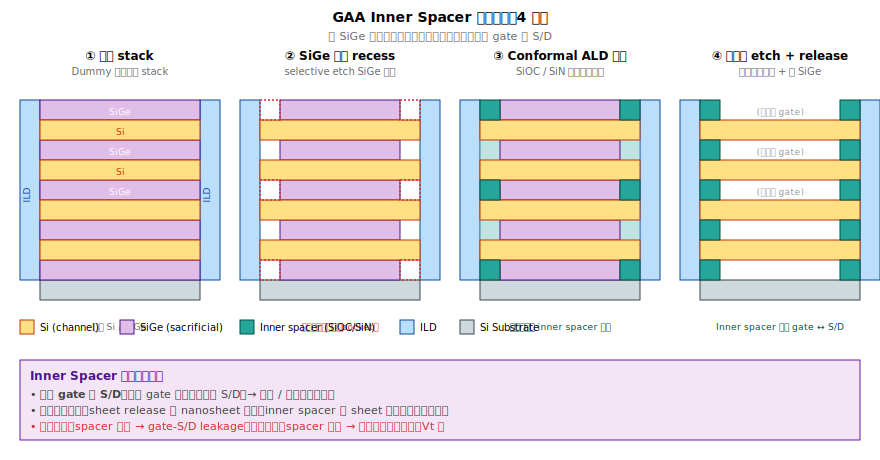

# Appendix A — Q&A（術語與基礎觀念對照）

> 本附錄收錄 FEOL 第一冊讀者常問的基礎概念。如果在閱讀正文時遇到沒解釋清楚的詞，先翻這一篇。

> **撰寫原則**：本書只引用公開文獻與標準教科書中可查證的內容。當答案有不確定性時會明白標示。

## A.0 Source / Drain / Gate 是什麼

MOSFET（電晶體）的三個端點：

```
              ┌─ Gate ─┐         (控制器)
              │        │
   ┌────┐  ┌──┴────────┴──┐  ┌────┐
   │ S  │  │   channel    │  │ D  │
   │    │←─│              │─→│    │      (載子流動)
   └────┘  └──────────────┘  └────┘
   出發地       通道            目的地
```

- **Source（源極）**：載子（NMOS 是電子，PMOS 是電洞）的「出發地」。
- **Drain（汲極）**：載子的「目的地」。
- **Gate（閘極）**：在 channel 上方（或環繞 channel），控制 channel 有沒有打開。

直觀比喻：source 是水庫、drain 是農田、channel 是水管、gate 是閥門。Gate 電壓 > Vt → 閥門打開 → 載子從 source 流向 drain。

為了讓 S/D 能提供大量載子，兩端必須**重摻雜**（heavily doped）：NMOS 摻 N 型（10²⁰ /cm³ 級的 P 或 As），PMOS 摻 P 型（B）。

**參考**：Sze (2006), Ch. 6；Razavi (2017), Ch. 2。

---

## A.0b Epi（磊晶）是什麼

**Epi = Epitaxy = 在單晶基板上有規則地長出新的單晶層**，新的原子接續底下晶格方向，整體仍是一塊單晶。

```
   普通 CVD                       Epi
   雜亂或多晶                     接續單晶
   ╱╳╲╱╳╲╱╳╲                     │ │ │ │ │ │
   ╲╱╳╲╱╳╲╱     ←非單晶          │ │ │ │ │ │ ←接續底下方向
   ───────────                   ───────────
     Si 單晶                       Si 單晶
```

→ 元件（電晶體）需要單晶矽才有低缺陷與好的載子遷移率，所以 channel、S/D 等關鍵區域都會用 epi 做。

### 「Epi」在不同章節的脈絡

| 場合 | 在做什麼 |
|---|---|
| **Epi wafer**（Ch 1） | Wafer 供應商在 bulk 矽上長幾 µm 高品質 epi 層 |
| **Nanosheet stack epi**（Ch 4，GAA） | 長 Si/SiGe 交替堆疊，作為 GAA 元件的原料 |
| **S/D epi**（Ch 6） | 把 fin/sheet 兩端 Si 挖掉、再長 SiGe / SiP 做 source 與 drain |

「epi」是技術名，要看脈絡判斷在做哪一種應用。

### S/D epi：FinFET 與 GAA 都會用

從 22 nm FinFET 之後，所有先進邏輯製程的 source / drain 都用 epi 做（不再用單純的 implant）。原因：

1. **Fin / sheet 太薄**，直接 implant 會把結構打散。
2. **應力工程**：SiGe（Ge 晶格較大）→ 壓縮通道 → 電洞遷移率 ↑（給 PMOS）。SiP（重摻 P）→ 拉伸通道 → 電子遷移率 ↑（給 NMOS）。
3. **Junction 陡度**：in-situ doping（長膜時同時摻雜）做得比 implant 陡。

| | FinFET | GAA Nanosheet |
|---|---|---|
| Recess 在哪 | Fin 兩端 | Stack 兩端（含 SiGe 犧牲層） |
| Epi 起點 | Fin 兩側 Si 表面 | Stack 端面，多層 Si 同時長 |
| 形狀 | 菱形 | 多層包覆，較複雜 |
| 額外結構 | 一般 spacer | 一般 spacer + **inner spacer** |

化學配方（SiH₄ + GeH₄ + PH₃ 等）與反應器（RP-CVD）兩者類似，差別在 layout 與整合複雜度。

**參考**：Plummer (2000), Ch. 7；Bean (1985)；Mertens (2018) IEDM。

---

## A.0c Channel / Source / Drain 各是什麼材料

| 區域 | 材質 | 摻雜（典型先進 node） |
|---|---|---|
| **Channel**（FinFET fin / GAA nanosheet） | 單晶 Si（部分先進 PMOS 用 SiGe channel） | 輕摻或近本徵（well 級 ~10¹⁷/cm³） |
| **NMOS S/D** | Si:P（Si 為基、重摻 P）；部分製程加 C 為 Si:C:P | P ~10²¹/cm³（2–3 at%） |
| **PMOS S/D** | SiGe:B（Si-Ge 合金 + 重摻 B） | Ge 30–60%、B ~10²¹/cm³（1–3 at%） |

**記法說明**：
- `Si:P` = 以 Si 為基底，P 取代部分 Si 位置（substitutional doping）
- `SiGe` = Si 與 Ge 共同形成的單晶合金
- `SiGe:B` = SiGe 合金 + B 摻雜

**Gate（閘極）** 的材質前面已有專章（Ch 8）：是 IL → high-k → cap → WFM → fill 的**多層金屬與介電堆疊**，不是單一材料。

### S/D 材料同時做兩件事

1. **提供載子**：重摻 P（電子）或 B（電洞），達 10²¹/cm³ 量級
2. **應力工程**：晶格大小不同造成通道應變
   - SiGe（Ge 比 Si 大）→ 壓縮 channel → 電洞 ↑（給 PMOS）
   - Si:P / Si:C:P → 拉伸 channel → 電子 ↑（給 NMOS）

兩件事在 epi 反應器中**同時達成**：通入 Si 來源（SiH₄ 或 DCS）+ Ge 來源（GeH₄）+ 摻雜氣體（B₂H₆ 或 PH₃），讓晶格生長同時進行摻雜（in-situ doping）。

### NMOS / PMOS 分兩次長

由於 S/D 材料不同，必須先用光阻把一邊蓋住、長另一邊；換邊後再做一次。Lot history 會看到 NEPI（或 EPIN）與 PEPI（或 EPIP）兩個獨立站。

**參考**：Auth, C. et al. (2012). *A 22nm high performance and low-power CMOS technology featuring fully-depleted tri-gate transistors, self-aligned contacts and high density MIM capacitors*. VLSI Symposium. Yeo, Y.-C. et al. (2007). *Strain Engineering Using Silicon-Germanium Source/Drain Stressors*. IEEE Trans. Elec. Dev.

---

## A.1 晶向 `<100>`、`<110>`、`<111>` 是什麼？

**米勒指數（Miller indices）** 用來描述晶體中的特定方向或平面。

- **方括號 `[hkl]`**：一個特定方向
- **角括號 `<hkl>`**：所有等價方向的集合（晶體對稱下視為同一族）
- **小括號 `(hkl)`**：一個特定平面
- **大括號 `{hkl}`**：所有等價平面的集合

矽是 **diamond cubic 結構**（屬於 face-centered cubic, FCC 對稱）。三個常見晶面：

| 晶面 | 在 FCC 立方結構中的位置 | 表面原子密度 | 表面能量 |
|---|---|---|---|
| **(100)** | 與立方體面平行 | 中等 | 中等 |
| **(110)** | 對角面 | 較高 | 較高 |
| **(111)** | 三角對稱面（連接立方體三個對角頂點） | 較低 | **最低** |

### 對製程的影響

- **<100> wafer 是邏輯製程標準**。原因：(100) 介面與 SiO2 形成介面態（interface trap）密度最低，閘極氧化品質最好。
- **(111) 表面能最低**：磊晶 / 蝕刻 / 缺陷 都傾向沿 {111} 面進行（這就是 S/D epi 為什麼是菱形 —— 見 Q11）。
- **(110) 提升電洞遷移率**：歷史上有人嘗試用 (110) wafer 做 PMOS 通道，但整合困難，主流仍是 (100)。

**參考**：Sze, S. M. & Ng, K. K. (2006). *Physics of Semiconductor Devices*, 3rd ed., Wiley, Ch. 1. Plummer, J. D. et al. (2000). *Silicon VLSI Technology*, Prentice Hall, Ch. 3.

---

## A.2 NMOS、PMOS、CMOS 是什麼？

| 縮寫 | 全名 | 中文 | 通道導電載子 | 做在哪種矽上 |
|---|---|---|---|---|
| **NMOS** | N-channel Metal-Oxide-Semiconductor FET | N 型場效電晶體 | 電子（負電荷） | P-well / P-substrate |
| **PMOS** | P-channel MOSFET | P 型場效電晶體 | 電洞（正電荷） | N-well |
| **CMOS** | Complementary MOS | 互補式 MOS | 同電路兩者並用 | 同一片 wafer 上有 N-well 和 P-well |

CMOS 的關鍵特性：**靜態時幾乎不耗電**（只在切換時耗電），這是它能在現代 IC 主導的根本原因。每個邏輯閘（NAND、NOR、INV）都由 NMOS 與 PMOS 配對組成。

**參考**：Weste, N. H. E. & Harris, D. M. (2010). *CMOS VLSI Design: A Circuits and Systems Perspective*, 4th ed., Pearson, Ch. 1–2. Razavi, B. (2017). *Design of Analog CMOS Integrated Circuits*, 2nd ed., McGraw-Hill, Ch. 2.

---

## A.3 什麼是 latch-up（PNPN 寄生 SCR）？

CMOS 的物理結構**意外地**包含一個 PNPN 四層半導體：

```
   表面：P+ 接點   N+ 接點
          ↓        ↓
   ┌──────────┬──────────┐
   │          │          │
   │  N-well  │ P-substrate │
   │  (給 PMOS)│ (給 NMOS) │
   │          │          │
   └──────────┴──────────┘

   依序：P+ → N-well → P-substrate → N+
        (P)    (N)        (P)        (N)
```

這個 PNPN 結構等效於兩個交錯的 BJT（Bipolar Junction Transistor）：
- **Q1（垂直 PNP）**：P+ → N-well → P-substrate
- **Q2（水平 NPN）**：N-well → P-substrate → N+

兩個 BJT 的輸出互為對方的輸入，形成**正回饋**。在電路圖上，這個結構等效於 **SCR（Silicon Controlled Rectifier，矽控整流器）**。

### 觸發機制

正常情況：兩個 BJT 都關著（基極電流不足），等效 SCR 不導通。

**Latch-up 發生條件**：某種擾動讓其中一個 BJT 短暫導通（例如 ESD、電源 spike、輻射粒子打入產生瞬時載子、I/O 過電壓），使另一個 BJT 也跟著導通，形成正回饋鎖定 → 整個 SCR 全開 → **VDD 直接短路到 GND**，電流瞬間爆量，可能燒毀晶片。

### 抑制設計

- **Retrograde well**（深處摻雜濃）→ 降低 BJT gain
- **Guard ring**（在 well 邊緣加一圈高摻雜接點）→ 把寄生電流分流
- **較深的 well 或 trench isolation** → 切斷 BJT 路徑
- **Substrate / well contact 密度**（DRC 規則） → 確保偏壓穩定

**參考**：Troutman, R. R. (1986). *Latchup in CMOS Technology: The Problem and Its Cure*. Kluwer Academic Publishers. Sze (2006), Ch. 8.

---

## A.4 Junction 是什麼？

**Junction（接面）** 指兩種不同型別半導體相接的介面。最重要的是 **PN junction**（P 型矽與 N 型矽相接）。

### PN junction 的特性

- 內建電場與耗盡區（depletion region）使電流**只能單向流動** → 整流（rectification）
- 是所有 BJT、二極體的核心
- 在 MOSFET 中，**source-to-channel** 與 **drain-to-channel** 各自是一個 PN junction

### Junction 在 FEOL 工程中的關鍵 metric

- **深度（junction depth, Xj）**：摻質擴散到多深
- **陡度（abruptness）**：dopant profile 多陡
- **重摻雜度（peak concentration）**：影響電阻與接觸特性

這些 metric 由 **implant + anneal + epi** 三者聯合決定。淺、陡、高濃度 = 好的 short-channel 抑制。

**參考**：Sze (2006), Ch. 2. Plummer (2000), Ch. 7.

---

## A.5 Vt 是什麼？

**Vt = Threshold Voltage（閾值電壓 / 啟動電壓）**

當 gate 電壓超過 Vt 時，通道才形成、source-drain 才會導電。Vt 是 MOSFET 最重要的單一參數。

### Vt 由哪些因素決定（簡化）

```
Vt = Vfb + 2|φ_F| + Q_dep / C_ox
```

| 項 | 意義 | 工程上怎麼動 |
|---|---|---|
| **Vfb** | Flat-band voltage | Metal work function（HKMG 的 WFM 工程） |
| **φ_F** | Fermi potential | 通道摻雜濃度 |
| **Q_dep** | Depletion charge | 通道摻雜 |
| **C_ox** | Gate oxide capacitance | EOT（high-k 影響） |

### Multi-Vt design

同一 SoC 內常見的分類：
- **LVT**（Low Vt）：開得快、漏電多 → 用在 critical path
- **SVT**（Standard Vt）：通用
- **HVT**（High Vt）：漏電少、慢 → 用在低功耗邏輯
- **ULVT**（Ultra-Low Vt）：極致速度，常用於高頻設計

實作上，多 Vt 是透過 WFM 厚度 / 種類差異達成（見 FEOL 第 8 章）。

**參考**：Sze (2006), Ch. 6. Razavi (2017), Ch. 2.

---

## A.6 Photo lot 是什麼？

**Lot** 是 fab 內的最小生產單位，**通常是 25 片晶圓**（FOUP 一盒）。

**Photo lot** = 在某一道**微影站（photolithography）** 同時跑過的一批 wafer。

在 RCA 上，「photo lot」是 commonality analysis 的一個重要維度。同一 photo lot 共用：
- 同一台 scanner
- 同一個 reticle
- 同一光阻批號（photoresist lot）
- 鄰近時間點的 chamber 條件

→ 如果某缺陷集中在「同一 photo lot」，懷疑指向微影站；如果分散在多個 photo lot 但集中在某 etch lot，懷疑指向蝕刻站。這種「**用工序的最小生產單位做切片**」是 RCA 基本工具。

> **編注**：「photo lot」不是嚴格術語，是 fab 內的工作用語，準確說法是「在某 photo step 處理的同一個 wafer lot」。

---

## A.7 介電層（dielectric layer）做什麼用？

**介電層 = 電性絕緣材料**。在 IC 結構中有三大類用途：

### 1. 電性絕緣

把不同導電結構分開，防止短路。
- **STI**：隔離相鄰電晶體
- **Spacer**：隔離 gate 與 source/drain
- **ILD（Inter-Layer Dielectric）**：隔離不同層的金屬線

### 2. 電容介質

放在兩個導體之間形成電容。
- **Gate dielectric**（gate 與 channel 之間）：MOS 電容，是 MOSFET 控制通道的關鍵
- **MIM cap**（金屬-絕緣-金屬電容）：類比電路用

### 3. 保護 / 緩衝 / etch stop

- **Pad oxide**（在 SiN 與 Si 之間做應力緩衝）
- **CESL**（contact etch stop layer，蝕刻時當路標）
- **Passivation**（晶片表面的最後保護層）

### 關鍵物性

| 性質 | 意義 | 期望方向 |
|---|---|---|
| **介電常數 k** | 儲存電荷能力 | Gate 想要高 k；金屬線間想要低 k |
| **崩潰電場（breakdown field）** | 能承受多強的電場 | 愈高愈好 |
| **Leakage current** | 通過絕緣層的漏電 | 愈低愈好 |
| **介面態密度（Dit）** | 與半導體接觸的介面缺陷密度 | 愈低愈好 |
| **熱穩定性** | 熱預算下不結晶 / 不分解 | 愈穩定愈好 |

**參考**：Sze (2006), Ch. 4. Plummer (2000), Ch. 6.

---

## A.8 為什麼 epi 是菱形剖面？

選擇性磊晶（selective epitaxial growth）長在 (100) 表面的矽 fin 上時，**沿著表面能量最低的 {111} 晶面成長**。

### 物理機制

當原子（Si、SiGe 的 Si/Ge）從氣相沉積到表面，它們在表面遷移（surface migration），最終會「**坐到能量最低的位置**」。在 diamond cubic 矽中，{111} 面的表面能量最低，所以磊晶傾向把 {111} 面當作邊界。

### 幾何

從 (100) 表面看，四個 {111} 等價面與表面的夾角約 **54.7°**（cos⁻¹(1/√3)）。fin 兩側各有一組 {111} 面斜向上長，最終在頂端相遇 → 形成菱形（rhombic / diamond）剖面。

```
        {111}  {111}
         ╲      ╱
          ╲    ╱
           ╲  ╱           ← 菱形剖面
            ╲╱
   ─────────╳─────────
          (100) Si fin 表面
```

### 對工程的意義

- **菱形角延伸到 fin 之外**：相鄰 fin 的菱形容易碰到 → epi merge（FEOL Ch 6.6）
- **{111} 面的摻雜能力**：In-situ doping 在 {111} 面的併入效率與 (100) 不同 → 摻雜不均
- **形貌可控但難控**：reactor 條件能微調 facet 比例，但要長得「剛剛好」需要極窄的 process window

**參考**：Bean, J. C. (1985). *Silicon molecular beam epitaxy*. Materials Letters. Plummer (2000), Ch. 7.

---

## A.9 Poly 與 Dummy gate 是同一回事嗎？

在 **gate-last（RMG）流程**中，dummy gate 的材料**就是** poly-Si。所以工程對話中：

- 「拆 poly」 = 拆 dummy gate
- 「poly 殘留」 = dummy gate 沒挖乾淨
- 「poly etch」 = dummy gate 蝕刻定義

但這是脈絡決定的等同，**在通用語意上兩者並非同義**：

- **Poly-Si（多晶矽）** = 一種材料。可以當電阻、SRAM cell 的負載、舊製程（gate-first）的真正閘極
- **Dummy gate** = 一個角色（佔位用、會被替換掉的閘極結構）。在 gate-last 流程中由 poly-Si 擔任，在某些研究製程中可能由其他材料擔任

→ 看脈絡。在現代邏輯 fab 裡 99% 的「poly」對話指的是 dummy gate。

---

## A.10 HKMG 防止的是哪種漏電？

**Gate leakage**：從 gate 電極**穿過 gate dielectric** 到 channel 或 substrate 的漏電。

```
   Gate (metal or poly)
        │
        │   ↓ 量子穿隧（quantum tunneling）
        │   ↓ 電子直接穿過絕緣層
        │
        ▼
   Channel (Si)
```

### 物理：量子穿隧

根據量子力學，電子有非零機率「**穿過**」一個有限高度、有限厚度的位能障壁，即使古典物理上它不該過得去。穿隧機率（簡化）：

```
P_tunnel ∝ exp(-2 × √(2m × ΔE) × t / ℏ)
```

其中 `t` 是絕緣層厚度。**穿隧機率隨厚度指數遞減**。

### SiO2 撞牆

| 製程節點 | SiO2 厚度 | gate leakage |
|---|---|---|
| 130 nm | ~2.5 nm | 可接受 |
| 90 nm | ~1.6 nm | 開始上升 |
| 65 nm | ~1.2 nm | 顯著 |
| **45 nm** | **< 1 nm** | **指數爆增 → 不可接受** |

### High-k 怎麼解

用介電常數較高的材料（HfO2，k ≈ 25），用較厚的物理厚度達到同樣的「**等效電性厚度**」（EOT）：

```
EOT = t_phys × (k_SiO2 / k_HK)
    = t_phys × (3.9 / 25)
```

物理上 2 nm 厚的 HfO2 ≈ 0.3 nm 厚的 SiO2（在電容意義上）。物理厚度大 → 穿隧機率降 100x 以上 → gate leakage 大幅下降，但保留同樣的閘極控制能力。

**參考**：Robertson, J. (2006). *High dielectric constant gate oxides for metal oxide Si transistors*. Reports on Progress in Physics, 69, 327–396. Wong, H. & Iwai, H. (2006). *On the scaling issues and high-κ replacement of ultrathin gate dielectrics for nanoscale MOS transistors*. Microelectronic Engineering, 83, 1867–1904.

---

## A.11 Nanosheet 邊緣有什麼特別的？

GAA（Gate-All-Around）製程中，奈米片（nanosheet）的「邊緣」可從兩個方向理解。每個方向都有獨特的工程議題。



### 方向 1：通道方向的端點（sheet end）

從側視圖看，nanosheet 沿通道方向有兩個端，**分別接到 source 與 drain**。這個介面是 GAA 的關鍵設計區域。

```
   側視（沿通道方向）

                ┌──────── Gate（環繞）─────────┐
                │                                │
   ╱╲    ┌─────│─── Si nanosheet 1 ────────────│─────┐    ╱╲
  ╱  ╲  │     │                                │      │  ╱  ╲
 ╱S/D ╲ │ ▓▓ │░░░  Si nanosheet 2  ░░░░░░░░░░│ ▓▓   │ ╱S/D ╲
 ╲ epi╱ │ inner                              inner   │ ╲ epi╱
  ╲  ╱  │ spacer ── Si nanosheet 3 ─────── spacer    │  ╲  ╱
   ╲╱   └────────────────────────────────────────────┘   ╲╱
                                ▲
                          奈米片端點接到 epi
```

#### Inner spacer（內側 spacer）

GAA 比 FinFET 多出來的關鍵結構。功能：**把 gate 與 source/drain 在物理上隔開**，避免短路與寄生電容。

製程：
1. Dummy gate removal 後，nanosheet stack 還含有 SiGe 犧牲層
2. **SiGe 橫向 recess etch**：選擇性 etch 把 SiGe 兩端往內縮，留下「凹槽」
3. **Conformal ALD** 把絕緣材料（SiOC / SiN）填入凹槽
4. **方向性 etch** 清掉多餘部分，只保留藏在 nanosheet 之間的內 spacer

如果 inner spacer 失效（過薄、未填滿、未對齊），結果是：
- Gate 與 S/D 之間的寄生電容暴增 → AC 性能崩
- Gate-to-S/D leakage → 直接短路

#### Sheet end 形貌（端點剖面）

奈米片端點的剖面形狀（圓滑、方正、{111}-faceted）影響：
- 與 S/D epi 的應力耦合（strain transfer）
- 接觸電阻（Rc）：端點越大，silicide 介面面積越大
- 載子注入的效率（carrier injection efficiency）

業界正在探討「**wrap-around contact**」—— 把 silicide 不只在 S/D 上方，而是包到 sheet end 周圍 —— 以進一步降低 Rc。

### 方向 2：寬度方向的側邊（lateral edge）

從上視圖看，nanosheet 有寬度（width），定義了通道寬度 Weff。寬度方向的兩側是「lateral edge」。

```
   俯視（top view，看一片 nanosheet）

   ┌───────────────────────────┐
   │                           │
   │     Si nanosheet          │  ← gate 環繞，包括這兩條邊
   │                           │
   └───────────────────────────┘
       ↑                     ↑
       lateral edge       lateral edge
```

#### 與 fin 的差異

- **Fin 寬度由 SADP/SAQP spacer 決定**：自我對準，幾乎不變動
- **Nanosheet 寬度由微影 + etch 決定**：可變、可大可小，給 layout 自由度

→ Nanosheet 設計可以做很寬（高 Weff，高驅動電流）或很窄（低 Weff，省空間），是 GAA 對 FinFET 的重要優勢。

#### Lateral edge 的工程議題

- **Line Edge Roughness（LER）**：邊緣不夠光滑會散射載子，降低遷移率，增加 Vt 變異。
- **Gate corner field crowding**：gate 環繞時，奈米片角落（corner）的電場集中度較高，corner 區的 Vt 比中央略低。設計時要把 corner 效應算進去。
- **Sheet thickness uniformity**：Si/SiGe stack 從上到下，每層 epi 在 wafer 不同位置厚度可能不一致 → 不同層的奈米片 Weff 不同。

#### Forksheet

Forksheet 是 NMOS / PMOS 兩個鄰近 device 的奈米片**共用一道介電牆**，把 PMOS 的 SiGe 與 NMOS 的 SiP 用 SiN 牆強制分開，邊緣不再「自由」。優點是 N/P 距離可以再縮小、Vt 邊界更穩定。是 N2 之後可能進場的結構創新。

**參考**：
- Loubet, N. et al. (2017). *Stacked nanosheet gate-all-around transistor to enable scaling beyond FinFET*. VLSI Symposium.
- Mertens, H. et al. (2018). *Nano-RFET: A FinFET-like Channel Architecture with a Gate-All-Around Effective Channel*. IEDM.
- Weckx, P. et al. (2017). *Forksheet FETs for advanced CMOS scaling*. VLSI Symposium.

---

## A.12 Wafer signature 是什麼？

**Wafer signature** = 缺陷或 fail die 在 wafer 上的**空間分布形狀**。在 wafer map 上看出來的「**形狀**」（pattern）能直接指向問題模組。

| 形狀 | 常見模組 | 物理機制 |
|---|---|---|
| 同心圓 | CMP / CVD / RTA | 旋轉、lamp、showerhead 不均 |
| 半月 / 半邊 | PVD / wafer 裝載 | 機構不對稱 |
| 直條 / 斜線 | Photo / fin module | 掃描方向不對稱 |
| 邊緣環 | Edge bead / 應力 / chuck 邊緣 | 邊緣製程差 |
| 點狀群集 | Reticle defect / OPC hot spot | 同一 reticle 位置 |
| Random 散布 | 顆粒 / 機械污染 | 不固定源 |

「看 signature 猜模組」是良率分析的核心技能。詳細在第七冊（RCA 方法論）展開。

---

## A.13 Loading effect 是什麼？

**Loading effect** = 同一片 wafer 上，**不同 pattern 密度的區域**在沉積或蝕刻時行為不同。

### 兩種典型 loading

- **Density loading（pattern loading）**：dense 區與 iso 區的反應氣體局部濃度不同 → etch / dep rate 不一樣
- **Aspect-ratio dependent etching (ARDE)**：高 AR 結構的 etch rate 比低 AR 慢

對 yield 的影響：
- 元件性能在 dense 區與 iso 區不同 → SRAM cell 與類比比較器特性不對稱
- Wafer 上不同 die 位置的元件參數略有差異
- **Iso-Dense Bias**：是 SPC 的標準監控指標

對策：**OPC（Optical Proximity Correction）** 在設計階段預先修正、**dummy fill** 讓密度均勻、機台加大氣體流量補償。

**參考**：May, G. S. & Spanos, C. J. (2006). *Fundamentals of Semiconductor Manufacturing and Process Control*, IEEE Press.

---

## A.14 EOT 是什麼？

**EOT = Equivalent Oxide Thickness（等效氧化矽厚度）**

把 high-k 介電的電容性質「**換算成同等電容的 SiO2 有多厚**」。

```
EOT = t_phys × (k_SiO2 / k_dielectric)
    = t_phys × (3.9 / k_dielectric)
```

### 例子

- 物理 2 nm 的 HfO2（k ≈ 25）：EOT = 2 × (3.9/25) ≈ **0.31 nm**
- 物理 1 nm 的 SiO2（k = 3.9）：EOT = 1 × (3.9/3.9) = **1 nm**

兩者**電容相同**，但 HfO2 物理上厚 6 倍以上 → **量子穿隧漏電低很多**。

EOT 是 HKMG 工程的核心 metric，也是業界跨節點比較 gate stack 的標準語言。

**參考**：Robertson (2006).

---

## A.15 我（本書作者）回答不了的詞

當本書沒涵蓋某個詞，或答案有不確定性時，**會明白標註**「不確定」或「請查 fab 內部文件」，避免製造誤導。如果在閱讀正文時遇到沒解釋的詞而本附錄也沒收，請：

1. 先在 fab 的內部 wiki / process flow document 搜尋
2. 與資深同事確認該詞在你 fab 的具體所指
3. 如果是業界通用詞，回到本書正文章節對應章節查看，或查附錄 [參考文獻清單](#參考文獻)

## 參考文獻

- Sze, S. M. & Ng, K. K. (2006). *Physics of Semiconductor Devices*, 3rd ed., Wiley.
- Plummer, J. D., Deal, M. D., & Griffin, P. B. (2000). *Silicon VLSI Technology: Fundamentals, Practice, and Modeling*, Prentice Hall.
- Weste, N. H. E. & Harris, D. M. (2010). *CMOS VLSI Design: A Circuits and Systems Perspective*, 4th ed., Pearson.
- Razavi, B. (2017). *Design of Analog CMOS Integrated Circuits*, 2nd ed., McGraw-Hill.
- May, G. S. & Spanos, C. J. (2006). *Fundamentals of Semiconductor Manufacturing and Process Control*, IEEE Press.
- Troutman, R. R. (1986). *Latchup in CMOS Technology: The Problem and Its Cure*. Kluwer.
- Robertson, J. (2006). *High dielectric constant gate oxides for metal oxide Si transistors*. Rep. Prog. Phys. 69, 327–396.
- Wong, H. & Iwai, H. (2006). *On the scaling issues and high-κ replacement of ultrathin gate dielectrics for nanoscale MOS transistors*. Microelectronic Engineering, 83, 1867–1904.
- George, S. M. (2010). *Atomic Layer Deposition: An Overview*. Chemical Reviews, 110(1), 111–131.
- Loubet, N. et al. (2017). *Stacked nanosheet gate-all-around transistor to enable scaling beyond FinFET*. VLSI Symposium.
- Weckx, P. et al. (2017). *Forksheet FETs for advanced CMOS scaling*. VLSI Symposium.
- Mertens, H. et al. (2018). IEDM.
