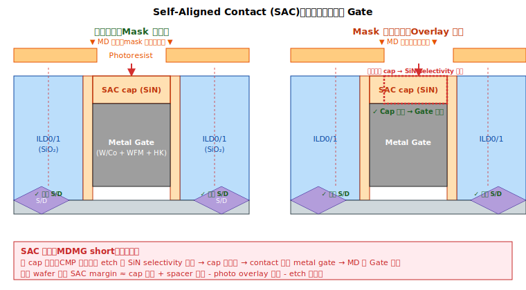

# Chapter 0 — MOL Overview

## 0.1 你會在這章學到什麼

- MOL 在整個製程中的位置與功能
- 為什麼 MOL 在 FEOL 與 BEOL 之間獨立成一個模組
- MOL 的尺寸量級為什麼讓它變成 yield 戰場
- Self-Aligned Contact (SAC) 是什麼、為什麼必要
- 後續章節的閱讀地圖

## 0.2 從 FEOL 接過來：起點狀態回顧

開始讀 MOL 之前，先確認 FEOL 留下什麼：

```
   FEOL 結束時 wafer 表面（沿通道方向剖面）：
   
             SAC cap
             ┌─────┐
       spacer│ SiN │spacer
   ▓▓▓▓▓▓▓   │     │   ▓▓▓▓▓▓▓
   ▓▓▓▓▓▓▓   │  MG │   ▓▓▓▓▓▓▓     ← Metal Gate（HKMG）已就位
   ▓▓▓▓▓▓▓   │  HK │   ▓▓▓▓▓▓▓
   ▓ ILD0 ▓══╪═════╪══▓ ILD0 ▓     ← ILD0 已填好磨平
       ╱╲    │     │    ╱╲
      ╱SD╲   │chnl │   ╱SD╲        ← S/D epi 完成
       ╲╱    │     │    ╲╱
   ════════════════════════════
              Si Substrate
```

**FEOL 留給 MOL 的狀態**：
- 每顆電晶體都已經做好（fin / nanosheet、HKMG、S/D、CMG 都已完成）
- 表面是 **SAC cap + ILD0 + ILD0** 的水平介電平面
- Gate 在 SAC cap 下、S/D 在 ILD0 / CESL 下，**全部還沒有任何金屬通道接到表面**
- 整片 wafer 在電性上**無法被外界存取**

**MOL 要做的事，一句話**：在 FEOL 留下的這片平面上，**為每顆電晶體的 source、drain、gate 各挖一條垂直接觸柱**（MD 接到 S/D、MP 接到 gate、V0 接到 BEOL 入口），並用 silicide 確保接觸電阻夠低。

讀完本冊後再回頭看這張圖，你會看到：
- 每顆 epi 上方多了 silicide → MD → V0
- 每個 metal gate 上方多了 MP → V0
- ILD1 把 V0 與 M0 之間填好

→ 這就是 MOL 的「畢業狀態」（詳見 Ch 7.3）。

## 0.3 MOL 是什麼

回到第一冊的三大階段圖：

```
┌─────────────────────────────────────────────────────────────┐
│  FEOL（Front End of Line）                                    │
│  做出電晶體本身：fin、source、drain、gate                       │
├─────────────────────────────────────────────────────────────┤
│  MOL（Middle of Line）         ← 本冊                         │
│  把 source / drain / gate 三個端點「拉出來」                    │
│  接到第一層金屬（M0）的銜接層                                   │
├─────────────────────────────────────────────────────────────┤
│  BEOL（Back End of Line）                                     │
│  M0 → V0 → M1 → ... → Pad，多層金屬把所有電晶體接成電路        │
└─────────────────────────────────────────────────────────────┘
```

MOL 雖然在中間，但它有**獨特的工程目標**：

1. **介面（interface）工程**：金屬與半導體的接觸點需要極低電阻 → silicide。
2. **垂直連接**：在 FEOL 留下的高低不平地形上，挖出垂直的接觸窗。
3. **致命的鄰近性（proximity）**：source/drain 接點（MD）與 gate 接點（MP）在水平距離上只有十幾奈米 —— 任何工程偏差都會直接造成短路。

這三個特性讓 MOL **單站步驟少、缺陷殺傷力高**，是良率工作的高度集中區。

## 0.4 MOL 的整體形狀

從 FEOL 結束（CMGCMP 完成）到 BEOL 開始（M0 開始 BEOL 的 damascene），MOL 的工作展開成下面這張圖：

```
[CMGCMP 結束]      ← FEOL 終點
       ↓
[1] Dielectric Stack    ← CESL 已存在 + 加上 SAC cap + ILD1
       ↓
[2] MD Photo + Etch     ← 在 source/drain 上挖洞
       ↓
[3] Silicide Formation  ← 在 S/D 表面長 metal silicide（介面工程）
       ↓
[4] MD Liner + Fill + CMP
       ↓
[5] MP Photo + Etch     ← 在 gate 上挖洞
       ↓
[6] MP Liner + Fill + CMP
       ↓
[7] V0 / VG / VD        ← 從 MD/MP 往上做 via 到 M0
       ↓
[BEOL M0 dep]      ← MOL 終點
```

> 註：實際 fab 內可能合併或拆分上述步驟。例如：
> - 部分流程會把 MD 和 MP 整合成「Trench Contact (TC)」一次做完
> - 部分流程在 silicide 之後再把 ILD 補上、再做 fill
> - GAA 製程的 MP 與 MD 整合更複雜
> 
> 各家命名差異很大，但**工程目標一致**：把三個端點安全地拉出來，互不短路、低電阻。

## 0.5 尺寸量級：為什麼 MOL 這麼難

來看一個典型的 N5 製程截面（單位 nm）：

```
   MD ←─ ~25 ─→ MG ←─ ~25 ─→ MD
   │             │             │
   │   絕緣 ~15   │   絕緣 ~15  │      ← 中間的絕緣寬度只有十幾 nm
   │             │             │
   ┌─┐         ┌───┐         ┌─┐
   │M│ spacer  │MG │  spacer │M│
   │D│ ▓▓▓▓▓   │   │  ▓▓▓▓▓  │D│
   │ │         │HK │         │ │
   ═════════════════════════════════
       fin   spacer  fin
```

幾個關鍵尺度：
- **MD-to-MG horizontal gap**: ~10–20 nm（FinFET / GAA）
- **Contact CD**: ~20 nm
- **Contact AR (aspect ratio)**: 5–10:1
- **Silicide thickness**: 5–10 nm

→ **任何 1 nm 級的偏差都可能把絕緣層打穿**，這就是 MDMG short 為什麼如此頻繁的物理根源。

## 0.6 兩個你必須知道的核心觀念

### Self-Aligned Contact（SAC）

如果用傳統做法，每個 contact 都靠 mask align 來避開 gate，那麼**任何 mask overlay 誤差**（哪怕只有 5 nm）都會造成 contact 落到 gate 上 → short。

業界做法：**用結構自動避讓**，不靠 mask 精準。



關鍵元素：
- **Gate cap（SAC cap）**：在 metal gate 頂部蓋一層 SiN cap（hard cap）。形成步驟（gate recess + SiN dep + cap CMP）詳見 [Vol 1 FEOL Ch 8.8](../01-feol/08-replacement-metal-gate.md#88-gate-recess--sac-cap)。
- **Spacer**：gate 兩側已經有 SiN spacer，從 [FEOL Ch 5](../01-feol/05-dummy-gate-spacer.md) 階段就形成。

當 MD contact etch 開窗時，蝕刻化學對 SiN 的 selectivity 高 → SiN cap 和 spacer 被當作「保護傘」 → contact 自動「避開」gate，落到 source/drain 上。

```
   SAC etch 過程：
   
            ┌─────┐ contact 開口（mask 可能稍微歪）
            ▼     ▼
   ╔════════════════════╗
   ║  ILD（被蝕刻）       ║
   ║  ░░░░░░░░░░░░░░     ║
   ╚═══┌────────┐════════╝
       │  cap   │   ← cap 擋住 gate
       │ (SiN)  │
       │ ┌────┐ │
       │ │ MG │ │
       │ │    │ │
       └─┴────┴─┘
```

→ 即使 MD photo 對位有 5 nm 誤差，contact 依然停在正確的位置（落在 S/D 上、不傷 gate）。

但這個保護依賴於：
- **Cap 厚度與品質**
- **Spacer 完整**
- **Etch chemistry 對 SiN/SiO2 的 selectivity 夠**

任何一環失控 → SAC 失效 → MDMG short。

### Silicide

Metal 與 Si 直接接觸的接面電阻（contact resistance, Rc）很高。為了把 Rc 降到可以接受，業界在金屬與 Si 之間插入一層 **金屬矽化物（silicide）**。

```
   Metal (W/Co)
        ↓
   Silicide (TiSi / NiSi / CoSi)   ← 中間轉接層，Rc 大幅降低
        ↓
   Si（S/D epi）
```

選擇 silicide 種類是 N7、N5、N3 演進中的主軸之一（第 3 章詳述）。

## 0.7 為什麼 MOL 是 yield 殺手集中區

幾個結構性原因：

1. **空間最緊**：MD-to-MG 距離十幾 nm，加上 SAC 容錯只有少數幾 nm，物理 budget 極窄。
2. **缺陷會被前段「埋進來」**：CMGCMP 的 ox residue、CMG etch 的殘留、ILD0 的 void —— 這些 FEOL 後段的問題到 MOL 才會放大成電性失效。
3. **Etch 化學最複雜**：要穿透 ILD（SiO2 系）但停在 SiN（cap、spacer、CESL）上，selectivity 要求極高。
4. **Silicide 不可逆**：silicide 一旦反應出來，組成、形貌、厚度都已固定，後段沒有任何修補機會。
5. **單顆 die 失效**：一個 MDMG short 通常就 kill 整顆 die。

這也是 MOL 相關討論長期集中於 MD / MP / CMG / silicide 幾個關鍵字的結構性原因。

## 0.8 一句話總結

> MOL 的本質是：**在 FEOL 的擁擠地形上挖出兩種接觸窗（MD、MP），用 silicide 接好半導體，再從上面用 via 拉到 M0**。它的所有困難都源自於「空間極小」加上「不能短路」這兩個彼此對抗的物理限制。

## 0.9 接下來

下一章 [Chapter 1: Dielectric Stack](./01-dielectric-stack.md) 會詳細講 FEOL 結束時的介電堆疊狀態，以及進入 MOL 時加上的關鍵保護層 —— SAC cap。這是理解後續所有 etch/short 問題的基礎。
