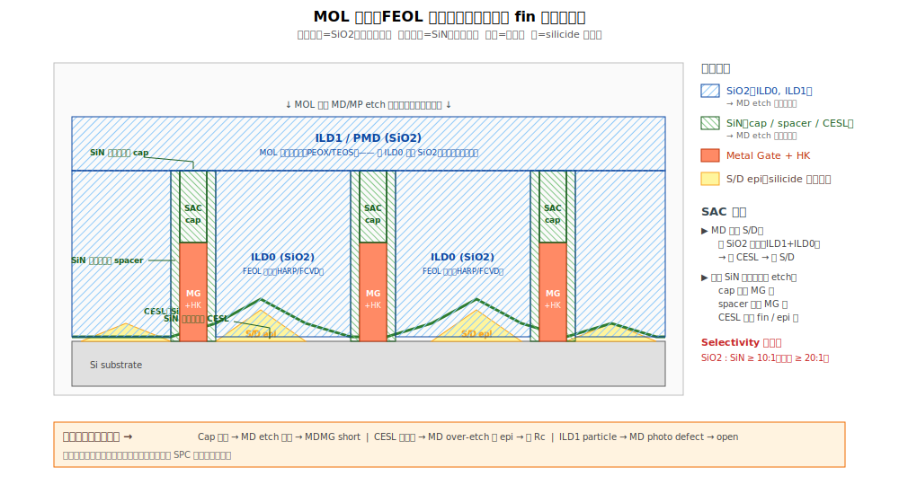

# Chapter 1 — Dielectric Stack（FEOL→MOL 的介電堆疊）

## 1.1 你會在這章學到什麼

- FEOL 結束時 wafer 表面的介電堆疊長什麼樣
- CESL 是什麼、為什麼從 ILD0 階段就先鋪好
- **SAC cap**（gate 頂部的 SiN 帽）的關鍵角色
- Gate cap recess（拆掉 metal gate 頂部換成 SiN cap）是怎麼做的
- ILD1 / Local ILD 的角色與材料選擇
- 介電堆疊的 selectivity 邏輯：為什麼 SiN/SiO2 這對組合貫穿全部 MOL

## 1.2 先決條件

讀本章請先回想 FEOL 第 8 章（RMG）和第 9 章（CMG）的結尾狀態。我們現在從那個狀態接著做。

## 1.3 FEOL 結束後的截面




CMGCMP 完成後，wafer 表面看起來是：

```
═══════════════════════════════════════════════════════
                   截面圖（沿 fin 方向）

   ILD0 │ Spacer │  Metal │ Spacer │ ILD0 │ Spacer │ Metal │ Spacer │ ILD0
   ████ │ ▓▓▓▓ │   Gate │ ▓▓▓▓ │ ████ │ ▓▓▓▓ │  Gate │ ▓▓▓▓ │ ████
   ████ │ ▓▓▓▓ │  ┌───┐ │ ▓▓▓▓ │ ████ │ ▓▓▓▓ │ ┌───┐ │ ▓▓▓▓ │ ████
   ████ │ ▓▓▓▓ │  │HK │ │ ▓▓▓▓ │ ████ │ ▓▓▓▓ │ │HK │ │ ▓▓▓▓ │ ████
   ─────┴──────┴──┴───┴─┴──────┴──────┴──────┴─┴───┴─┴──────┴─────
                CESL（SiN，從 ILD0 之前就鋪好的薄層）
              ╱╲              ╱╲              ╱╲              ╱╲
             ╱  ╲S/D epi     ╱  ╲S/D epi     ╱  ╲S/D epi     ╱  ╲
            ╱fin ╲          ╱fin ╲          ╱fin ╲          ╱fin ╲
═══════════════════════════════════════════════════════
                       Si substrate
```

幾個重點：
- **ILD0**（粗 ████）：填在 gate stripe 之間，寬寬的氧化矽。
- **Spacer**（細 ▓▓▓▓）：gate 兩側的 SiN 側壁，從 dummy gate 時代就一直在。
- **Metal Gate**：HK + WFM + W/Co fill，剛剛 gate CMP 磨平的頂面。
- **CESL**：在 ILD0 沉積之前就鋪好的薄 SiN，**包覆 fin / S/D / spacer 底部**。後面會當作 contact etch 的 stop layer。

## 1.4 從這個狀態進到 MOL 需要什麼

回想 MOL 的兩個主要 contact：
- **MD**：要從上方挖到 S/D epi 表面
- **MP**：要從上方挖到 metal gate 頂面

兩個 contact 在水平上只差十幾 nm。如果直接做，**MD 蝕刻時稍微歪一點就會破壞 metal gate**。

解法：**把 metal gate 頂部「換成」一層厚厚的 SiN cap**，當作 etch 的「保護傘」。當 MD etch 化學打到 SiN cap 時，蝕刻速率大幅降低（selectivity 高），contact 就不會穿透到 gate。

這層 cap 就叫 **SAC cap（Self-Aligned Contact cap）**。

## 1.5 Gate Cap Recess + Cap Fill 流程

```
[1] Metal Gate Recess Etch    ← 把已經磨平的 metal gate 頭部「往下挖一段」
       ↓                        留下一個淺凹槽（~30 nm 深）
[2] SAC Cap Deposition        ← 在這個凹槽裡填 SiN（ALD/PEALD 確保填滿）
       ↓
[3] Cap CMP                   ← 把多餘 SiN 磨掉，與 ILD0 齊平
       ↓
       此時：metal gate 頭被一層 SiN cap 蓋住，與 ILD0 齊平
```

在某些流程中，這幾步是 CMG/CMGCMP 模組的一部分；其他流程則放在 CMGCMP 之後、MOL 之前獨立做。命名差異很大，但邏輯一致。

完成後的截面：

```
═══════════════════════════════════════════════════════
   ILD0 │ Spacer │ SAC cap │ Spacer │ ILD0 │ Spacer │ SAC cap │ Spacer │ ILD0
   ████ │ ▓▓▓▓ │ ╳╳╳╳ │ ▓▓▓▓ │ ████ │ ▓▓▓▓ │ ╳╳╳╳ │ ▓▓▓▓ │ ████
   ████ │ ▓▓▓▓ │ ╳╳╳╳ │ ▓▓▓▓ │ ████ │ ▓▓▓▓ │ ╳╳╳╳ │ ▓▓▓▓ │ ████
   ████ │ ▓▓▓▓ │ ┌──┐ │ ▓▓▓▓ │ ████ │ ▓▓▓▓ │ ┌──┐ │ ▓▓▓▓ │ ████
   ████ │ ▓▓▓▓ │ │MG│ │ ▓▓▓▓ │ ████ │ ▓▓▓▓ │ │MG│ │ ▓▓▓▓ │ ████
   ─────┴──────┴─┴──┴─┴──────┴──────┴──────┴─┴──┴─┴──────┴─────
```

`╳╳╳╳`（密集斜線）表示 SAC cap，與 spacer 同樣是 SiN。從 ILD（SiO2）的角度看，現在 gate 上方有一個由 SiN 包圍的「保護金字塔」（cap + spacer + CESL）。這就是 SAC 機制的物質基礎。

## 1.6 ILD1（也叫 Pre-Metal Dielectric, PMD）

在 SAC cap 完成後，許多流程會再追加一層 SiO2 系介電（**ILD1** 或 **PMD**），把整個表面再墊高一些。為什麼？
- 給 MD/MP 蝕刻提供「足夠深度」做足夠 selectivity
- 提供 V0/VG/VD 的高度餘裕
- 機械保護 SAC cap 在後續製程中不被磨穿

材料：通常是 **PEOX（PE-CVD oxide）** 或 **TEOS-based SiO2**，不需要太特殊（不像 ILD0 要 gap-fill）。厚度 30–80 nm 視製程而定。

> 命名雜訊提醒：「ILD1」、「PMD」、「Cap dielectric」都可能指這層；有些 fab 把 SAC cap 之上、M0 之下的所有介電都統稱為 ILD1。各家差異大，看脈絡。

## 1.7 介電堆疊的 selectivity 邏輯

到 MOL 開工之前，整個 stack 的材料分佈：

| 位置 | 材料 |
|---|---|
| 表面 ILD1 | SiO2 |
| Gate 上方 SAC cap | **SiN** |
| Gate 兩側 spacer | **SiN** |
| Gate 之間 ILD0 | SiO2 |
| Fin/epi 上方薄層（在 ILD0 下） | **SiN（CESL）** |
| Gate 內部 | Metal + HK |

簡化來說：**「想把 MD 接到 S/D」 → 走 SiO2 路徑（ILD1 + ILD0）→ 撞到 CESL（SiN）→ 切穿 CESL → 落到 S/D**。整個過程中，**任何時候打到 SiN 都應該大幅減速**（selectivity 機制保護 gate 與 S/D 邊界）。

這就是為什麼 MOL 的 etch chemistry **核心都是「對 SiO2 高蝕刻、對 SiN 低蝕刻」**：
- 主蝕刻氣體：CxFy 系（如 C4F8、C5F8）
- 添加 H 來增加對 SiN 的 selectivity
- 添加 O 來控制聚合物（polymer）形成

```
   Selectivity ratio (SiO2 / SiN) 在 MOL etch 上要求 >= 10:1
   先進製程的目標是 >= 20:1
```

任何讓這個 selectivity 降低的因素（chamber 條件、wafer 表面狀態、polymer 累積）都會直接讓 MOL 出問題。

## 1.8 典型缺陷

| 缺陷 | 物理樣貌 | 成因 | 後果 |
|---|---|---|---|
| **Gate Cap 太薄 / 不均** | SAC cap 厚度偏離規格 | Recess 過深、cap fill 不滿、CMP 過磨 | SAC selectivity 不夠 → MD 打穿 → MDMG short |
| **Cap Void** | Cap 內有空洞 | ALD step coverage 差 | 接觸 wet 殘留、cap 強度差 |
| **Cap CMP Erosion** | Cap 整體被磨低 | Pattern density 不均 | Cap 厚度不足 |
| **CESL 厚度飄** | Etch 行為飄 | CVD chamber matching | MD etch endpoint 不準 |
| **CESL Damage** | CESL 被前段製程傷到 | Plasma damage、wet 過頭 | MD etch 提前打穿 |
| **ILD1 Particle** | 表面顆粒 | CVD chamber 髒 | MD/MP photo defect、後段 short |
| **ILD1 Thickness 飄** | Wafer 內厚度不均 | CVD 均勻度差 | Trench 深度不一致 → contact 電阻 / contact-to-via 對位飄 |

## 1.9 與 yield 的關係

這層介電堆疊的問題很「**沉默**」—— 站內檢測幾乎看不到，但會在 MD/MP 蝕刻時放大成 short。常見故事：

- **Cap 太薄 5 nm → SAC 失效 → 整批 wafer 在 MD etch 後出現 MDMG short**
- **CESL 厚度飄 → MD etch 在 fin 邊緣 over-etch → 傷到 epi → 高 Rc**
- **ILD1 有 particle → MD photo defect → contact 開不出來 → open**

→ **介電堆疊的 SPC 比 contact 本身更重要**：cap 厚度、CESL 厚度、ILD1 厚度的均勻性是 yield 工程師日常監控的關鍵 metric。

## 1.10 站點對應

| 縮寫 | 全名 | 對應流程 |
|---|---|---|
| **MGREC, GTREC** | Metal Gate Recess etch | gate 頂往下挖 |
| **CAPDEP, SACDEP** | SAC cap deposition | 填 SiN 進凹槽 |
| **CAPCMP, SACCMP** | SAC cap CMP | 磨平 |
| **ILD1DEP, PMDDEP** | ILD1 / PMD deposition | 介電墊高 |
| **ILD1CMP** | ILD1 CMP | （部分流程才有） |

> CESL 在第一冊 7.4 節已介紹過（屬於 ILD0 module 的一部分）。

## 1.11 接下來

介電堆疊就位、SAC cap 與 spacer 形成「SiN 保護傘」之後，進入 MOL 的第一個主角 —— **MD（Metal to S/D Contact）**：[Chapter 2](./02-md-contact.md)。
