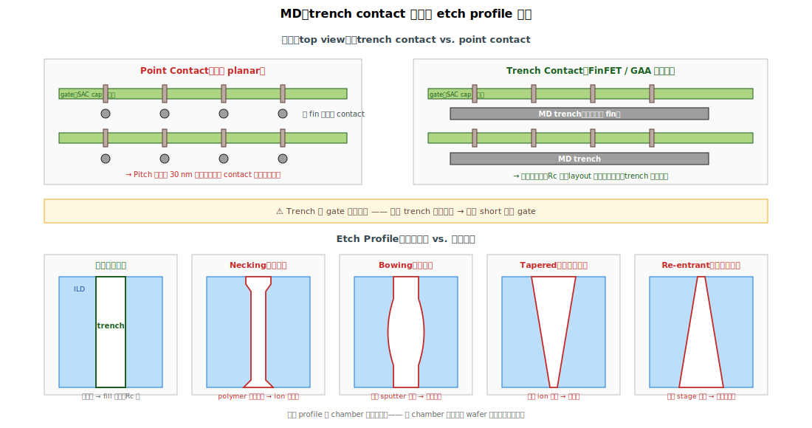

# Chapter 2 — MD（Metal to S/D Contact）

## 2.1 你會在這章學到什麼

- MD 是什麼，為什麼是 MOL 第一個做的 contact
- **Trench contact vs. point contact** 的差異與演進
- MD photo / etch 的關鍵挑戰
- Etch profile：botton CD、necking、bowing
- Etch 終點怎麼定（CESL 雙層蝕刻策略）
- 這個站的典型缺陷與 yield 影響
- 為什麼 MD etch 是 MOL 內最敏感的單站之一

## 2.2 MD 是什麼

**MD（Metal to source/Drain contact）** 是把 source/drain epi 與後段金屬連接的「井（trench）」。

```
   側視圖：

           ┌──┐  ← MD 上方接 V0 / M0
           │  │
           │MD│
           │  │
   ════════│══│════════
           │  │
           ╱╲╱╲   ← S/D epi（菱形磊晶）
          fin
```

每個 NMOS / PMOS 元件都需要兩個 MD（source 與 drain 各一）。

## 2.3 Trench Contact vs. Point Contact




### Point Contact（早期 planar 製程）

每個 S/D 用一個圓形 contact 落地，contact 與 contact 間靠 layout 規則隔開。

問題：當 fin pitch 收緊到 30 nm 以下，圓形 contact 的橫向尺寸吃掉太多布局空間。

### Trench Contact（FinFET / GAA 主流）⭐

不用「點」，而是用一條跨過多顆 fin 的「**長條（trench）**」：

```
   俯視圖（top view）：
   
   ┌─────────────────────────┐  ← MD trench 1（橫跨多個 fin 的 S/D）
   │                          │
   ────fin1────fin2────fin3────
   ↓     ↓     ↓     ↓     ↓     ← spacer / SAC cap 區
   ════════════════════════════  ← gate stripe（被 SAC cap 蓋住）
   ↑     ↑     ↑     ↑     ↑
   ────fin1────fin2────fin3────
   │                          │
   └─────────────────────────┘  ← MD trench 2（橫跨多個 fin 的 S/D）
```

優點：
- 一條 trench 同時接好多個 fin → 接觸面積大、Rc 低
- Layout 上 MD 不用每個 fin 各一顆，省空間

代價：
- Trench 本身的 etch 難度更高（深、窄、長）
- Trench 與 gate 平行延伸，**任何 trench 的牆壁失守都會 short 多顆 gate**

→ 整個 MOL 模組的 layout 邏輯就是：MD（trench）和 MG（被 SAC cap 蓋住）兩種橫條交錯排列，中間靠 spacer 隔開。

## 2.4 MD Photo

MD 是 EUV 主力應用層之一（從 N7 開始）。挑戰：
- **Pitch 極細**：MD-to-MD pitch 與 gate pitch 一致，~50 nm（N5）→ ~40 nm（N3）
- **形狀要長條**：曝光必須有夠強的方向性對比
- **Overlay 容錯極小**：MD 必須精準落在兩條 gate 之間，誤差 < 5 nm

實務上常見的 photo 策略：
- N7 / N5：EUV single patterning
- N3 / N2：EUV LELE（Litho-Etch-Litho-Etch）或高 NA EUV

光阻 stack（MD photo 用的）：
- 底層 organic underlayer
- SOC（Spin-on Carbon）
- SiARC（Si-containing anti-reflective coating）
- EUV 光阻

→ 單純的 photo 變動（dose 飄、focus 飄、scanner stability）就會讓 MD CD 變動 1–2 nm，直接影響後面的 etch。

## 2.5 MD Etch：核心難度

MD etch 要做的事：

```
   表面 ILD1（SiO2）
        ↓ 蝕刻
   ILD0（SiO2）
        ↓ 蝕刻
   CESL（SiN，薄薄一層）
        ↓ 切穿
   S/D epi 表面（停在這）
```

聽起來簡單，但要在「SAC cap」與「spacer」（也都是 SiN）旁邊穿過去而**不蝕刻它們**，難度非常高。

### 兩階段蝕刻策略

```
Stage 1: Main Etch（SiO2 蝕刻）
  • 化學：CxFy 系 + Ar / O2
  • Selectivity SiO2:SiN >= 15:1
  • 蝕穿 ILD1 + ILD0
  • 在 CESL 上「停住」（CESL 厚度只有 10–20 nm，要剛好停在這層）

Stage 2: Liner Open（SiN 蝕刻）
  • 化學：較強的 SiN-friendly chemistry
  • 短時間，只穿 CESL，不傷 epi
  • Soft landing 到 S/D
```

兩階段的轉換時機由 **endpoint detection（電漿光譜變化）** 控制。Stage 1 結束時，蝕刻光譜的 SiO2 副產物（如 CO）強度下降、SiN 副產物（如 CN）強度上升 → 系統切換到 Stage 2。

### Etch Profile 的幾何挑戰

理想的 trench 是垂直筆直：

```
   ┌──┐
   │  │
   │  │
   │  │
   └──┘
```

實際容易出現的偏差：

```
   ┌──┐         ┌──┐         ┌──┐         ┌──┐
   │ │           │  │         │ │          │  │
   │  │         │   │         │ │          │  │
   │ │           │  │         │  │         │  │
   └──┘         └─┘            └──┘        └──┘
   Necking   Bowing       Tapered      Re-entrant
   (上窄)    (中胖)      (上寬下窄)    (上窄下寬)
```

每種偏差的來源不同：
- **Necking（上窄）**：Polymer 在開口處過度沉積堵塞 → ion 進不去
- **Bowing（中胖）**：側壁 sputter 過度 → 中段被斜向離子打寬
- **Tapered（上寬下窄）**：bottom 開不夠、ion energy 不足
- **Re-entrant**：早期 stage 過頭、上方先擴大

→ Etch profile 是**整批 wafer 的 fingerprint**，特定 chamber 跑出來的 profile 會有自己的特色。良率會議上常見的對話：「這批的 MD profile bowing 比規格大，可能是 chamber 8 的 RF coil 老化」。

### Loading Effect

不同 layout 密度的區域，etch rate 會不同：
- **Iso（孤立）**：開口寬、ion 容易進、etch 快
- **Dense（密集）**：開口窄、polymer 多、etch 慢

→ 結果：iso 區的 MD 比 dense 區更深，造成「**iso-dense bias**」。先進蝕刻機台會用 **DARC（differential etching）** 化學配方來平衡，但無法完全消除。

## 2.6 SAC etch 的關鍵時刻

當 MD photo 對位輕微歪掉、開口部分蓋到 gate 區時：

```
   理想對位                  Mask 歪掉一點
   
        ▼                          ▼
   ▒▒▒▒▒▒▒▒                    ▒▒▒▒▒▒▒▒    ← MD photo 開口
        │                          │
   ┌────┴────┐                ┌────┴────┐
   │         │                │ ⚠ 部分  │
   │ ILD0    │                │ 蓋到    │
   │         │                │ gate   │
   ▓▓▓ SAC ▓▓▓                ▓▓▓ SAC ▓▓▓  ← SAC cap 應該擋住
   ▓▓ cap ▓▓▓                 ▓▓ cap ▓▓▓
   ┌─────────┐                ┌─────────┐
   │   MG    │                │   MG    │
   │         │                │         │
```

理想情況：SiN 的 selectivity 救你 —— SiO2 部分繼續被蝕，SAC cap 紋風不動，contact 自動避開 gate。

失敗情況：cap 太薄、selectivity 不夠、etch 過頭 → **SAC cap 被打穿** → contact 落到 metal gate 上 → MDMG short。

→ 這就是「**SAC etch margin（餘裕）**」的工程意義：保證在合理的 mask 偏移、etch 飄移下，cap 還能擋住。

## 2.7 Post-Etch Clean

蝕刻完之後，trench 內部有：
- Polymer 殘留（CxFy 反應產物）
- Native oxide（S/D epi 表面瞬間長的 SiO2）
- 蝕刻產生的雜質

下一站做 silicide 之前必須清乾淨：
- **Wet clean**：稀 HF + 有機溶劑混合
- **Dry clean (SiCoNi)**：低溫、selective、對 epi 不傷

清得不夠 → silicide 長不上、Rc 高；清過頭 → epi 被吃進去、形貌變差。又是一個窄 process window。

## 2.8 典型缺陷

| 缺陷 | 物理樣貌 | 成因 | 後果 |
|---|---|---|---|
| **MD Photo 對位偏** | Mask 偏離設計位置 | Scanner overlay 飄 | SAC margin 不夠 → MDMG short 風險 |
| **MD CD 飄** | Trench 寬度偏離規格 | Photo dose / focus、resist 變動 | Rc 飄、Vdsat 飄 |
| **Necking / Bowing** | Trench profile 不直 | Etch chemistry / chamber | Fill 困難、void、Rc 高 |
| **Etch 不穿（open fail）** | Trench 沒打到 epi | Stage 2 endpoint 沒抓到、polymer 過度堆積 | 元件 open |
| **Etch 過頭** | 打進 epi 或 fin | Stage 2 過頭、CESL 太薄 | Epi 損傷、Rc 飆 |
| **SAC Punch-through** | Cap 被打穿，trench 落到 gate | Cap 太薄、selectivity 不足、photo 偏 | **MDMG short** ⭐ |
| **Spacer Damage** | Spacer 被蝕薄 | Selectivity 不夠 + 過蝕刻 | Gate-S/D leakage |
| **Polymer 殘留** | Trench 內壁有 CFx 殘留 | Clean 不徹底 | Silicide 長不上、Rc 高 |
| **Native Oxide** | Trench 底部長薄氧化 | Queue time 過長、清洗不徹底 | Silicide 不接、open |
| **Loading 造成深度不均** | iso vs. dense 區深淺差 | Etch chamber 行為 | 元件性能不均 |

## 2.9 與 yield 的關係

MD etch 的 fingerprint 在 wafer 上極為明顯：
- **Chamber matching**：不同 chamber 的 wafer 會有系統性的 CD / profile 偏移
- **Center-to-edge**：plasma 不均勻造成同心圓 signature
- **Slot-by-slot**：同一 batch 內不同位置的 chuck 條件不同

當你在會議上看到 wafer map 是同心圓 + 集中在 chamber X，幾乎可以鎖定是 MD etch。

更深層的 RCA 關連：
- **MDMG short Pareto** → 先看是 SAC punch-through 還是 contact landing 偏 → 看 cap 厚度（FEOL 模組）vs. MD photo（MOL 模組）
- **Open fail Pareto** → 多半是 etch open fail 或 silicide 沒長 → MD etch 與 silicide 兩站合查

## 2.10 站點對應

| 縮寫 | 全名 | 對應流程 |
|---|---|---|
| **MDPHO, MDPH** | MD photo | Photo |
| **MDETCH, MDETC** | MD etch | Etch |
| **MDCLN, POSTCLN** | MD post-etch clean | Clean |

某些 fab 把 MD 與 MP 整合稱 **TC（Trench Contact）**，命名變成 TCPHO / TCETCH。語義基本相同。

## 2.11 接下來

MD trench 開好、清乾淨之後，下一個關鍵步驟是在 trench 底部長 silicide —— 這是金屬接半導體最重要的介面工程。請接 [Chapter 3: Silicide](./03-silicide.md)。
