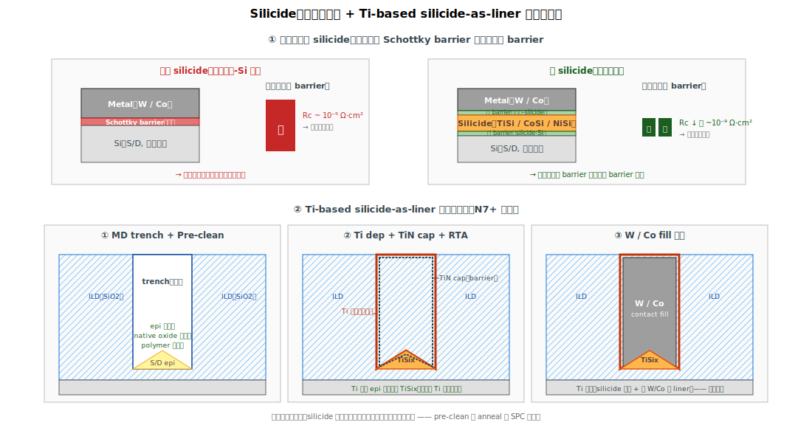

# Chapter 3 — Silicide（金屬-半導體介面工程）

## 3.1 你會在這章學到什麼

- 為什麼金屬不能直接接矽 —— Schottky 與接觸電阻的物理
- Silicide 是什麼，怎麼形成
- TiSi2、CoSi2、NiSi、Ti-based silicide 的演進史
- **Salicide（self-aligned silicide）**vs. Trench silicide
- 先進製程的關鍵：**Ti-based silicide-as-liner** 整合
- Silicide 的典型缺陷：agglomeration、piping、missing
- 為什麼 silicide 階段是「不可逆」工程

## 3.2 為什麼需要 silicide




### 直覺：金屬直接接矽會卡

水管比喻：當兩段水管直接對接，但管口寬窄不同 → 接縫處會「卡」、水流變慢。電流通過「金屬–半導體」介面也是類似情況：兩種材料的「電子工作環境」不對稱（具體是**功函數差異**），介面就有「**接觸電阻 Rc**」。

直接金屬落在矽上的情況：

```
   Metal (W / Co)
   ━━━━━━━━━━
   Schottky barrier ← 電子要「跨過去」，但 barrier 高，過得慢
   ━━━━━━━━━━
   Si (S/D)
```

在現代製程，這個 Rc 高達 ~10⁻⁵ Ω·cm²，遠高於可接受值（~10⁻⁹）。元件做再好，訊號也卡在這裡。

> 「Schottky barrier」與「ohmic contact」的詳細定義見 [附錄 A.4](./A-qa.md#a4-silicide-為什麼能降低接觸電阻)；接觸電阻 Rc 的尺度與重要性見 [附錄 A.2](./A-qa.md#a2-接觸電阻contact-resistance-rc-是什麼為什麼關鍵)。

### 解法：插入一層 silicide

在金屬與矽之間插入「金屬矽化物（metal silicide）」當中介，把高 Schottky barrier 拆成兩個低 barrier：
- Silicide 與重摻矽形成低 barrier 的歐姆接觸
- Silicide 與上方金屬的接觸幾乎是純金屬-金屬，電阻極低
- 雙重接觸串聯後，總 Rc 可降到 ~10⁻⁹ Ω·cm² 以下

```
Without silicide:                With silicide:
   Metal                              Metal
   ━━━━━                              ━━━━━
   Schottky barrier (壞)              Silicide (TiSi/CoSi/NiSi)
   ─────                              ─────
   Si (S/D)                           Low-barrier contact (好)
                                      ─────
                                      Si (S/D)
```

## 3.3 Silicide 形成的化學

把金屬鋪到矽上，**加熱**會讓兩者反應形成矽化物：

```
   M（金屬薄膜）
   ━━━━━
   Si（基板）       + 熱處理（200–800 °C）→
   
                    M-Si reacts → MSi 或 MSi2
```

不同金屬的反應：
- **Ti + Si** → TiSi（C49 phase, ~700 °C）→ TiSi2（C54, ~750 °C，低電阻）
- **Co + Si** → CoSi（~500 °C）→ CoSi2（~700 °C）
- **Ni + Si** → Ni2Si（~250 °C）→ NiSi（~400 °C）→ NiSi2（~750 °C，高電阻避免）

**選擇性（self-aligned）特性**：金屬只與「裸露的 Si」反應，不與 SiO2 / SiN 反應。所以反應後，多餘的金屬（沉積在介電上的部分）可以用選擇性 wet etch 拿掉，只留下 silicide 在 S/D 上 —— 這就是 **Salicide** 命名的來源（**S**elf-**A**ligned silicide）。

## 3.4 Silicide 演進史

| 時代 | 主流 silicide | 特點 |
|---|---|---|
| 0.5 µm 以前 | 無 silicide / TiSi2（C49） | 性能尚可 |
| 0.25–0.13 µm | **TiSi2（C54）** | 主流，但對 narrow line 不利（C49→C54 轉換受 line width 影響） |
| 90–45 nm | **CoSi2** | 解決 TiSi2 narrow line 問題 |
| 32–16 nm | **NiSi / NiPtSi** | 更低反應溫度、薄、適合淺接面 |
| FinFET（16 nm 起） | **NiSi → 走向 Ti-based silicide-as-liner** | 因為 fin 表面是 3D，傳統 salicide 不好 |
| N7 以下 | **Ti / TiN as silicide-and-liner** | 新範式（下節詳述） |

每一代的更換原因：上一代撞到了某個物理或工程極限。NiSi 因為 epi 形貌（菱形 SiGe）的整合困難，FinFET 之後不再是首選。

## 3.5 先進製程：Ti-based Silicide-as-Liner ⭐

從 N10/N7 開始，業界轉向**「Ti 同時當 silicide 與 contact liner」**的整合方式。流程：

```
[1] MD Trench 開好（前章）
       ↓
[2] Pre-clean：去 native oxide，露出乾淨的 epi
       ↓
[3] Ti Deposition（PVD/CVD），在 trench 內保形長 ~5–10 nm Ti
       ↓
       Ti 接觸 epi（SiGe / SiP）的部分會立即反應形成 TiSix
       Ti 落在 ILD/cap/spacer 上的部分維持金屬 Ti
       ↓
[4] TiN Cap Deposition：保護下方 Ti，當 W/Co 的 barrier
       ↓
[5] RTA / Soak Anneal：誘導 TiSix 反應完成，達到低電阻相
       ↓
[6] W/Co/Ru Fill（下一章）
```

關鍵特徵：
- **Ti 既是 silicide 來源，也是 contact 的 liner**
- **不需要把多餘 Ti 拿掉**（因為它本來就是 liner，留著反而有用）
- TiN 同時提供 W fill 的 barrier 與 W 黏附

→ 這個整合大幅簡化模組（少了一道 selective etch），但對 Ti 沉積的均勻性、保形性、化學純度都有極高要求。

### 為什麼選 Ti

1. **Reactivity 高**：跟 SiGe / SiP 都能反應形成低電阻 silicide
2. **熱穩定**：對後續 BEOL 熱預算友善
3. **Barrier 性質好**：TiN 可同時當 W/Co fill 的 barrier
4. **保形沉積成熟**：CVD-Ti、PVD-Ti 都能做到

代價：對於不同摻雜的 epi（NMOS SiP vs. PMOS SiGe），silicide 的形成行為不同 → 需要分別優化 anneal、有時候還要 dual-silicide 工程（Ni 給 NMOS、Ti 給 PMOS）。

## 3.6 Salicide vs. Trench Silicide

| 維度 | 傳統 Salicide（planar 時代） | Trench Silicide（FinFET 時代） |
|---|---|---|
| **時機** | LDD 之後、ILD 之前 | MD trench 開好之後 |
| **目的** | 在大面積 S/D 上長 silicide，後段 contact 落上去 | 只在 trench 底部 epi 上長 silicide |
| **多餘金屬處理** | Selective wet etch 拿掉 | 留著當 liner 用 |
| **接觸電阻** | 較高（介面比較深） | 較低（直接在 trench 底部接到 fill） |
| **整合複雜度** | 較簡單 | 較複雜，但好處多 |

主流先進製程是 **trench silicide**（FinFET、GAA 都是）。Salicide 在 mature node（28/40 nm）還在用。

## 3.7 Pre-Silicide Clean：成敗的關鍵

silicide 對表面清潔極度敏感。MD trench 開完之後到 Ti 沉積之前，**一切都必須極乾淨**：

關鍵威脅：
- **Native Oxide**：epi 暴露後幾秒內就會長一層原生 SiO2
- **Etch Residue**：CFx polymer
- **Particle**：機台搬運帶入

清潔工具箱：
- **Dilute HF**：去 native oxide，但會吃 SiO2 介電（Selective control 重要）
- **SiCoNi（plasma SiF + Cl 混合）**：選擇性高，對 epi 不傷
- **Anneal in H2/NH3**：去除最後一層原生氧
- **In-situ H2 bake**：在 PVD 前在同一 chamber 內加熱去氧

→ 任何一環失敗，silicide 都長不出來、或長得不均勻。**queue time（QT）控制是核心 SPC 項目**：trench 開完到 Ti dep 之間 < 1 hr 是常見 spec。

## 3.8 典型缺陷

| 缺陷 | 物理樣貌 | 成因 | 後果 |
|---|---|---|---|
| **Silicide Missing** | 局部沒有 silicide | Pre-clean 不徹底、polymer 殘留、native oxide | Open contact、Rc 飆升 |
| **Silicide 厚度不均** | Wafer 內不同位置厚度差 | Ti dep 均勻度、anneal 不均 | Rc 變動、parametric drift |
| **Silicide Agglomeration** | Silicide 「結球」斷裂 | Anneal 過頭、表面能量主導 | 部分區域沒 silicide → open / high Rc |
| **Silicide Piping** | Silicide 沿著 dislocation 鑽進矽裡（NiSi 經典缺陷） | NiSi 的 spike/encroachment 行為 | Junction leakage、device fail |
| **NiSi → NiSi2 轉相** | NiSi 在熱預算下變成高電阻 NiSi2 | 後段熱步驟過熱 | Rc 上升 |
| **Ti 不均** | PVD step coverage 差 | 機台條件、trench AR 高 | 邊角 silicide 薄、可靠度差 |
| **TiN 不連續** | Liner 有裂縫 | CVD step coverage、應力 | 後續 W fill barrier 失效、F 攻擊 silicide |
| **Selectivity 失效**（salicide 時代） | Silicide 跑到不該長的地方 | Selective etch 不夠、表面污染 | Layout 短路 |

## 3.9 與 yield 的關係

Silicide 是 MOL 中**最不可逆**的工序：一旦反應出來，組成、形貌、厚度就固定了，後段任何 fab process 都救不回來。所以這站的 SPC 極為嚴格：
- Sheet resistance（Rs）量測
- Silicide 厚度 X-SEM / TEM
- Contact resistance test structure（Kelvin / TLM）

典型 yield 連結：
- **Rs spec out** → 整 batch silicide 偏厚 / 偏薄 → Ti dep 或 anneal 條件飄
- **Rc parametric outlier** → 局部 silicide 缺陷 → pre-clean 站問題
- **Wafer center high-Rc, edge normal** → Anneal 不均（chamber tilt 或 lamp 老化）
- **Specific die location fail** → MD etch 殘留 → silicide 沒長

→ Silicide 的問題很少獨立發生，往往是「**前一站的 etch / clean → silicide 表現異常 → 後段 Rc 異常**」這條鏈上的中間環節。RCA 上單看 silicide 站很容易找不到原因，要往前推到 etch / clean。

## 3.10 站點對應

| 縮寫 | 全名 | 對應流程 |
|---|---|---|
| **PRECLN, MDCLN** | Pre-silicide clean | 清表面 |
| **TIDEP, TIPVD** | Ti deposition | Liner / silicide source |
| **TINDEP, TINPVD** | TiN cap deposition | Barrier |
| **SILRTA, SILANL** | Silicide RTA | 反應 anneal |
| **NIDEP, NIPVD** | Ni deposition（NiSi 流程才有） | 對應 NiSi |
| **SILSEL, SILETC** | Selective etch（salicide 流程才有） | 拿掉多餘金屬 |

## 3.11 接下來

Silicide 形成、liner 鋪好之後，trench 還是空的中央。下一步是 W/Co/Ru fill 把它填滿，再 CMP 磨平。這在多數流程中與 silicide 屬於同一個整合流程，下一章一併涵蓋 MD fill 與 MP module —— [Chapter 4: MP Contact](./04-mp-contact.md)。
