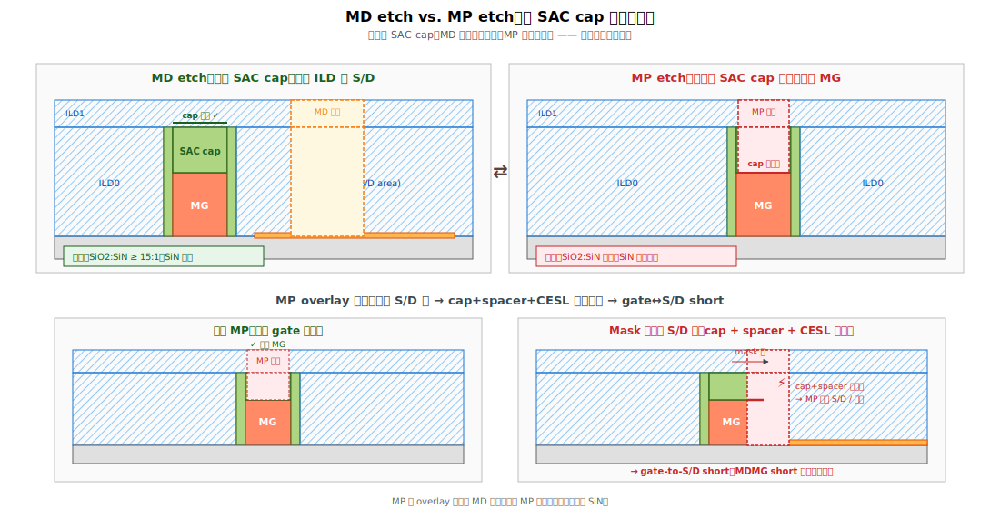

# Chapter 4 — MP（Metal to Gate Contact）+ MD/MP Fill

## 4.1 你會在這章學到什麼

- MP 是什麼，為什麼在 MD 之後做（非絕對，依流程）
- MD trench fill：W 與 Co 的選擇、bottom-up 沉積
- MD CMP：磨平的策略
- MP photo/etch 的特殊挑戰：必須打穿 SAC cap
- 多種模組整合：Combined MD/MP 與分離流程
- 典型缺陷與 yield 關連

## 4.2 流程整合的兩種模式

不同 fab、不同節點，MD 與 MP 的順序略有差異。常見兩種：

### Mode A：Sequential（先 MD 再 MP）

```
[1] MD photo + etch + silicide + fill + CMP（第 2、3 章）
       ↓
[2] MP photo + etch（穿 SAC cap 到 metal gate）
       ↓
[3] MP fill + CMP
```

優點：MD 與 MP 各自最佳化、互不干擾。
缺點：兩道 mask、兩次 fill/CMP，cycle time 長。

### Mode B：Combined（MD/MP 一起做）

```
[1] Trench Contact（TC）photo：兩種 contact 同時開
       ↓
[2] TC etch：兩種開口同時蝕刻
       ↓
[3] Silicide（只在 epi 區形成）+ fill + CMP
```

優點：少一道 mask、cycle time 短。
缺點：兩種 contact 蝕刻深度不同（MD 要打穿全部 ILD，MP 只到 SAC cap 上方），需要在同一道 etch 內處理 depth-loading 問題。

→ 各家 fab 命名、流程都不一樣。本章以 **Mode A（sequential）** 為主敘述，因為步驟拆得清楚比較好理解。

## 4.3 MD Fill：W、Co、Ru 的演進

### Tungsten（W）—— 老主力

```
   [1] 在 Ti/TiN liner 上面 CVD 長 W：WF6 + H2 → W + 6HF
   [2] 從 trench 兩側往中間 conformal 長
   [3] 最終形成「from-side 沉積」
```

W 的問題：
- **F 攻擊**：WF6 會釋放 F，可能腐蝕下方 Ti silicide → 必須有完整 TiN barrier
- **電阻較高**（vs. Co、Ru）
- **Step coverage 限制**：細 trench 中央容易留 seam 或 void

### Cobalt（Co）—— FinFET 後段嘗試

優點：
- **電阻較低**（W 的 70% 左右）
- **Bottom-up 沉積**可實現（用 CVD-Co 配合特殊氣體化學）
- 對 narrow trench 更友善

代價：
- **Electromigration（EM）較弱**（比 W 差）
- **整合難度高**：CMP slurry、selective etch 都需要重新工程
- **Defect 模式不同**：Co void 與 Co protrusion 是新挑戰

業界經驗（截至 2026）：Intel 較早全面導入 Co MD fill；TSMC 在 N7 引入但 N5 又有部分倒退回 W；Samsung 走自己的路徑。

### Ruthenium（Ru）—— N3/N2 的候選

優點：
- 不需要 barrier（barrier-less fill）
- 電阻低、EM 好
- 對下方 silicide 不腐蝕

代價：
- **CMP 困難**（Ru 化學惰性高）
- **成本高**
- 整合不成熟

→ 各 fab 在 N3/N2 都在評估 Ru，主流仍以 W/Co 混用為主。

## 4.4 Bottom-Up Fill：理想與現實

最理想的填法是「從底部往上長」（bottom-up），這樣不會留 seam：

```
   理想 bottom-up：              現實 conformal：
                                  
   ┌────────┐                    ┌────────┐
   │░░░░░░░░│                    │░░░│ ░░░│  ← seam in middle
   │░░░░░░░░│                    │░░░│ ░░░│
   │░░░░░░░░│                    │░░░│ ░░░│
   │░░░░░░░░│ ← 從下往上完整     │░░░░░░░░│
   ╰────────╯                    ╰────────╯
```

實現 bottom-up 的方法（針對 Co）：
- 表面選擇性化學（在 silicide 上長得快、在 ILD 上長得慢）
- 抑制劑（inhibitor）添加，減緩側壁與頂部沉積

對 W：較難純 bottom-up，多用「**hybrid**」（先 conformal 一段，後 fill）。

## 4.5 MD CMP

把表面多餘的 W/Co/TiN 磨掉，露出乾淨的 ILD1 表面。挑戰：
- **多材料 selectivity**：W vs. TiN vs. ILD1 polish rate 要平衡
- **Dishing**：MD 區比 ILD 軟，容易凹下去 → 影響後續 V0 對位
- **Pattern density 差異**：dense MD 區整體被磨低（erosion）

→ MD CMP dishing 是「contact resistance ↑」與「V0 to MD short」的常見起源。

## 4.6 MP Photo + Etch 的特殊挑戰




MP 要從 ILD1 表面往下打到 metal gate。距離雖然不深，但有兩個獨特問題：

### 問題 1：必須穿過 SAC cap

MD etch 的時候，我們是「**靠 SAC cap 保護**」；MP etch 反過來，**必須把 SAC cap 打掉才能接到 gate**。

這意味著 MP etch 不能用同一套化學：
- MD：對 SiN 高 selectivity（保護 SAC cap）
- MP：對 SiN 低 selectivity（打穿 SAC cap）

如果 fab 用 combined TC etch，這個矛盾就要在同一道蝕刻內處理 → 通常分兩階段或用特殊化學配方。

### 問題 2：MP 一旦偏向 S/D 側

MP photo 對位偏 → contact 部分蓋到 gate 兩側 spacer + epi 區：

```
   理想 MP                      Mask 偏向 epi 側
   ┌──┐                        ┌──┐
   │  │                        │ │←─ 部分覆蓋 epi 區
   │  │                        │  │
   │  │                        │  │
   ▓▓▓▓▓▓                      ▓░░▓▓▓
   ▓ MG ▓                      ▓ MG ▓
```

如果 MP etch 化學會打穿 SiN（要打 cap），它也會打穿 spacer / CESL → 直接接到 epi → **gate-to-S/D short（同樣是 MDMG short 的對偶情境）**。

→ MP 對 overlay 的容錯比 MD 更小，因為 MP 本來就要打穿 SiN。

## 4.7 MP Fill

材料選擇與 MD 類似（W / Co），但 trench 形狀不同：
- MP trench 比較淺（< 50 nm）
- MP trench 比較窄（CD ~20 nm）
- AR 中等（~3:1）

通常用 CVD-W + Ti/TiN liner 或 Co with selective fill。完成後 CMP 與 ILD1 齊平。

## 4.8 典型缺陷

| 缺陷 | 物理樣貌 | 成因 | 後果 |
|---|---|---|---|
| **Fill Void / Seam** | Trench 內部空洞或縫 | Bottom-up 沉積不夠、step coverage 差 | Rc ↑、EM 差、wet 殘留 |
| **W F-attack** | TiN barrier 破洞、F 腐蝕 silicide | TiN coverage 差 | High Rc、open |
| **Co Protrusion** | Co 往 ILD 上「擠出來」 | Co growth 失控 | CMP 殘留、後段 short |
| **CMP Dishing** | MD/MP 區凹陷 | 軟金屬 polish 過快 | V0 對位飄、Rc 變動 |
| **CMP Erosion** | Dense MD 區整體被磨低 | Pattern density | ILD 不平 → 後段 short |
| **Slurry Particle** | 表面顆粒 / 刮痕 | CMP 漿料異常 | Killer defect |
| **MP SAC 打不穿** | MP 沒接到 gate | Etch 不夠 / 化學不對 | Open contact |
| **MP 偏向 S/D 側** | MP 蓋到 spacer/CESL/epi | Photo overlay | Gate-to-S/D short |
| **MD 與 MP 在 CMP 後 short** | 兩種 contact 的金屬被磨平時相連 | Slurry / pad smearing | Hard short |

## 4.9 與 yield 的關係

MD/MP fill + CMP 是 MOL 內**最容易產生 wafer 級 fingerprint** 的工序。常見 wafer signature：

- **Center-to-edge dishing 差異**：CMP head pressure 不均
- **Chamber-fingerprint void**：W/Co dep chamber-by-chamber 差異
- **Slot-by-slot Rc**：多 chamber polishing 的 slot 變動

RCA 上的常見故事：
- **Rc Pareto 異常 + center fail** → CMP dishing 過度，contact 高度不對
- **MDMG short 集中在某 chamber** → MP etch chamber 失控
- **Cobalt protrusion 集中在 wafer 邊** → Co dep chamber 邊緣 plasma 不均

## 4.10 站點對應

| 縮寫 | 全名 | 對應流程 |
|---|---|---|
| **MDFILL, WFILL, COFILL** | MD fill (W/Co) | Fill |
| **MDCMP** | MD CMP | 磨平 |
| **MPPHO** | MP photo | Photo |
| **MPETCH, MPETC** | MP etch | Etch |
| **MPFILL** | MP fill | Fill |
| **MPCMP** | MP CMP | 磨平 |
| **TCPHO, TCETCH, TCFILL, TCCMP** | Combined Trench Contact | Mode B 流程 |

## 4.11 接下來

MD 與 MP 都做好了，三個端點都已拉到 ILD1 表面。下一步是從這個平面往上做 via，連到 BEOL 的第一層金屬 M0 —— [Chapter 5: Vias to M0](./05-vias-to-m0.md)。
