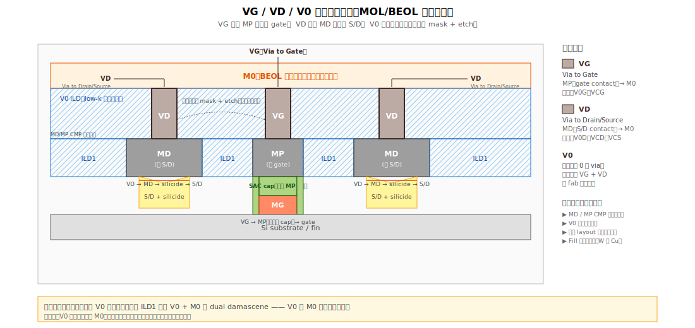
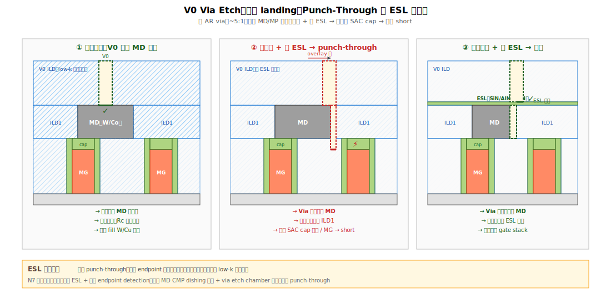

# Chapter 5 — Vias to M0（VG / VD / V0）

## 5.1 你會在這章學到什麼

- VG、VD、V0 各是什麼，命名邏輯
- 從 MD/MP 表面拉到 M0 的整段 via 工程
- Via etch 的特殊難度：高 AR、stop layer 切換
- 為什麼這層的 via 是 MOL/BEOL 銜接的「咽喉」
- Via 的典型缺陷：punch-through、open、misalignment
- 銜接 BEOL 的角色

## 5.2 命名地圖




各家 fab 命名差異不小，先建立一個對照：

| 名稱 | 從哪到哪 | 別名 |
|---|---|---|
| **VG（Via to Gate）** | MP（gate contact） → M0 | V0G、VCG |
| **VD（Via to Drain/Source）** | MD（S/D contact）→ M0 | V0D、VCD、VCS |
| **V0** | 通稱「第 0 層 via」，可能涵蓋上述兩者 | 視 fab |

> 在很多新製程，MP 與 MD 高度（top surface）已經一致，所以 VG 和 VD 是同一道 mask + etch + fill，僅 layout 上區分。
> 
> 部分 fab 沒有「VG/VD」獨立層，而是直接在 ILD1 上做 V0 + M0 的 dual damascene。各家命名與整合不同，以下以「需要 via 從 MD/MP 連到 M0」的通用情境敘述。

## 5.3 場景：MD/MP CMP 之後的表面

```
═══════════════════════════════════════════════════════
   截面：

   ILD1 │ MP │ ILD1 │ MD │ ILD1 │ MP │ ILD1 │ MD │ ILD1
   ████ │XXXX│ ████ │WWWW│ ████ │XXXX│ ████ │WWWW│ ████
   ████ │XXXX│ ████ │WWWW│ ████ │XXXX│ ████ │WWWW│ ████
   ████ │SAC │ ████ │ T  │ ████ │SAC │ ████ │ T  │ ████
   ████ │CAP │ ████ │ i  │ ████ │CAP │ ████ │ i  │ ████
   ────────────────────────────────────────────────────
                   ...（FEOL / 下方已完成）
═══════════════════════════════════════════════════════

   現在表面是平整的：MD/MP 與 ILD1 共面
```

從這個平面，我們需要做出一些 via，連到上方即將沉積的 M0。

## 5.4 Via to M0 流程

```
[1] Via Etch Stop Layer（VESL）  ← 在 ILD1 上鋪一層薄 SiN/AlN（部分流程才有）
       ↓
[2] V0 ILD Deposition            ← 沉積 SiO2 / SiOC（low-k 開始進場）
       ↓
[3] V0 Photo                     ← 印 via 圖案
       ↓
[4] V0 Etch                      ← 蝕穿 ILD，停在 MD/MP 表面或 VESL
       ↓
[5] V0 Liner（TaN / TiN）        ← Diffusion barrier
       ↓
[6] V0 Fill                       ← W 或 Cu seed + Cu electroplating
       ↓
[7] V0 CMP                       ← 磨平
```

通常與 M0 整合成 **dual damascene**：via 與 M0 trench 一道做完。

### Dual Damascene 流程

```
[1] M0 ILD（low-k SiOCH）
       ↓
[2] Via Photo + 蝕刻較深（via 部分）
       ↓
[3] Trench Photo + 蝕刻較淺（M0 trench）
       ↓
[4] 兩階段蝕刻完，形成「下方圓孔 + 上方溝」的形狀
       ↓
[5] Liner + Cu seed + ECP（電鍍 Cu）+ CMP
```

→ 這已經算 BEOL 的範疇，本書第三冊會詳細展開。本章只到「via 把 MD/MP 拉上來」為止。

## 5.5 Via Etch 的特殊難度




### High AR（高深寬比）

V0 的開口可能 ~20 nm，深度 ~80–100 nm，AR 達 5:1 以上。蝕刻挑戰：
- 開口處 polymer 累積 → necking
- 深處 ion 衰減 → tapered
- Bowing 也是常客

→ Via etch 是 fab 內最敏感的 dry etch 之一，profile fingerprint 極強。

### Stop Layer 雙重困境

理想：via 蝕到 MD/MP（W/Co）就停。

問題：
- **MD/MP 表面是金屬**，蝕刻化學打到 W/Co 行為複雜
- **MD CMP dishing 後**，via 落點高度可能不一致
- **若 misalignment 落到 ILD 上**，會繼續蝕下去 → **via punch-through**

```
   理想對位                    對位偏掉
   
        ▼                          ▼
        │                          │
   ┌────│────┐                ┌────│────┐
   │ ILD│    │                │ ILD│    │
   │    │    │                │    │   ← via 蝕刻穿過 ILD
   │    ▼    │                │    ▼ 沒停在 MD 上
   │ ════│   │                │ ═══│  打到隔壁 MD
   │  MD │   │                │ MD ▼
   │     │   │                │  穿到下方 SAC cap、metal gate
   ↓ 對到 MD                   ↓ Via punch-through
```

Punch-through 的後果：via 落到 SAC cap → 繼續蝕 → 接到 metal gate → **VG-to-MD short 或更深層的 short**。本質上這是 MDMG short 的一種變體（從 V0 階層發生）。

### Etch Stop Layer（ESL）的角色

許多流程在 ILD1 與 V0 ILD 之間夾一層薄 SiN/AlN/SiCN 當 stop layer。功能：
- 防止 via etch 過頭
- 提供 endpoint detection 訊號
- 把 misaligned via 強制停在 ESL 上，避免 punch-through

代價：
- 多一層介電影響電容
- Low-k 趨勢與高 k stop layer 衝突

→ N7 以下，許多製程採「**stop layer-less + 精準 endpoint detection**」策略，而不是傳統厚 stop layer。

## 5.6 Via Fill 與 MOL/BEOL 的分界

V0 fill 通常用：
- **W**（傳統，stop on liner）
- **Cu**（dual damascene 開始）

→ 一旦進入 Cu，整個工程典範就變成 BEOL：
- Damascene 流程
- Low-k ILD
- 電鍍 + CMP
- Electromigration / TDDB 的 reliability 主導

所以「**MOL 的結束**」其實是個漸變區，看你怎麼定義：
- 嚴格定義：MOL 結束於 V0 fill，M0 後屬於 BEOL
- 寬鬆定義：MOL 結束於 MD/MP CMP，V0 屬於 BEOL

各家 fab 內部分類不同。本書採嚴格定義，把 V0 算進 MOL。

## 5.7 典型缺陷

| 缺陷 | 物理樣貌 | 成因 | 後果 |
|---|---|---|---|
| **Via Open** | Via 沒接到 MD/MP | Etch 不夠、polymer 殘留、liner 不連續 | 元件 open |
| **Via Punch-through** | Via 穿過 MD 落到下方 | 對位偏 + etch 過頭 + 沒 stop layer | Short 到 gate / S/D / fin |
| **Via CD 飄** | Via 寬度偏離規格 | Photo dose / focus | Rc 飄 |
| **Via Profile 異常** | Necking / bowing | Etch chemistry | Fill 困難、void |
| **Liner 不連續** | Barrier 有缺口 | PVD step coverage | Cu 擴散到 ILD、TDDB 早夭 |
| **Cu Void** | Via 內 Cu 不連續 | Seed 不均、ECP 不順 | Open / EM 差 |
| **Via-to-MD Misalignment** | 對位偏 | Overlay | Rc ↑、邊角 short |

## 5.8 與 yield 的關係

V0 階段的問題是「**最後一道 MOL 守關**」，後段 BEOL 的所有電性測試都要靠 V0 連通。常見 RCA 故事：

- **Open fail Pareto** → Via etch open + silicide missing 兩個來源比例 → 用 die location 區分
- **Random soft fail** → V0 高 AR 蝕刻偶發 punch-through → wafer 散布、難 trace
- **某 chamber 集中 fail** → V0 dep / etch chamber 不穩

→ V0 的 wafer signature 通常與 MD CMP（dishing 改變 via landing 高度）+ V0 etch chamber 連動。

## 5.9 站點對應

| 縮寫 | 全名 | 對應流程 |
|---|---|---|
| **VESLDEP** | Via etch stop layer dep | [1] |
| **V0DEP** | V0 ILD deposition | [2] |
| **V0PHO** | V0 photo | [3] |
| **V0ETCH, VAETCH** | V0 etch | [4] |
| **V0LIN** | V0 liner deposition | [5] |
| **V0FILL** | V0 fill | [6] |
| **V0CMP** | V0 CMP | [7] |
| **VGPHO / VDPHO** | 部分 fab 細分 | gate via vs. drain via |

## 5.10 接下來

到這裡，MOL 完成：三個端點全部拉到 V0 表面、與 M0 連接。下一章不再講新模組，而是把 MOL 內所有的缺陷故事**串成一個體系**，特別是把 MDMG short 從不同階段的觸發路徑整合成一張總圖 —— [Chapter 6: MOL Defect Kingdom](./06-defect-kingdom.md)。
