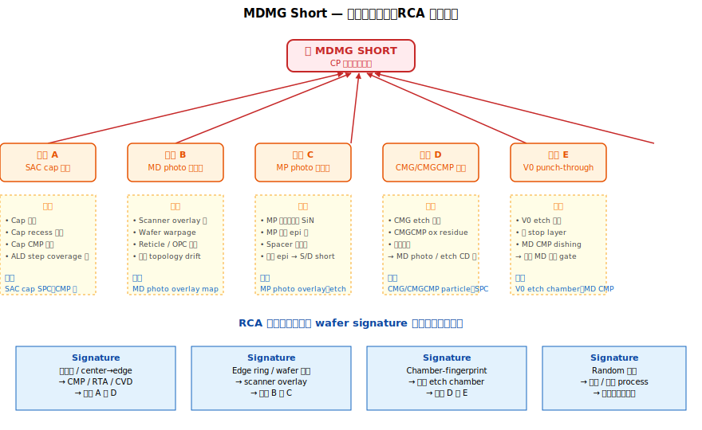

# Chapter 6 — MOL Defect Kingdom（缺陷大全）

> 這一章是全冊的高潮。前 5 章建立了 MOL 的物理與製程基礎，這一章把所有缺陷故事串成一個完整的因果體系，並深入拆解 yield 工作中最常出現的幾條主鏈。

## 6.1 你會在這章學到什麼

- MOL 缺陷的三大分類：**short、open、parametric**
- ⭐ **MDMG short 的完整觸發路徑圖**（從不同源頭怎麼導向同一個 fail）
- Contact open 的多重起源
- Silicide 缺陷的下游放大
- Wafer signature 的閱讀方法：什麼形狀對應什麼模組
- MOL Pareto 分析的常見陷阱

## 6.2 MOL 缺陷的三大分類

| 類別 | 物理本質 | 在電性測試上的表現 |
|---|---|---|
| **Short** | 兩個應該絕緣的 node 連通 | Iddq fail、bin sort 抓到 hard short、SRAM 整列死 |
| **Open** | 應該連通的兩個 node 沒接上 | Functional fail、element 不工作、stuck-at fault |
| **Parametric** | 連通與絕緣都正常，但電阻 / 速度 / 電壓 偏離規格 | Speed bin 變動、Iddq 邊界、Vt drift、yield loss 比例異常 |

良率工程師日常追的 80% Pareto 都集中在 short 與 open，parametric 是 SPC 與設計改善的長期主題。

## 6.3 ⭐ MDMG Short 完整觸發路徑圖

下面這張圖把所有導致 MDMG short 的源頭整合成一張總路徑圖，是 RCA 會議上常用的決策樹。



```
                                    🔥 MDMG SHORT 🔥
                                         ↑
        ┌────────────────┬───────────────┼───────────────┬────────────────┐
        ↑                ↑               ↑               ↑                ↑
        ↑                ↑               ↑               ↑                ↑
   [路徑 A]         [路徑 B]         [路徑 C]         [路徑 D]         [路徑 E]
   SAC 失效          MD photo         MP photo          CMG/CMGCMP       V0 punch
   (cap 失守)        對位偏           對位偏            殘留導致          through
        ↑                ↑               ↑               ↑                ↑
        │                │               │               │                │
   ←前章 1.8         ←本章 6.4      ←前章 4.6          ←FEOL 9         ←前章 5.5
   Cap 太薄/  Photo overlay      MP 化學會打     Ox residue 改變      V0 etch 過頭
   不均/CMP   超出 budget        穿 spacer      地形 → MD/MP        穿透 MD → MG
   過磨                          → 接到 epi      photo CD 飄
```

實務上 RCA 第一步是判斷「**fail 集中在哪一條路徑**」。判斷依據：

| 觀察特徵 | 嫌疑路徑 |
|---|---|
| Cap 厚度量測 SPC 出規格 | A（SAC 失效） |
| MD overlay 量測 SPC 出規格 | B（MD photo） |
| MP overlay 量測 SPC 出規格 | C（MP photo） |
| Wafer signature 與 CMG/CMGCMP chamber 重合 | D（CMG/CMGCMP） |
| Failures 集中在 V0 之後才測出 | E（V0 punch through） |
| Wafer signature 與 MD etch chamber 重合 | A 或 B 共病 |
| 多 chamber 都 fail 且非系統性 | 設計 hot pattern + 邊際 process |

這也是良率 RCA 的標準起手式：**先看 wafer map，判斷是 chamber-fingerprint 還是 die-location-fingerprint，再決定查 photo / etch / cap 哪一條線索**。

## 6.4 路徑 B 深入：MD Photo Overlay 怎麼導到 MDMG short

不只是 photo 機台失準，**material stack 的 distortion** 也會造成 overlay 飄：

```
[原因 1] Scanner overlay 機台校正飄
       → 整片 wafer 系統性偏移
       → 邊緣 die overlay 最差（rotation 誤差放大）
[原因 2] Wafer warpage（CMP/應力造成的彎曲）
       → 邊緣 die 的 reticle stage 對位失真
       → 邊緣 fail 集中
[原因 3] Underlying topography（前段 CMP 留下的 step）
       → Resist 上不均勻
       → Local CD 飄、photo 解析度下降
[原因 4] Reticle defect / pellicle damage
       → 特定 pattern 在所有 die 同位置 fail
[原因 5] OPC（光學鄰近效應修正）模型誤差
       → 特定 layout 邊角失真
       → Hot pattern fail
```

每個原因都有不同的 wafer signature 與診斷工具，**不能只看 photo SPC**。

## 6.5 Open Fail 的多重起源

Open contact 的可能源頭比 short 還多：

```
                        🔍 Open Contact 🔍
                              ↑
     ┌────────┬──────────┬────┴────┬──────────┬──────────┐
     ↑        ↑          ↑         ↑          ↑          ↑
  MD etch   Native    Silicide   Silicide   W/Co     V0 etch
  open      oxide     missing    aggl.      fill     不穿
  fail      之 epi    /piping    /high Rc   void
            介面
```

每個源頭的特徵：

| 源頭 | 特徵 / Signature |
|---|---|
| **MD etch open fail** | Trench 沒打到 epi，CD 飄、deep iso/dense bias |
| **Native oxide** | Queue time 過長、specific lot lot-to-lot |
| **Silicide missing / agglomeration** | RTA chamber-fingerprint、Rs spec out |
| **Silicide piping**（NiSi 製程） | Junction leakage 同時出現、特定 layout |
| **Fill void** | CMP 後 X-SEM 可見、bottom-up 沉積失效 |
| **V0 etch 不穿** | 集中在 V0 chamber、mid die 多 |

Open 比 short 更難 trace，因為「沒接」不像「接到」會留下短路 fingerprint，需要 cross-section TEM/SEM 查證。

## 6.6 Silicide 缺陷的下游放大

Silicide 是 MOL 的「**沉默地雷**」—— 出問題時，本站 SPC 看起來可能正常（Rs 在 spec 內），但 die 級別的 Rc 已經飄移，CP 上才看到。

典型故事：
```
[Silicide RTA chamber 8 燈管老化]
        ↓
[wafer center 退火不足，TiSi 沒完全形成 C54 phase]
        ↓
[Rs spec 通過（取樣點不夠 sensitive）]
        ↓
[CP test：center die 的 ring oscillator speed 偏慢 5%]
        ↓
[Speed bin shift → 高 bin 出貨比例下降]
        ↓
[查到 chamber 8、燈管老化]
```

這種**「parametric 而非 catastrophic」**的故事在 silicide 階段特別多，需要工程師有 patience 跨多日 lot 的趨勢分析才能追到。

## 6.7 Wafer Signature 速讀

> **Inline 偵測捷徑**：以上各條 short / open 路徑，在 fab 內常以 **e-beam inspection 的 VC defect 命名**呈現給工程師。MDMG short → **VG BVC**（Via to Gate 在 PVC 下異常變亮）；Contact open → **VD DVC**；V0 punch-through → **V0 BVC anomaly**。命名邏輯與 RCA 對應見 [Vol 6 Ch 7.5](../06-inspection-tools/07-ebeam.md)。

良率工程師的核心技能之一是看 wafer map signature 立刻猜模組。下表是 MOL 常見對照：

| Signature 形狀 | 可能模組 | 為什麼 |
|---|---|---|
| **同心圓（center→edge）** | CMP / RTA / CVD | 旋轉 / lamp / showerhead 不均 |
| **半月形 / 邊緣帶狀** | PVD / wafer 裝載偏移 | 機構不對稱 |
| **方向性（直條 / 斜線）** | Photo scanner / fin module | 掃描方向不對稱 |
| **Cluster（特定 die）** | Reticle defect / OPC hot spot | 同 reticle 位置 |
| **Random scatter** | Particle / 機械 contamination | 顆粒源不固定 |
| **Edge 5 die ring** | Wafer warpage / chuck 邊緣 | 邊緣製程差 |
| **Slot-correlated** | Multi-chamber 內某 chamber | 設備差異 |
| **Lot-to-lot drift** | 化學品 / 漿料批次 | 耗材 |

→ 看到一個 signature，配合 lot history 比對 chamber，找出 commonality —— 這是 RCA 第一步。

## 6.8 MOL Pareto 分析的常見陷阱

### 陷阱 1：合併不同 fail mode

把 «MDMG short» 與 «V0-MD short» 算成同一條 Pareto bar，會掩蓋兩者的不同模組來源。**Failure bin 要拆得夠細**。

### 陷阱 2：只看當下站

MD photo 出 spec 時，MD photo 站本身的 SPC 可能正常 —— 飄移可能在 5 站之前的 ILD CMP（造成 wafer warpage）。**RCA 要追前後三站**。

### 陷阱 3：誤把巧合當成因果

兩個 chamber 同時出問題，可能是同一個耗材供應商批次問題，不一定是兩個機台各自有事。**Chamber commonality 之外，要查 utility / chemical / tool maintenance schedule**。

### 陷阱 4：忽略 design hot pattern

某些 layout（例如 SRAM 角落 cell、LDO 比較器、密集 dummy filler 邊界）天生 process margin 較窄。整體 Pareto 上的 outlier 可能不是 fab 變動，而是設計極限。**配合 layout density / DRC margin 分析**。

## 6.9 一個整合案例（教科書級）

```
情境：某 batch wafer 在 CP 出現 MDMG short Pareto top
      集中在 wafer edge 5 ring + slot 18–25

第一步：看 wafer signature
       → Edge ring + slot 範圍 → 多 chamber 嫌疑
       
第二步：拉 lot history，找 commonality
       → 同一個 CMG etch chamber 跑了這些 wafer
       → 同 chamber 的 process gas line 上週剛換供應商
       
第三步：檢查 CMG etch SPC
       → Etch CD 與 profile 都在 spec
       → 但 wafer-to-wafer variation 略增加
       
第四步：拉 CMGCMP 的 inline particle
       → 發現 slot 18–25 在 CMGCMP 後 particle count 高 3x
       → ⚠ chamber 內 polymer 殘留
       
第五步：CMGCMP particle → ox residue → MD etch profile 飄 → SAC margin 不夠 → MDMG short
       
結論：CMG etch 的 polymer 飄 → CMGCMP 沒 fully 清掉 → MD etch 受 topology 影響飄 → SAC fail

行動：CMG etch chamber wet clean schedule 從 weekly 改成 every 3 days；
      CMGCMP 增加 mega-sonic clean 強度。
```

→ 這就是典型的「**跨 5 站 RCA**」，從電性 fail 一路推到工程動作。掌握這種推理鏈是良率工程師的核心能力。

## 6.10 與設計 / DR / OPC team 的協作

當 process 已經盡力但還是有 hot pattern fail，下一步是與設計工具團隊合作：

- **DRC（Design Rule Check）放寬 margin**：設計階段直接禁止某些 marginal pattern
- **OPC（Optical Proximity Correction）優化**：對 hot pattern 加強光學修正
- **Litho-friendly design**：設計團隊配合 fab 的 process window 做 layout
- **LELE → SADP → EUV 升級**：在製程能力許可下升級 patterning

這部分是 yield team 對外的**跨部門能力**：把 fab 的問題翻譯成 design 能聽懂的語言。

## 6.11 接下來

最後一章 [Chapter 7: MOL Summary](./07-summary.md) 把整冊內容壓縮成速查表 + 站點字典，方便日常查詢。
