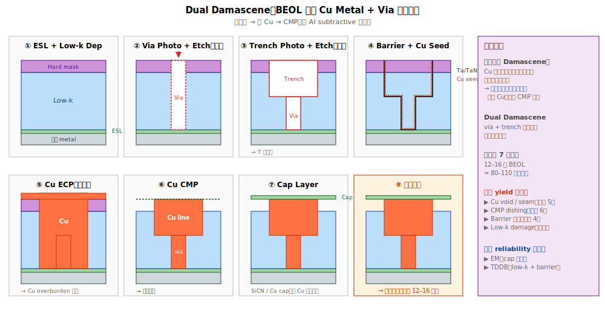

# Chapter 1 — Cu Damascene 製程基礎

## 1.1 你會在這章學到什麼

- 為什麼 BEOL 從 Al 改用 Cu —— 物理動機
- 為什麼 Cu 必須用 damascene 製程（而不能用 subtractive etch）
- Single damascene vs Dual damascene 流程
- 整個 BEOL 一層 metal 的完整製程流程
- 典型缺陷與 yield 議題

## 1.2 為什麼從 Al 換成 Cu

從 250 nm 之後業界從 Al 換到 Cu。三個物理理由：

| 性質 | Al | Cu | 結果 |
|---|---|---|---|
| **電阻率（ρ）** | 2.65 µΩ·cm | **1.68 µΩ·cm** | Cu 電阻低 37% → 訊號傳遞快 |
| **熔點** | 660 °C | 1085 °C | Cu 熱穩定佳 |
| **EM 耐受** | 中等 | **較佳** | Cu 能流更大電流密度 |

→ 隨著電晶體微縮，**金屬線的 RC delay 變成訊號瓶頸**。Cu 的低電阻直接緩解這個問題。

## 1.3 為什麼 Cu 不能用 subtractive etch

Al 製程的傳統做法（**subtractive**）：

```
[1] 整片沉積 Al 薄膜
       ↓
[2] photo + etch 把 Al 蝕刻成線條
       ↓
[3] 線條之間填介電
       ↓
[4] CMP 磨平
```

這個方法**對 Cu 不可行**，原因：

> **Cu 沒有揮發性的氣態化合物**。

蝕刻金屬需要把它變成氣體排出。Al 蝕刻產物 AlCl3 在常溫易揮發，乾蝕刻可行。**Cu 的所有可能反應產物（CuCl2、CuF2 等）熔沸點都很高，無法在常溫下變成氣體**。

→ 業界改用相反的策略：**先挖介電的溝，再填 Cu**。這就是 **damascene**。

## 1.4 Damascene 是什麼

「Damascene」字源自大馬士革鋼的鑲嵌工藝。半導體業界指：

> **「先在介電層挖溝，再填金屬，最後 CMP 磨平」** 的整合方式。

兩種變體：

### Single Damascene（單一 damascene）

每層 metal 與每層 via 各自獨立做一次 damascene：

```
[1] 介電 dep（low-k）
[2] Via etch
[3] Via fill + CMP
[4] 介電 dep（low-k）
[5] Metal trench etch
[6] Metal fill + CMP
   → 一層 metal 完成（via + line）
```

優點：流程簡單。
缺點：步驟多，每層 metal 需要兩次 CMP。

### Dual Damascene（雙 damascene，主流）

把 via 與 metal trench 合併成一次 damascene 做完：

```
[1] 介電 dep
[2] Via photo + etch（較深）
[3] Trench photo + etch（較淺）
       → 介電中形成「下方圓孔 + 上方溝」的 T 型結構
[4] 一次 fill Cu 把 via 與 trench 一起填滿
[5] 一次 CMP 磨平
   → 一層 metal + via 完成
```

優點：步驟少、一次 CMP、底部 via-trench 介面無接縫。
缺點：兩道 photo 對位精度要求高。

> **Dual damascene 是先進製程的標準做法**。本書 Ch 1–4 的「damascene」預設指 dual damascene。

## 1.5 Dual Damascene 完整流程




下面是 BEOL 一層 Cu metal + via 的完整製程序列：

```
[1] Etch Stop Layer (ESL) deposition       ← 薄 SiN/SiCN/SiC，停下層金屬之上
       ↓
[2] Low-k 介電 deposition                   ← ~80–150 nm 厚
       ↓
[3] Hard mask deposition                    ← TEOS / metal hard mask 給 photo
       ↓
[4] Via Photo + Etch                        ← 在 hard mask 上印 via 圖案、蝕刻
       ↓
[5] Trench Photo + Etch                     ← 上方挖 metal trench
       ↓
       → 形成「下方圓 via + 上方溝」的 T 型結構
       ↓
[6] Liner / Barrier deposition              ← TaN + Ta 雙層（防 Cu 擴散 + Cu 黏附）
       ↓
[7] Cu Seed deposition                      ← PVD-Cu 薄層當電鍍起點
       ↓
[8] Cu Electroplating (ECP)                 ← 電鍍 Cu 把 via + trench 填滿
       ↓
[9] Cu Anneal                               ← 低溫退火使 Cu 顆粒長大、降電阻
       ↓
[10] Cu CMP                                 ← 磨掉表面多餘 Cu，停在 hard mask
       ↓
[11] Hard mask removal                      ← 去掉 hard mask
       ↓
[12] Cap layer dep                          ← 薄層 SiCN / SiCO 蓋住 Cu，防氧化、防擴散
       ↓
       → 一層 metal + via 完成；下層做下一層
```

### 步驟 [4][5] 兩種策略

兩道 photo 的順序有兩種主流：

**Via-First**：先做 via photo + etch，再做 trench photo + etch。
**Trench-First**：先做 trench photo + etch，再做 via photo + etch。

各有優缺點：
- Via-first：底層平整時 via etch 容易，但 trench photo 要在凹凸表面上做
- Trench-first：trench 對位較準，但 via 在 trench 底部 photo 較難

各 fab 在不同 node 採用不同策略。

## 1.6 Cu Electroplating（ECP）的角色

Cu fill 用**電鍍（electroplating）** 而不是 CVD / PVD。理由：
1. **完美的 bottom-up 填充**：透過添加劑控制電鍍化學，能讓 Cu 從底部開始長，避免 trench 中央留 void
2. **大量沉積能力**：電鍍速率高，幾秒填滿幾百 nm 的 trench
3. **晶粒控制**：透過退火讓 Cu 晶粒長大，降低電阻

ECP 的化學：CuSO4 電解液 + 多種添加劑（accelerator、suppressor、leveler）。每家 fab 使用不同的 proprietary 配方。

## 1.7 Cu CMP 的特殊性

Cu CMP 是 BEOL 最關鍵也最敏感的單站。挑戰：

```
   理想 CMP：
   ─────────────              ─────────────
   ░ ▓ ░ ▓ ░ ▓ ░     →      ░░░░░░░░░░░░░
   ▓Cu▓░░░▓Cu▓                ░░░░░░░░░░░░░
   ─────────────              ─────────────
   表面凹凸                    表面平整
   
   實務上常見問題：
   Dishing：Cu 線中央凹陷
   Erosion：dense 區整體被磨低
   Scratch：機械刮痕
   Particle：漿料異物殘留
```

Cu CMP 漿料含**氧化劑**（H2O2 系），把 Cu 表面氧化成 CuO 後再磨掉。漿料化學的精準控制是 Cu CMP 良率核心。

## 1.8 與 Al 製程的徹底對比

```
   傳統 Al subtractive：              現代 Cu damascene：
   
   1. Al 整片沉積                     1. 介電整片沉積
   2. Photo + etch Al                 2. Photo + etch 介電（挖溝）
   3. 介電填縫                         3. Cu fill（ECP）
   4. CMP 磨平                         4. CMP 磨平
   
   特徵：金屬被「定義」                特徵：金屬被「鑲嵌」
        介電「填補」                       介電「先到」
```

→ Damascene 是「**金屬填介電**」；subtractive 是「**金屬定義後填介電**」。流程順序完全相反。

## 1.9 典型缺陷

| 缺陷 | 物理樣貌 | 主要嫌疑站點 |
|---|---|---|
| **Cu Void** | Cu 線內部空腔 | ECP 添加劑配方、seed 不均 |
| **Cu Seam** | Cu 從兩側合攏的接縫 | ECP 條件、bottom-up 失效 |
| **Trench profile 不對** | Trench 上寬下窄 / 中胖等 | 介電 etch chamber |
| **CMP Dishing** | Cu 線中央凹陷 | CMP slurry、pad、頭壓力 |
| **CMP Erosion** | Dense 區整體被磨低 | Pattern density、pad 均勻度 |
| **Scratch / Particle** | CMP 留下刮痕或顆粒 | Slurry、pad、設備 |
| **Liner discontinuity** | Barrier 不連續 | PVD step coverage |
| **介電 crack** | low-k 機械破裂 | CMP 過壓、low-k 太脆 |

→ 這些 defect 在第四冊（Defect 冊）有更詳細的綜合視角，本冊放重點在「**為什麼會發生**」而非「**怎麼分類**」。

## 1.10 與 yield 的關係

BEOL yield 的特性：
- **Redundancy 緩衝**：layout 上常有 redundant via / metal，單點 fail 還能繞線
- **單層 fail 多半可救**：除非整層 metal 全 fail
- **但如果同層多點 fail（systematic）→ yield 立刻崩**：通常意味 chamber 整體偏

→ 這也是為什麼 BEOL 的 yield ranking 常常在「**良率 vs 可靠度**」之間擺盪：偶發 yield issue 可救，但**累積的 reliability margin 才是長期最重要的指標**。

## 1.11 站點對應

| 縮寫 | 全名 | 對應流程 |
|---|---|---|
| **ESLDEP** | Etch stop layer dep | [1] |
| **ILDDEP / LKDEP** | Low-k 介電 dep | [2] |
| **HMDEP** | Hard mask dep | [3] |
| **VPHO / VAPHO** | Via photo | [4] |
| **VETCH / VAETCH** | Via etch | [4] |
| **MTPHO / TRPHO** | Trench photo | [5] |
| **MTETCH / TRETCH** | Trench etch | [5] |
| **TANDEP / TADEP** | TaN/Ta liner dep | [6] |
| **CUSEED** | Cu seed PVD | [7] |
| **CUECP / ECP** | Cu electroplating | [8] |
| **CUANN** | Cu anneal | [9] |
| **CUCMP** | Cu CMP | [10] |
| **HMRMV** | Hard mask removal | [11] |
| **CAPDEP**（BEOL）| Cap dep（SiCN/SiCO）| [12] |

## 1.12 接下來

Damascene 流程依賴一個關鍵元素：**low-k 介電**。下一章 [Chapter 2: Low-k Dielectric](./02-low-k.md) 詳述為什麼 BEOL 介電 k 值持續降低、各代 low-k 材料的演進、以及 porous low-k 的工程挑戰。
