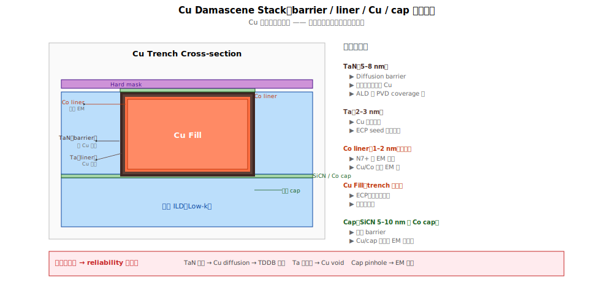

# Chapter 3 — Liner / Barrier 工程

## 3.1 你會在這章學到什麼

- 為什麼 Cu 必須有 barrier
- TaN / Ta 雙層 barrier 的角色分工
- Cu 擴散到 low-k 的物理後果
- 各代 barrier 材料的演進
- Barrier 整合的工程挑戰
- 與 EM / TDDB 可靠度的關係

## 3.2 為什麼 Cu 必須有 barrier

**Cu 是個「煩人」的金屬**：它在 SiO2 / low-k / Si 中**擴散極快**。

| 原子 | 在 SiO2 中擴散係數（粗略） |
|---|---|
| Al | 慢 |
| **Cu** | **快**（比 Al 快 ~10⁶ 倍） |
| W | 中等 |

物理：Cu 的離子半徑小、與 SiO2 / low-k 的化學親和度低，容易在介電中沿著缺陷或晶界遷移。

### 沒有 barrier 會怎樣

```
   Cu 線
   ─────────
   ░░░░░░░░░ ← Cu 擴散到 low-k
   ░░░░░░░░░ ← 隨時間累積（特別是高溫高電場下）
   low-k 介電
   ─────────
```

後果：
1. **TDDB 早夭**：Cu 在介電內形成導電路徑 → 介電擊穿
2. **Leakage 增加**：線間漏電飆升
3. **元件失效**：Cu 擴散到 FEOL 區域會殺死電晶體（Cu 在 Si 內形成深能階缺陷）

→ Cu 必須**完整包覆**在 barrier 內，**任何缺口都會導致長期可靠度災難**。

## 3.3 TaN / Ta 雙層 barrier




主流 BEOL 用 **TaN + Ta** 雙層 barrier：

```
   Cu fill
   ───────────
   Ta（薄層）       ← 對 Cu 的黏附性 + ECP seed 介面
   ───────────
   TaN（薄層）      ← 主要 diffusion barrier
   ───────────
   Low-k 介電
```

### TaN 的角色：Diffusion Barrier

TaN（鉭氮化物）對 Cu 擴散有**極高阻擋**：
- 結構緻密
- 非晶相（amorphous）阻止 Cu 沿晶界擴散
- 化學穩定

→ 主要功能：**擋住 Cu 不讓它進入 low-k**。

### Ta 的角色：Adhesion + Seed 介面

Ta（純鉭）的功能：
- **Cu 對 Ta 黏附性好**（比對 TaN 好）
- ECP 的 Cu seed 在 Ta 上電鍍均勻
- 提供 Cu 的「**潤濕層**（wetting layer）」

→ 主要功能：**讓 Cu 黏好 + 後續 ECP 均勻**。

### 雙層的厚度

- TaN：~2–5 nm（薄但要連續）
- Ta：~2–3 nm
- 總 barrier：~5–8 nm

**先進製程持續壓薄**：BEOL pitch 縮到 30 nm 時，barrier 就佔掉 trench 寬度的 1/4–1/3。barrier 太厚會讓 Cu 截面積太小、電阻飆升。

## 3.4 Barrier 沉積方法演進

| 方法 | 適用 | 特點 |
|---|---|---|
| **PVD（傳統）** | 早期 BEOL | 簡單、便宜，但 step coverage 差（高 AR 結構底部薄） |
| **iPVD / IBM PVD** | 28–10 nm | 改良 PVD，coverage 較佳 |
| **ALD-TaN** | N7 以下 | 完美 conformal coverage，是先進製程主流 |
| **CVD-TaN** | 部分 fab | 介於 PVD 與 ALD 之間 |

**ALD-TaN 是趨勢**：在愈來愈窄的 trench 與 via 中，PVD 已撐不下去。ALD 能均勻包覆每一面，但**速度慢、成本高**。

## 3.5 替代方案：Co Liner

近年（N7 起）部分製程用 **Co liner** 取代 / 增強 Ta：

```
   Cu fill
   ─────
   Co（薄層）      ← 取代 Ta 部分功能
   ─────
   TaN           ← TaN barrier 仍保留
   ─────
   Low-k
```

Co liner 的優勢：
- **改善 EM**：Cu 在 Co 介面遷移較慢（緩和 Cu EM）
- **降低介面電阻**：Co 與 Cu 介面接觸電阻較低
- **較薄**：可做到 ~1–2 nm

→ 「**Co cap + Co liner**」配合使用是 N7 / N5 的常見組合，明顯延長 EM lifetime。

## 3.6 Cap layer：Cu 上面也要有 barrier

不只是 trench 內側壁要 barrier，**Cu 表面也要 cap layer**：

```
   Cap layer (SiCN / SiCO / 金屬 cap)     ← 上面 barrier
   ─────────────────────────
   Cu line                                ← 主導體
   ─────────────────────────
   Ta + TaN                               ← 側壁與底部 barrier
   ─────────────────────────
   Low-k
```

Cap layer 功能：
1. 防止 Cu 上方擴散
2. 降低 Cu 表面 EM 速率（Cu/cap 介面是 EM 的主要路徑）
3. 防止 Cu 氧化

兩種主流：
- **介電 cap**（SiCN、SiCO）：傳統做法，dielectric 性質
- **金屬 cap**（CoWP、Co、Ru）：選擇性沉積在 Cu 上，**EM 改善顯著**

## 3.7 典型缺陷

| 缺陷 | 物理樣貌 | 嫌疑站點 |
|---|---|---|
| **Barrier discontinuity** | TaN/Ta 不連續、有缺口 | PVD / ALD step coverage 差 |
| **Barrier 太薄** | Coverage 不足 | Step coverage limit at high AR |
| **Cu seed 不均** | 後續 ECP 不順 | PVD-Cu chamber 條件 |
| **Cap layer 缺陷** | SiCN 有 pinhole 或 Co cap 不均 | CVD / selective dep chamber |
| **Cu 擴散到 low-k** | 隱藏缺陷，TEM 才能確認 | 任一 barrier 失效 |

→ Barrier 缺陷的特徵：**inline 看不到，但 reliability 測試會抓到**。是 BEOL 的「**潛伏殺手**」。

## 3.8 與 yield / reliability 的關係

Barrier 工程是**「reliability driver」**，與 yield 的關係比較間接：

- **Yield 影響**：barrier 太厚 → Cu 截面積不足 → 線阻偏高 → speed bin shift（parametric）
- **Reliability 影響**（主要）：
  - Barrier 缺口 → Cu 擴散 → TDDB 早夭（Ch 7）
  - Cap layer 弱 → 表面 EM 嚴重（Ch 6）
  - Liner 與 Cu 介面差 → EM 路徑

→ 良率工程師看到「**一片 wafer 通過所有 inline 測試但 TDDB stress 幾天就 fail**」，要立刻查 barrier 站。

## 3.9 站點對應

| 縮寫 | 全名 | 內容 |
|---|---|---|
| **TANDEP** | TaN dep（PVD/ALD/CVD）| Diffusion barrier |
| **TADEP** | Ta dep（PVD）| Adhesion / wetting layer |
| **CODEP** | Co liner dep | EM 改善 |
| **CAPDEP**（BEOL）| Cap layer dep | SiCN / SiCO 介電 cap |
| **COCAP** | Co cap selective dep | 金屬 cap，EM 改善 |
| **CUSEED** | Cu seed PVD | ECP 起點 |

## 3.10 接下來

Damascene、Low-k、Liner/Barrier 是 BEOL 一層 metal 的三大支柱。下一章 [Chapter 4: 多層整合](./04-multilayer.md) 把多層串起來看：M0–M_top 各層差異、local vs global interconnect、世代之間的演進。
