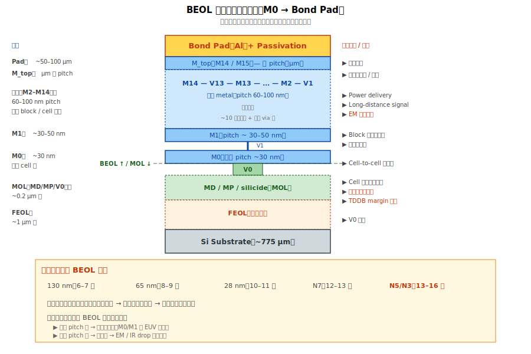

# Chapter 4 — 多層整合（Multi-layer Integration）

## 4.1 你會在這章學到什麼

- M0 到 M_top 的層次與功能差異
- Local vs Semi-global vs Global interconnect
- 不同層的 pitch、厚度、設計考量
- 世代演進中的 BEOL stack 變化
- 多層整合的工程議題

## 4.2 BEOL 不是「同一件事重複 N 次」




雖然每層 metal 都是 dual damascene，但**不同層做的事差很多**。從 M0 到 M_top，金屬寬度可以差 10 倍以上、用途也完全不同。

```
   ┌─ Bond Pad ─────────────────┐
   │                             │
   │  M_top（M14 / M15）         │ ── Global / Power delivery
   │                             │
   │  M11–M13                    │ ── Semi-global
   │                             │
   │  M5–M10                     │ ── Block-level
   │                             │
   │  M2–M4                      │ ── Cell-level
   │                             │
   │  M0–M1                      │ ── Local（cell 內）
   │                             │
   └─ V0 (MOL) ──────────────────┘
```

## 4.3 三大層級的功能差異

### Local Interconnect（M0、M1）

**功能**：cell 內部與緊鄰 cell 之間的短距離連線。

| 性質 | 數值 |
|---|---|
| Pitch | ~30–50 nm（最細） |
| 線厚度 | ~30–50 nm |
| 線長 | ~100 nm 級 |
| 主要設計考量 | **解析度**（最先進 EUV / multi-pattern） |

→ **最依賴最先進製程**：M0/M1 是整個 BEOL 對解析度要求最高的層。N3 / N2 的 EUV 就主要用在這幾層。

### Semi-global Interconnect（M2–M10）

**功能**：blocks 間連線、clock tree、訊號繞線。

| 性質 | 數值 |
|---|---|
| Pitch | ~60–100 nm（中等） |
| 線厚度 | ~60–100 nm |
| 線長 | ~µm 級 |
| 主要設計考量 | **訊號完整性** + **RC 平衡** |

→ Pitch 較粗，光學容易；但**訊號繞長距離**，要平衡 R 與 C。

### Global Interconnect（M_top）

**功能**：clock distribution、power delivery、跨模組長距離訊號。

| 性質 | 數值 |
|---|---|
| Pitch | ~µm 級（最粗） |
| 線厚度 | ~µm 級（厚！）|
| 線長 | 整 die 級 |
| 主要設計考量 | **電流容量** + **EM** + **電壓降（IR drop）** |

→ Pitch 粗、線厚，但電流大（power 線可達數 mA / line），**EM 是最大顧慮**。

## 4.4 Pitch 演進史

不同節點的 M1 pitch（最細層）：

| 節點 | M1 Pitch（典型） |
|---|---|
| 250 nm | ~600 nm |
| 130 nm | ~400 nm |
| 65 nm | ~200 nm |
| 28 nm | ~90 nm |
| N7 | ~40 nm |
| N5 | ~30 nm |
| N3 | ~24 nm |

→ M1 pitch 大致跟著 fin pitch 縮小，是 BEOL 微縮的代表指標。

## 4.5 層數演進

不同節點的 BEOL 總層數：

| 節點 | 總層數 |
|---|---|
| 250 nm | 4–5 |
| 130 nm | 6–7 |
| 65 nm | 8–9 |
| 28 nm | 10–11 |
| N7 | 12–13 |
| N5 / N3 | 13–16 |

層數隨製程世代增加，因為：
1. 元件密度提高 → 連線複雜度爆炸
2. 細 pitch 層走不了長距離（電阻太高）→ 需要粗 pitch 層做 long route
3. Power delivery 需要愈來愈強（電晶體多）

## 4.6 多層整合的工程議題

### 議題 1：層間對位（Overlay）

每層 photo 的位置必須與下層對齊。容錯隨 pitch 縮小：
- M1 pitch 30 nm → overlay 容忍度 < 5 nm
- 整個 BEOL 12 層累積誤差不能超過設計 margin

→ Scanner overlay 與 OPC 是**從 BEOL 累積到頂層的關鍵**。

### 議題 2：應力累積

每層金屬都有殘餘應力。多層累積 → wafer warpage：
- N7 的 wafer 在做完 BEOL 後可能彎曲幾十 µm
- 影響：後續 photo focus、CMP 均勻度、封裝可靠度

→ 設計上常引入「**應力補償層**」（compensation layer）平衡。

### 議題 3：熱預算

BEOL 全段不能超過 ~400 °C（low-k decompose 極限）。
- 所有 BEOL 退火、anneal 必須低溫
- 而且 BEOL 越上層 anneal，越底層的金屬已經受過該熱步驟（多次累積）
- 累積熱預算限制 BEOL 設計選項

### 議題 4：Cu CMP 控制

每層都要做 Cu CMP。挑戰累積：
- 早期層 dishing → 後續層 photo focus 飄
- Pad wear 隨層數累積
- 配方需要層別微調

## 4.7 世代演進中的 BEOL stack 變化

從 28 nm 到 N3 的變化：

| 元素 | 28 nm | N7 | N3 |
|---|---|---|---|
| 主流 fill metal | Cu | Cu | Cu + Co (high resistance lines) |
| Liner | Ta/TaN | Ta/TaN + Co | TaN + Co (more aggressive) |
| Low-k k 值 | ~2.7 | ~2.5 | ~2.4 (porous) |
| Cap | SiCN | SiCN + Co cap | Co cap dominant |
| 微影 | Multi-pattern | EUV | High-NA EUV (some layers) |
| 層數 | ~10 | ~13 | ~15 |

→ 每代都引入新材料 / 新製程，BEOL 整合複雜度持續攀升。

## 4.8 與 yield / reliability 的關係

多層整合的 yield 特徵：
- **單層偶發 fail 通常可救**：redundant via、metal alternative
- **跨層 systematic fail 會放大**：例如 M1 photo overlay 飄 → M1 fail → V1 對不到 → M2 也 fail

可靠度的多層特徵：
- **EM 集中在「電流密度高的層」**：power line（M_top 與 M0 connection 處）
- **TDDB 集中在「pitch 最細的層」**：M0/M1 線間最近，電場最強
- **Wafer warpage** 影響整片 reliability margin

## 4.9 對話用語

工作上常聽到這些講法：

| 講法 | 意思 |
|---|---|
| 「Mx layer」 | 第 x 層 metal（x = 0–14 或以上） |
| 「Vx layer」 | 第 x 層 via |
| 「local layer」 | M0、M1（最細） |
| 「intermediate layer」 | M2–M10（中等） |
| 「global layer」 | M_top（最粗） |
| 「critical layer」 | 對 yield / reliability 最敏感的層（依產品而異） |

## 4.10 接下來

BEOL 最頂層做完之後，就要做 **bond pad / passivation** 接到外部世界。下一章 [Chapter 5: Bond Pad / Passivation](./05-pad-passivation.md) 講 BEOL 末段、對外接口的工程。
