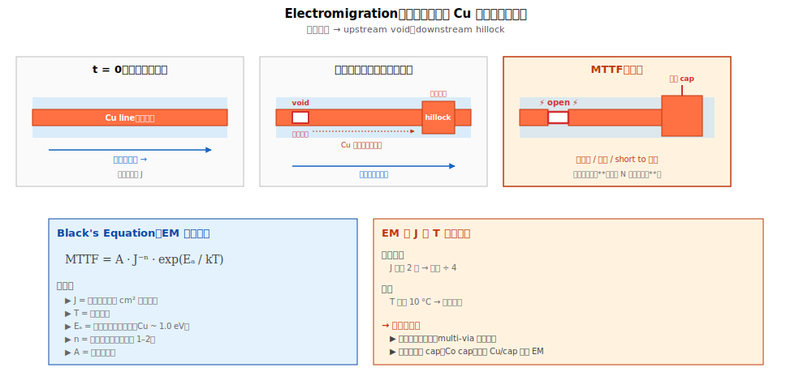

# Chapter 6 — Reliability：EM（Electromigration）

## 6.1 你會在這章學到什麼

- 什麼是 Electromigration（EM）
- 物理機制：電子如何把金屬原子推走
- Black's Equation 與壽命外推
- Cu 在不同位置的 EM 行為
- 加速應力測試與壽命估算
- EM 的設計與製程對策

## 6.2 EM 是什麼




**Electromigration（電子遷移、電遷）**：高電流密度通過金屬線時，**電子的動量會逐漸把金屬原子「衝走」**，造成局部金屬流失。

```
   高電流密度的金屬線：
   ════════════════════
       電子流 →
   ════════════════════
       原子被向下推 →
   
   時間累積後：
   ════════                 ════════
                ▢ void                ← 空腔（原子流失區）
   ════════                 ════════
                                       ← 嚴重時 → 開路
```

物理：電子流動時動量足夠把金屬離子撞鬆並推動。雖然單次撞擊微小，**長時間累積**會造成顯著金屬遷移。

## 6.3 EM 在哪裡發生

EM 不是均勻發生在整條線：

- **電流密度高的地方** EM 嚴重（線變細、轉角集中處）
- **介面處** EM 嚴重（Cu/cap、Cu/barrier、grain boundary）
- **溫度高的地方** EM 嚴重（指數加速）

→ 三個風險集中區：
1. **Via 進金屬線的拐角**（電流密度集中）
2. **Cu 表面與 cap layer 的介面**（最弱介面）
3. **熱點附近的金屬線**（temperature 加速）

## 6.4 Black's Equation：EM 壽命公式

業界用 Black's Equation 描述 EM 壽命（MTTF, Mean Time To Failure）：

```
   MTTF = A × J^(-n) × exp(Ea / (k × T))
   
   J  = 電流密度
   T  = 溫度
   Ea = 活化能（每種金屬不同）
   n  = 電流密度指數（通常 1–2）
   k  = Boltzmann 常數
   A  = 預指數因子（與材料、結構有關）
```

關鍵物理：
- **電流密度 J 增加 2 倍 → 壽命 ÷ 4** 左右（n ≈ 2）
- **溫度 T 上升 10 °C → 壽命下降一半** 左右（典型 Ea 對應這個比例）

→ EM 對「電流密度」與「溫度」**極度敏感**。

## 6.5 加速應力測試

直接量產品壽命要花 10 年。業界用**加速應力**幾天內推估：

### 測試結構

特殊的 EM test structure：

```
   Anode pad ─── 細金屬線（被測試線）─── Cathode pad
                            ↑
                       高電流密度區
```

### 應力條件（典型）

| 條件 | 工作條件 | EM 加速條件 |
|---|---|---|
| 電流密度 | ~1 MA/cm² | ~10 MA/cm² |
| 溫度 | ~100 °C | ~250–350 °C |

→ 加速因子：**幾百到幾千倍**。幾天測試結果用 Black's Equation 外推回工作條件。

### 壽命指標

行業標準：**< 0.1% 的 die 在 10 年工作條件下 EM fail**。

從加速測試得到的數據用 **Weibull 分布** 外推到目標 ppm（百萬分之一）等級。

## 6.6 Cu 比 Al 抗 EM

Cu 對 EM 的抵抗力比 Al 強的物理原因：

| 性質 | Al | Cu |
|---|---|---|
| 活化能 Ea | ~0.5 eV | ~1.0 eV |
| Bulk EM | 較強 | 弱 |
| **介面 EM** | 較弱 | **強**（特別是 grain boundary） |

→ Cu **bulk** 抗 EM，但 **介面** EM（特別是 Cu/cap 介面）反而是 weak point。

這就是為什麼**金屬 cap（Co cap）**對 Cu EM 改善這麼重要 —— 金屬 cap 與 Cu 之間是金屬-金屬介面，比 Cu/介電 cap 介面阻 EM 更強。

## 6.7 EM 的工程對策

從多個維度緩解 EM：

### 設計層面

1. **Wire width**：增加金屬線寬，降低電流密度
2. **Multi-via**：用多個 via 分擔電流，避免單一 via 處集中
3. **Power planning**：避免長距離大電流線
4. **Margin**：設計時留 EM 安全因子（一般 2–3 倍）

### 製程層面

1. **Co cap**：金屬 cap 取代介電 cap，改善表面 EM
2. **Co liner**：改善側壁 EM 路徑
3. **晶粒控制**：Cu anneal 後晶粒大 → 少 grain boundary → EM 慢
4. **介面工程**：不同 barrier 材料對 EM 影響大

### 材料層面（先進製程探索）

1. **Ru**（釕）：抗 EM 強（已在 V0/V1 用）
2. **Co**（鈷）：作 fill metal（細 line 更佳），但 EM 比 W 弱
3. **石墨烯**：研究階段，作 cap layer

## 6.8 EM 監控與 SPC

Inline 監控 EM 風險（不是直接量 EM lifetime，而是監控 EM-prone 條件）：

| 監控項 | 與 EM 的關係 |
|---|---|
| Cu sheet resistance | 反映 Cu 厚度 / 純度 → EM 起點 |
| Liner / barrier 完整度 | 介面缺陷 → EM 加速 |
| Cap layer 連續性 | 表面 EM 路徑 |
| Cu 晶粒大小 | 大晶粒 → EM 慢 |
| Wafer warpage | 應力 → 微裂 → EM 加速 |

→ Inline SPC 不能直接保證 reliability，但能預警「**這片 wafer 的 reliability margin 變窄**」。

## 6.9 與 yield 的關係

EM 與 yield 的關係比較間接：

- **Yield 看當下 fail**，EM 在多年後才 fail
- 但 EM-prone 的 wafer 在加速應力下 fail 快 → 進入 reliability bin → 影響「**良率對外公布的數字**」（depending on yield definition）
- **長期可靠度的「margin」會隨製程飄移而縮小**，最終影響某一批貨「**過幾年後客戶大量退回**」

→ 良率工程師要區分：「**inline yield ✓ + reliability ✓**」與「**inline yield ✓ + reliability X**」是兩種風險，後者更難解決。

## 6.10 站點對應與測試

EM 不是某一站「做出來」的；是**累積的結果**。但是這幾站的品質直接影響 EM：

| 站 | 對 EM 的影響 |
|---|---|
| Cu CMP | 表面平整度、cap 介面 |
| Cap dep（SiCN / Co cap） | EM 主要路徑 |
| Liner / barrier | 介面與晶粒 |
| Cu ECP + anneal | 晶粒大小 |

EM 測試在 **wafer level reliability monitor**（WLR）或 **package level** 做：
- **WLR**：fab 內快速測試 test structure
- **Package level**：封裝後做 long-term stress

## 6.11 接下來

EM 是「**金屬線壞**」。下一章 [Chapter 7: TDDB Reliability](./07-reliability-tddb.md) 講「**金屬之間的介電壞**」 —— 同樣是長期累積、加速測試、外推壽命，但物理機制完全不同。
