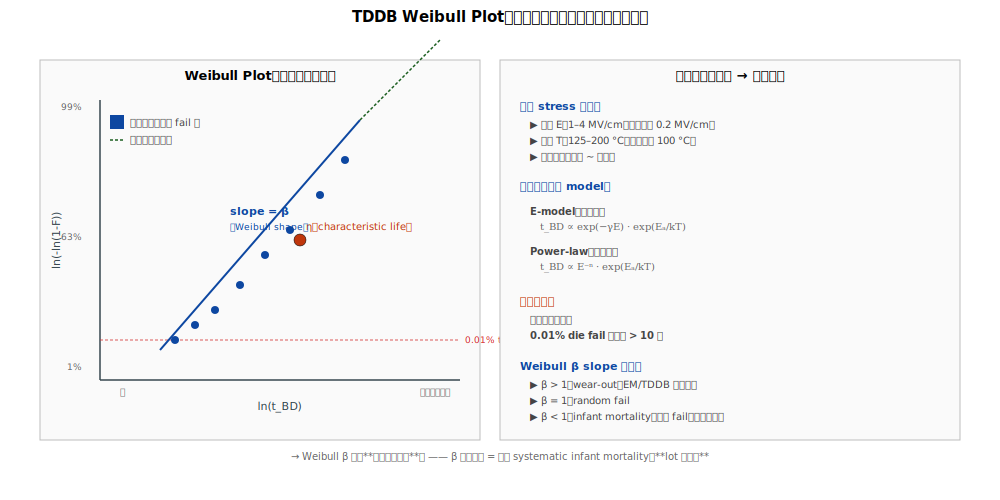

# Chapter 7 — Reliability：TDDB（Time-Dependent Dielectric Breakdown）

## 7.1 你會在這章學到什麼

- TDDB 是什麼、與 EM 的差別
- Low-k TDDB 的物理機制
- E-model、power-law 與壽命外推
- 加速應力測試
- TDDB 的設計與製程對策
- BEOL TDDB 與 FEOL gate stack TDDB 的比較

## 7.2 TDDB 是什麼

**TDDB（Time-Dependent Dielectric Breakdown，時間相依介電崩潰）**：絕緣材料在電場下，**長時間累積會逐漸累積缺陷，最終擊穿（介電變成導電）**。

```
   時間 t = 0：           時間 t = 加速條件下幾天 / 工作條件下幾年：
   
   Cu line A             Cu line A
   ════════              ════════
       ░░░                   ●●●     ← 累積的微缺陷形成導電路徑
       ░░░                   ●●●
       ░░░                   ●●●     ← 介電擊穿
   ════════              ════════
   Cu line B             Cu line B
   
   電場 E 慢慢累積 damage    電場推升缺陷穿透 → short
```

→ TDDB 是「**用了一段時間後突然 short**」，不是製造當下就 short。是 reliability fail，不是 yield fail。

## 7.3 TDDB 在哪裡發生

兩種 TDDB：

### FEOL TDDB（Gate Stack TDDB）

**位置**：HKMG 的 high-k 介電（HfO2）。

**機制**：gate 電壓使氧空缺（oxygen vacancy）累積在 high-k 中，最終形成 percolation path → gate leakage 失控。

→ 影響：電晶體本身壞（threshold 失控、漏電爆量）。

### BEOL TDDB（本章主題）

**位置**：相鄰 Cu 線之間的 low-k 介電。

**機制**：Cu 在電場驅動下緩慢進入 low-k，加上電場引發的介電缺陷累積，最終形成介電 path。

→ 影響：兩條 Cu 線之間漏電 → 短路。

兩種 TDDB 物理不同，但**都是「電場下時間累積到崩潰」的同一範式**。

## 7.4 BEOL TDDB 的物理特徵

低 k 介電在電場下的崩潰特別嚴重，原因：

1. **Cu 易擴散**：Cu 在電場下進入 low-k 的速度比 Al 快得多
2. **Low-k 機械脆弱**：應力下易產生 microcrack 提供 leakage path
3. **Porous low-k 吸濕**：水分進入 → 與電場耦合 → 加速 breakdown
4. **介面缺陷**：Cu/barrier、barrier/low-k 兩個介面都是潛在路徑

→ Cu/low-k 系統的 TDDB 比過去 Al/SiO2 系統嚴重，是 BEOL 持續的工程挑戰。

## 7.5 TDDB 壽命公式

業界用兩種主要 model 描述 BEOL TDDB 壽命：

### E-model（線性電場依賴）

```
   t_BD = A × exp(-γ × E) × exp(Ea / (k × T))
   
   E  = 電場（V/cm）
   γ  = 場加速係數
   Ea = 活化能
```

特性：壽命隨電場**指數遞減**。電場每增加幾 MV/cm，壽命降幾個量級。

### Power-law（次方依賴）

```
   t_BD = A × E^(-n) × exp(Ea / (k × T))
   
   n = power-law 指數（通常 30–50）
```

特性：壽命隨電場**冪次遞減**。

### 哪個對

兩個 model 在中等電場下相近，但**外推到工作電場時差異很大**：
- E-model 預測較**保守**（壽命較短）
- Power-law 預測較**樂觀**（壽命較長）

→ 業界仍在爭論。多數採 E-model（保守路線），但有些 fab 用 power-law（產品 spec 較寬）。

## 7.6 加速應力測試（VRDB / TDDB stress test）

### 測試結構

並排平行 Cu 線之間加電壓，量直到擊穿的時間：

```
   Cu line A ────────────┐
                         │
                       low-k 介電
                         │
   Cu line B ────────────┘
   
   施加電壓 V，量 leakage 隨時間變化
   當 leakage 突然飆升 → breakdown，記下時間 t_BD
```

### 應力條件

| 條件 | 工作條件 | TDDB 加速 |
|---|---|---|
| 電場 E | ~0.2 MV/cm | 1–4 MV/cm |
| 溫度 T | ~100 °C | 125–200 °C |

→ 加速因子：**幾千到幾百萬倍**。

### Weibull 分布外推




實測 N 個樣本的 t_BD，畫成 Weibull plot，外推到 0.01% 的 die 在 10 年壽命下 fail：

```
   ln(-ln(1-F)) = β × ln(t/η)
   
   F = 累積 fail 比例
   β = Weibull slope（材料 / 缺陷分布特徵）
   η = 特徵壽命
```

→ Weibull plot 上的 **β slope** 反映「**缺陷的均勻度**」。β 大 → 集中 fail（系統性原因）；β 小 → 散布 fail（隨機 defect）。

## 7.7 TDDB 的工程對策

### 設計層面

1. **Wire spacing**：增加線間距，降低電場
2. **Power line 規劃**：避免高電壓線旁邊有 dense signal
3. **Avoid sharp corners**：尖角電場集中
4. **Margin**：設計時保留 TDDB 安全因子

### 製程層面

1. **Barrier 完整性**：TaN / Ta / Co barrier 必須 100% 連續
2. **Low-k damage 修復**：silylation 等技術修復 damaged 區
3. **Cap layer 緻密**：防 Cu 由表面擴散
4. **Cu 純度**：ECP 條件、添加劑控制
5. **Moisture 隔絕**：BEOL 末段 pass / 封裝 moisture barrier

### 材料層面

1. **替代 low-k**：探索新材料（air gap、k 更穩的 SiCOH 變體）
2. **新 barrier**：ALD-TaN、Ru barrier
3. **較緻密 cap**：金屬 cap 取代介電 cap

## 7.8 與 EM 的對比

| 維度 | EM | TDDB |
|---|---|---|
| **失效物件** | 金屬線（Cu）| 介電（low-k） |
| **失效後果** | Open（線斷）| Short（線間導通） |
| **驅動力** | 電流密度 | 電場 |
| **加速因子** | J 與 T | E 與 T |
| **壽命公式** | Black's equation | E-model / power-law |
| **改善方向** | Cap、liner、設計 margin | Barrier、low-k 品質、設計 margin |

→ 兩者都是長期累積、加速測試、外推壽命的範式，**但失效機制完全相反**（一個是金屬走、一個是介電壞）。

## 7.9 BEOL TDDB 與 FEOL TDDB 的差別

| 維度 | FEOL TDDB（Gate） | BEOL TDDB |
|---|---|---|
| **位置** | High-k gate dielectric | Low-k 線間介電 |
| **電場方向** | Vertical（gate → channel） | Horizontal（line → line） |
| **時間尺度** | 工作條件下幾年 | 工作條件下幾十年（理論上） |
| **影響** | 元件壞（電晶體） | 線路 short |
| **改善方向** | High-k 品質、IL 控制 | Barrier、low-k 品質 |

兩種 TDDB 有時混淆。在 reliability spec 裡會分開列。

## 7.10 站點對應

TDDB 與 EM 一樣，不是某一站「做出來」，是**累積的結果**。直接相關的站：

| 站 | 對 BEOL TDDB 的影響 |
|---|---|
| Liner / barrier dep | 主要 barrier，缺口 → Cu 擴散 → TDDB |
| Low-k dep + cure | Low-k 品質、porosity、Si-CH3 完整性 |
| Cap dep（SiCN / Co cap）| 上方 barrier |
| 任何 wet / etch / strip | 是否傷 low-k |
| Cu CMP | 介面狀態、Cu 純度 |

## 7.11 與 yield 的關係

與 EM 類似，TDDB 屬於 reliability，不是 inline yield 直接看到。但 **inline 監控可以預警**：

- Low-k k 值飄高（damage）→ 隔離縮水 → TDDB margin 降
- Barrier coverage 不足 → Cu 擴散 → TDDB 早夭
- Cap pinhole → 上方擴散路徑

→ 良率工程師對 BEOL 的「**reliability margin**」要有同等敏感度，不只看 yield。

## 7.12 接下來

BEOL 主章節到此完成。下一章 [Chapter 8: Summary](./08-summary.md) 把整冊濃縮成速查表，配合附錄 A 的 Q&A 是日常工作的快速查詢點。
