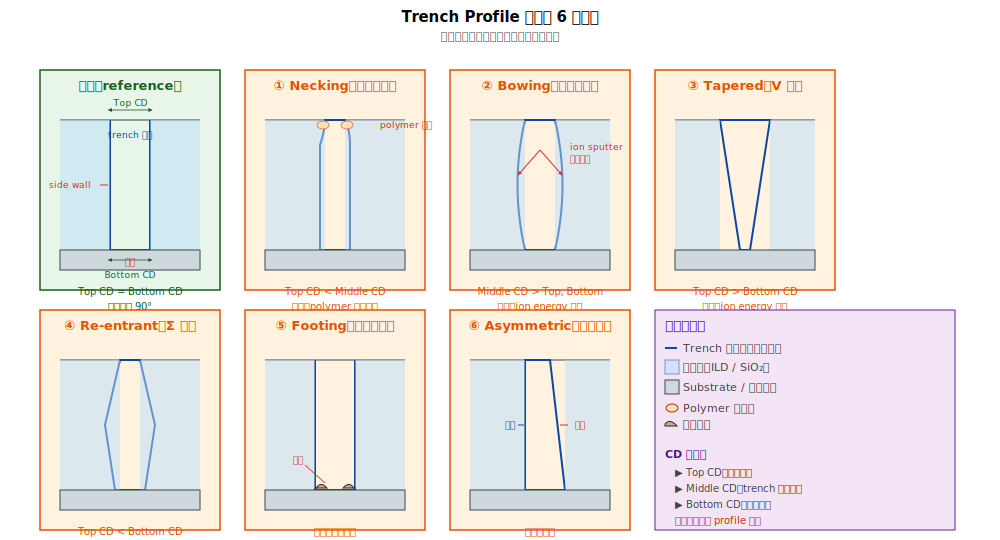

# Chapter 2 — Profile & CD Anomaly Library

## 2.1 你會在這章學到什麼

- 為什麼 profile / CD 是 RCA 第二條軸（與 map signature 互補）
- XCD / YCD 的意義與測量方式
- 6 種主要 profile 異常的形貌與物理機制
- Loading effect 與 iso-dense bias 怎麼讀
- 從 profile 反推嫌疑站點的方法

## 2.2 Profile / CD 是什麼

**CD（Critical Dimension，關鍵尺寸）**：layout 上的關鍵尺寸量測。

- **XCD**：沿 X 方向的 CD（沿 fin 方向、或 trench 開口寬度）
- **YCD**：沿 Y 方向的 CD（垂直 fin、跨 gate stripe）
- **Top CD / Bottom CD**：trench / line 上端與下端的寬度（可看出 profile 是否垂直）

**Profile**：cross-section 上看到的形狀（垂直、收口、外擴、底部殘留等）。

兩者一起構成「**從幾何形貌診斷缺陷**」的核心線索：

| 量測 | 工具 | 揭露什麼 |
|---|---|---|
| **XCD / YCD（top down）** | CD-SEM | 開口大小、線寬 |
| **Profile（cross-section）** | X-SEM、TEM | 側壁形狀、底部、頂部 |
| **3D 量測** | OCD（光學 CD）、scatterometry | non-destructive 整 wafer 形貌 |

## 2.3 為什麼 profile 是強力的 RCA 線索

Map signature 告訴你「**機台 / chamber 嫌疑**」，但不知道是「機台做出什麼樣的缺陷」。Profile 補上這塊：

> Map：「chamber #4 的 wafer 中心 fail」
> Profile：「chamber #4 的 wafer 中心 fin 比 spec 偏窄 5%」
> 合併：「chamber #4 中心區的蝕刻過頭，造成 fin 過窄」

→ 沒有 profile，只能猜「chamber 不對」；有了 profile，能定位到「**過蝕刻**」這個具體機制。

## 2.4 六種主要 profile 異常

下面是先進製程蝕刻 / 沉積中最常見的 profile 異常型態。每種有特定的物理機制與嫌疑站點。



### Type 1：Necking（上方收口）

**外觀**：trench 開口比中段窄，「**上窄下寬**」。

**物理機制**：蝕刻時 polymer（CFx 系蝕刻副產物）在開口處過度沉積，堵塞 ion 流路徑，使開口處蝕刻速率慢於下方。

**嫌疑站點**：
- 高 AR 蝕刻站（MD、V0、CMG etch）
- Chamber 條件偏：壓力過高、polymer-rich chemistry

**RCA 起手式**：
1. CD-SEM 量 top CD 與 middle CD 比例
2. Chamber pressure / polymer 添加氣體比例 SPC
3. Wet clean 後 trench 是否變回正常

### Type 2：Bowing（中段外擴）

**外觀**：trench 中段比上下都寬，「**中胖**」形。

**物理機制**：側壁 sputter 過度。能量太高的 ion 斜向打到側壁，把材料挖開。

**嫌疑站點**：
- 蝕刻 RF power 過高
- Chamber 內 ion 角度分布偏

**RCA 起手式**：
1. 量 top / middle / bottom CD，看哪段最寬
2. 蝕刻 RF power、bias voltage SPC
3. 嘗試降低 ion energy 看是否改善

### Type 3：Tapered（上寬下窄 / V 形）

**外觀**：trench 從上到下逐漸變窄。

**物理機制**：ion energy 不足；蝕刻方向性不夠強，底部開不大。

**嫌疑站點**：
- 蝕刻能量設定低
- Bias power 偏弱

**RCA 起手式**：
1. 量 top CD 與 bottom CD 比值
2. 適度提升 RF / bias
3. 是否需要 over-etch 補強底部開口

### Type 4：Re-entrant（上窄下寬 / Σ 形）

**外觀**：與 tapered 相反，底部比開口寬。

**物理機制**：早期蝕刻過程把上方先擴大（例如 Σ recess）；或某些 wet etch 對特定 facet 高選擇比，挖出特殊形狀。

**狀況**：
- **故意**：例如 PMOS S/D recess 用 TMAH 挖 Σ-shape 改善應力傳遞
- **缺陷**：trench 蝕刻不該 re-entrant 卻出現

**嫌疑站點**：取決於是哪個 module 的 trench / recess。

### Type 5：Footing（底部 footing 殘留）

**外觀**：trench 底部不乾淨，留下材料殘餘像「腳跟」。

**物理機制**：蝕刻 endpoint 控制不足，底部殘留材料沒蝕乾淨。

**嫌疑站點**：
- Gate etch（poly footing）
- MD etch（CESL footing）
- Spacer etch（spacer footing）

**RCA 起手式**：
1. X-SEM 確認 footing 厚度
2. 蝕刻時間 / over-etch % 是否足夠
3. Endpoint detection 訊號是否清楚

### Type 6：Profile 不對稱（Asymmetric）

**外觀**：trench 一邊垂直、另一邊傾斜。

**物理機制**：蝕刻 ion 角度 / chamber 內氣流 / wafer 對準有單側偏移。

**嫌疑站點**：
- 蝕刻 chamber 不對稱（與 wafer map 半月 signature 對應）
- 對應 wafer 上特定方向的 fail

**RCA 起手式**：
1. 多個 wafer 不同方位看是否同方向不對稱
2. Chamber RF coil / gas inlet 維護紀錄

## 2.5 Loading Effect 與 Iso-Dense Bias

**Loading effect** = 同一 wafer 上不同 pattern 密度區域的蝕刻 / 沉積行為差異。兩種主要表現：


### Pattern Density Loading

物理：dense 區氣體被周圍 pattern「吸走」濃度低，反應 byproduct 也較難排出，polymer 也更易累積。

→ **Iso-Dense Bias** = CD(iso) − CD(dense)：理想為 0，實務上常 1–5 nm。是 SPC 重要監控項。

### Aspect Ratio Dependent Etching (ARDE)

**ARDE**：高 aspect ratio（深寬比）的 trench 蝕刻速率比低 AR 慢。

→ 同 wafer 上深 trench 與淺 trench 同時做時，深 trench 可能還沒打到底而淺 trench 已經 over-etch。

**對策**：
- OPC 在 mask 上預先補償（dense 區的 line 略寬一點）
- 蝕刻配方對不同 AR 的選擇性
- Dummy fill 讓密度均勻

## 2.6 Profile / CD 量測工具

| 工具 | 量測什麼 | 優缺 |
|---|---|---|
| **CD-SEM**（top-down） | XCD、YCD | Inline、快、non-destructive；只看頂部 |
| **X-SEM**（cross-section） | Profile 全貌 | 必須切片（destructive）；高解析度 |
| **TEM** | Atomic 級結構 | 極高解析；昂貴、慢、destructive |
| **OCD（Optical CD）/ Scatterometry** | 整 wafer 3D 形貌 | Non-destructive、整 wafer；需 model 校正 |
| **AFM** | 表面 topology | 量 height / step；速度慢 |

實務：
- **Inline 監控**：CD-SEM + OCD 量全 wafer（non-destructive、覆蓋廣）
- **RCA 驗證假說**：當需要確認「物理形貌是什麼」的假說時，取 fail die 用 X-SEM / TEM 看細節。其他假說（如「整片 CD 飄到 chamber X」）可以直接用 inline 資料就能驗證，不一定要 destructive sampling。

## 2.7 Profile / CD 線索的 RCA 應用

從 profile 異常反推嫌疑站點的決策樹：

```
   發現 fin / trench profile 異常
              ↓
   ┌────────────────────────────┐
   │ 上下對稱嗎？                  │
   ├──────┬─────────────────────┤
   │ 是   │   profile 形狀？        │
   │      ├──┬──┬──┬──┬──────────┤
   │      │ Necking → polymer 過多 │
   │      │ Bowing → ion 太強      │
   │      │ Tapered → ion 太弱     │
   │      │ Footing → endpoint 不夠│
   │      │ Re-entrant → 看脈絡    │
   │ 否   │   Asymmetric → chamber 不對稱（合 map 半月）│
   └──────┴─────────────────────┘
```

→ Profile 通常先大致分類（對稱 / 不對稱），再看細部形貌。

## 2.8 Profile 異常 vs Wafer signature 的關聯

Profile 與 map signature 常**互相印證**：

| Map signature | 常見 profile 異常 | 整合解釋 |
|---|---|---|
| 同心圓 center 偏低 | Center 區 CD 偏窄 | 中心區蝕刻過頭 |
| 同心圓 edge 偏低 | Edge 區 CD 偏寬 | 邊緣 polymer 累積 |
| 半月 | Asymmetric profile | Chamber 不對稱 |
| Slot-correlated | Slot 內某些 wafer 的 CD 偏移 | 特定 chamber CD 控制差 |
| Lot drift | CD 隨時間飄移 | 耗材老化 |

→ **Map + Profile 配合，幾乎能鎖定到單一 chamber + 機制**。再加上 commonality 與 temporal 就完全定位。

## 2.9 接下來

下一章 [Chapter 3: Detection Methods](./03-detection.md) 進入第三條軸：**electrical 與檢測工具**。介紹 KLA / SEM / CP test 等工具能看到什麼、不能看到什麼。
