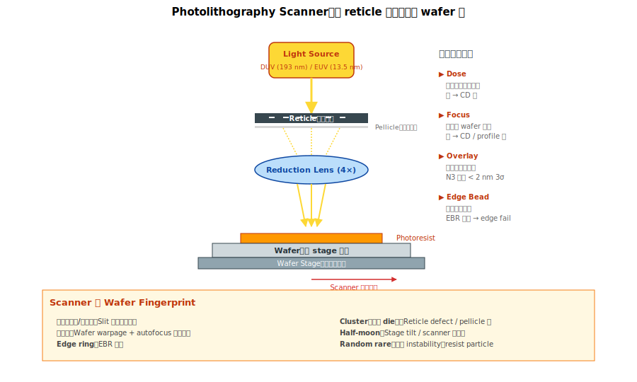

# Chapter 1 — Photolithography Tools

## 1.1 本章內容

- 微影機台的演進與分類
- Scanner / EUV 的關鍵控制參數
- 微影機台特有的 wafer fingerprint
- 好發 defect 與物理機制
- PM 與 maintenance 議題

## 1.2 機台基本原理




**微影（photolithography）**：把 mask（reticle）上的圖案，經過光學透鏡縮小投影到 wafer 表面的光阻上。

```
   Light source ──┐
                  ↓
              [Reticle]      ← mask 含設計圖案
                  ↓ (光通過 reticle)
              [Reduction lens]  ← 縮小投影（4×→ 1×）
                  ↓
              [Wafer 上光阻]  ← 圖案被印在這
                  ↓
              [Develop]       ← 顯影
                  ↓
              成形：光阻變成 mask 給後續 etch / implant 用
```

幾個關鍵：
- **解析度**：能印出的最小線寬，由波長 λ 與 NA（numerical aperture）決定
- **DOF（Depth of Focus）**：在 focus 範圍內能保持解析度的厚度容忍
- **Overlay**：相鄰兩層 photo 的對位精度

## 1.3 微影機台演進

| 世代 | 光源波長 | 主流時代 | 解析度極限 |
|---|---|---|---|
| **g-line** | 436 nm | 1980s | ~500 nm |
| **i-line** | 365 nm | 1990s 早期 | ~350 nm |
| **DUV (KrF)** | 248 nm | 1990s 末–2000s | ~150 nm |
| **DUV (ArF)** | 193 nm | 2000s–2010s | ~80 nm |
| **ArF immersion** | 193 nm + water | 2008–現在 | ~38 nm（單次曝光） |
| **EUV** | 13.5 nm | 2019–現在 | ~13 nm |

**Multi-patterning**：當解析度極限到了，用 LELE / SADP / SAQP 拆成多次曝光達到更細 pitch。N7 之前主流。

**EUV**：N7 開始引入，N5 / N3 大量使用。一台機 1–2 億美元，是 fab 內最貴的單一設備。

## 1.4 關鍵控制參數

### Dose（曝光劑量）

光阻接受到的能量（mJ/cm²）。dose 飄 → CD 飄。

### Focus

透鏡與 wafer 表面的距離。focus 偏 → CD 飄、profile 異常。

**Focus 是一個 wafer-to-wafer、wafer 內 die-to-die 都會變的參數**。Scanner 用 wafer mapping + autofocus 動態調整。

### Overlay

當前層相對前層的對位精度。N3 製程要求 overlay < 2 nm（3σ）。

### Edge Bead Removal (EBR)

光阻塗 wafer 後邊緣會堆積，要 wet etch 掉。EBR 不徹底 → 邊緣 die fail。

### Reticle / Pellicle

Reticle：含圖案的光罩。
Pellicle：保護 reticle 的薄膜。Pellicle 髒 / 破 → reticle defect 投影到 wafer。

## 1.5 Tool Fingerprint：Scanner 的「指紋」

| Signature | 物理機制 |
|---|---|
| **線狀（垂直 / 水平）** | Scanner slit 掃描方向不均 |
| **同心圓** | Wafer warpage + autofocus 補償不足 |
| **Edge ring** | Edge bead removal 不全 |
| **Cluster（特定 die）** | Reticle defect / pellicle 髒 |
| **Half-moon** | Stage tilt、scanner 校正偏 |
| **隨機（rare event）** | 光源 instability、resist particle |

→ Photo 的 fingerprint 比其他機台**更與「方向」相關**（scanner 是 linear motion，etch / CMP 是旋轉）。

## 1.6 好發 Defect

| Defect | 物理機制 | 對應 Vol 4 章節 |
|---|---|---|
| **Pattern Fail（CD 飄、bridge、break）** | dose / focus 飄 | [Vol 4 Ch 4.2](../04-defect/04-defects-pattern.md) |
| **CD Drift** | dose / scanner aging / resist batch | [Vol 4 Ch 4.3](../04-defect/04-defects-pattern.md) |
| **Overlay Fail** | scanner stability / wafer warpage | (引發 Vol 4 Ch 4.2 pattern fail) |
| **Edge Bead Defect** | EBR 不全、resist 邊緣堆積 | 邊緣 ring fail |
| **Reticle Defect 印到 wafer** | reticle 髒 / pellicle 破 | cluster signature |
| **OPC Hot Pattern Fail** | OPC 模型涵蓋不到的特殊 layout | [Vol 7 Ch 6](../07-rca/06-design-collab.md) |

## 1.7 PM / Maintenance 議題

- **Lamp / Source**：DUV laser 與 EUV LPP source 都有 power decay
- **透鏡污染**：scanner 內部 contamination（hydrocarbon）會降解析度
- **Stage calibration**：定期重新 calibration overlay
- **Pellicle 壽命**：EUV pellicle 是消耗品，依累積曝光劑量與膜熱負荷判斷換期（具體片數依製程與 vendor 而異）

## 1.8 RCA 起手式：看到 photo-related fail 怎麼辦

```
   觀察：wafer map cluster / 線狀
       ↓
   先確認：是不是 photo 站？
       ├─ 看時間（photo 是不是剛 release 新 recipe？）
       ├─ 看 reticle ID
       └─ 看 scanner ID
       ↓
   如果是 cluster + 同 reticle：reticle defect
   如果是 cluster + 跨 reticle：OPC hot pattern
   如果是 線狀：scanner 方向問題
   如果是 同心圓：focus / wafer warpage
   如果是 隨機散布：resist particle
```

## 1.9 站點對應

各製程模組的 photo 站常見命名：

| 站名 | 涵義 |
|---|---|
| ACT PHOTO | Active region photo |
| FIN PHO / MAND PHO | Fin / mandrel photo |
| GPHO / GTPHO | Gate photo |
| MDPHO | MD photo |
| MPPHO | MP photo |
| V0PHO | V0 photo |
| Mx PHO | Metal layer x photo |

## 1.10 接下來

下一章 [Chapter 2: Etch](./02-etch.md) 進入 fab 內**第二複雜**的機台家族 —— 蝕刻。Photo 印圖案、etch 把圖案實體化。
