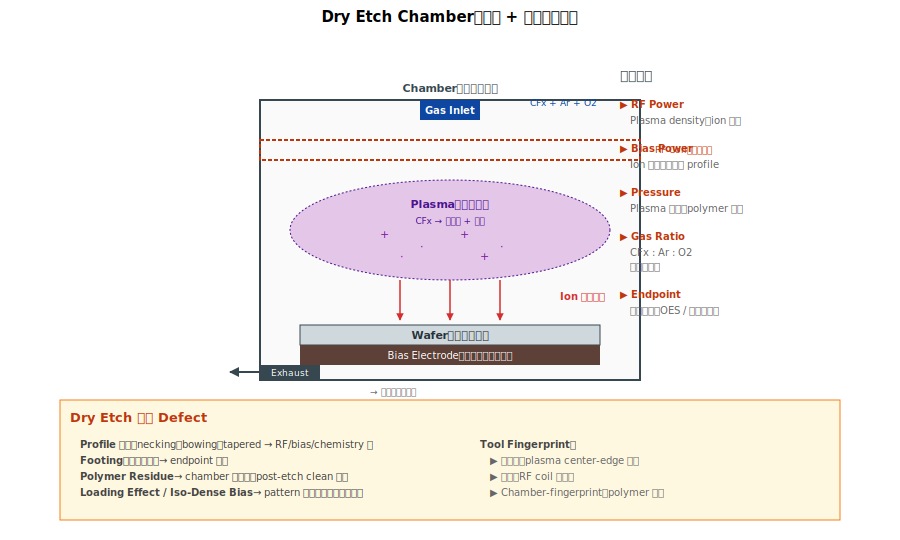

# Chapter 2 — Etch Tools

## 2.1 本章內容

- 乾蝕刻（dry etch）vs 濕蝕刻（wet etch）的物理
- Etch 機台的關鍵控制參數
- Etch fingerprint
- 好發 defect

## 2.2 機台基本原理

**Etch（蝕刻）**：把被光阻 mask 保護以外的材料移除。兩大類：

### Dry Etch（電漿蝕刻）




```
   反應氣體（CFx / Cl2 / HBr ...）── plasma 解離
                                        ↓
                                 自由基 + 離子
                                        ↓
                                 攻擊 wafer 表面
                                        ↓
                              副產物揮發排出
```

**特性**：
- 強方向性（ion 主要垂直入射）
- 適合高 AR、垂直 profile
- 化學 + 物理混合機制
- **fab 內主流**

### Wet Etch（濕蝕刻）

```
   wafer 浸入化學品（HF、TMAH、SC1 等）
        ↓
   材料溶解 / 化學分解
        ↓
   水洗、乾燥
```

**特性**：
- 各向同性（isotropic，等向性蝕刻）
- 適合 strip、選擇性高的特殊 etch
- 沒方向性，做不出垂直 profile

## 2.3 關鍵控制參數

### 對 Dry Etch

| 參數 | 影響 |
|---|---|
| **RF Power** | Plasma density、ion 能量 |
| **Bias Power** | Ion 方向性、選擇性 |
| **Pressure** | Plasma 密度、polymer 形成 |
| **Gas flow / ratio** | 化學選擇性 |
| **Temperature** | 反應速率、polymer 動力學 |
| **Endpoint** | 何時停止蝕刻 |

### 對 Wet Etch

| 參數 | 影響 |
|---|---|
| **化學品濃度** | 蝕刻速率 |
| **溫度** | 蝕刻速率（指數依賴） |
| **時間** | 總蝕刻量 |
| **攪拌** | 表面擴散層厚度 |

## 2.4 Tool Fingerprint：Etch 的「指紋」

### Dry Etch

| Signature | 物理機制 |
|---|---|
| **同心圓** | 中心—邊緣 plasma 不均 |
| **半月** | RF coil 不對稱 |
| **Chamber-fingerprint** | Polymer 累積、PM 後 conditioning |
| **Pattern-density-dependent** | Loading effect |

### Wet Etch

| Signature | 物理機制 |
|---|---|
| **Edge ring** | 邊緣 wet contact 不足 |
| **Random** | 化學品中 particle |
| **Lot drift** | 化學品老化、批次 |

## 2.5 好發 Defect

### Dry Etch 常見

| Defect | 機制 |
|---|---|
| **Profile 異常**（necking、bowing、tapered） | RF / bias / chemistry 偏 |
| **Footing**（底部殘留） | Endpoint 不足 |
| **Polymer Residue** | Polymer 累積、post-etch clean 不足 |
| **Selectivity 失效** | Chemistry 偏，傷到 mask 或下層 |
| **Ion Damage**（HK、low-k 等敏感介電） | Ion energy 過高 |
| **Loading Effect / iso-dense bias** | 不同 pattern 密度反應不均 |

### Wet Etch 常見

| Defect | 機制 |
|---|---|
| **Over-etch / Under-etch** | 時間 / 濃度控制不準 |
| **Particle 殘留** | 化學品不純、過濾不全 |
| **Watermark** | 乾燥不徹底，水分痕跡 |
| **Galvanic Corrosion** | 不同金屬接觸時的電化學 |

## 2.6 PM / Maintenance 議題

### Dry Etch

- **Chamber Wet Clean**：定期把 chamber 內壁的 polymer 清掉
- **Conditioning**：Wet clean 後跑 dummy wafer 達到穩態
- **Quartz parts 換**：polymer 滲透太深要整片換
- **End-point detection 維護**：optical 偵測器要定期清

### Wet Etch

- **化學品換批**：耗用達一定量就換新槽
- **Filter 更換**：定期換濾芯
- **DI water 純度**：恆定監控

## 2.7 RCA 起手式

```
   觀察：profile 異常 / residue / fail map
        ↓
   問：是 dry 還是 wet？
        ├─ Dry：看 chamber、recipe、PM 紀錄
        └─ Wet：看化學品批次、bath 使用次數
        ↓
   進階：
        ├─ Dry 看 wafer signature → chamber-fingerprint
        ├─ Dry 看 endpoint signal → endpoint 是否準
        └─ Wet 看 lot drift → 化學品老化
```

## 2.8 站點對應

| 站名 | 涵義 |
|---|---|
| STIETCH | STI etch (dry) |
| FINETCH | Fin etch (dry) |
| GETCH | Gate etch (dry) |
| MDETCH | MD etch (dry) |
| V0ETCH | V0 etch (dry) |
| MTETCH | Metal trench etch (dry) |
| HFSTRIP | HF wet etch / strip |
| NITSTRIP | SiN wet strip (熱磷酸) |
| POXSTRIP | Pad oxide strip |
| RCACLEAN | RCA clean (SC1/SC2) |

## 2.9 接下來

下一章 [Chapter 3: Deposition](./03-deposition.md) 講 CVD / ALD / PVD —— 把材料**長**到 wafer 上的機台家族。
