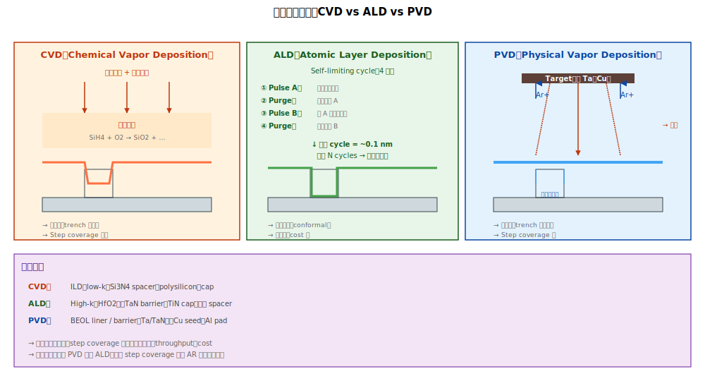

# Chapter 3 — Deposition Tools

## 3.1 本章內容

- CVD / ALD / PVD 三大沉積技術的物理差異
- 各自的關鍵控制參數
- Tool fingerprint
- 好發 defect

## 3.2 三大沉積技術




| 技術 | 全名 | 機制 |
|---|---|---|
| **CVD** | Chemical Vapor Deposition | 氣體前驅物分解，在 wafer 表面反應沉積 |
| **ALD** | Atomic Layer Deposition | 自我限制反應，每 cycle 沉積 1 原子層 |
| **PVD** | Physical Vapor Deposition | 物理方式（sputter、蒸發）把材料打到 wafer |

對應典型應用：

| 技術 | 典型 fab 應用 |
|---|---|
| **CVD** | ILD、low-k、Si3N4 spacer、polysilicon、cap、SiCN |
| **ALD** | High-k、TaN barrier、TiN cap、spacer（先進製程） |
| **PVD** | Ta/TaN、Cu seed、Al pad |

## 3.3 CVD

### 子分類

| 類型 | 特性 |
|---|---|
| **PE-CVD（Plasma-Enhanced）** | 用 plasma 助反應，較低溫，主流 |
| **LPCVD（Low Pressure）** | 高溫低壓，poly、SiN |
| **HARP（Sub-Atmospheric）** | TEOS/O3 系，高 gap-fill 能力 |
| **FCVD（Flowable）** | 流體前驅物，極窄縫填充 |

### 關鍵參數

- 溫度
- 壓力
- 前驅物流量比
- 沉積時間（決定厚度）

## 3.4 ALD

### 為什麼是 self-limiting

ALD 的精神：**「每個 step 反應到飽和為止**」。

```
   Step 1: 通入 Precursor A → 表面化學吸附 → 飽和（不再反應）
   Step 2: Purge A
   Step 3: 通入 Precursor B → 與表面 A 反應 → 飽和
   Step 4: Purge B
   → 1 cycle 完成，~1 原子層
   → 重複 N cycles 達目標厚度
```

### 特性

- 厚度精準（誤差 < 1 Å）
- 完美 conformal（3D 結構每面厚度均勻）
- **慢**（throughput 是 ALD 的最大限制）

### 主要應用

- Gate stack high-k（HfO2）
- Spacer SiOC / SiN（先進製程）
- BEOL barrier TaN / TiN

## 3.5 PVD

### 機制

物理 sputter：
```
   Target（要沉積的金屬，如 Ta）
        ↑ Ar+ ions 撞擊
   Atoms 被打離 target → 飛到 wafer 表面 → 沉積
```

### 特性

- 速度快
- Step coverage 差（高 AR 結構底部薄）
- 溫度低（沒化學反應）
- **target 本身昂貴**（特別是貴金屬如 Ta、Co、Ru）

### 主要應用

- BEOL liner / barrier（Ta/TaN）
- Cu seed
- Al pad
- 部分 silicide 前的 Ti / Co

## 3.6 Tool Fingerprint

### CVD

| Signature | 機制 |
|---|---|
| **同心圓** | Showerhead distance、temp 不均 |
| **Edge loading** | Edge gas flow 不足 |
| **Random particle** | Chamber wall flake、particle source |
| **Chamber-fingerprint** | Multi-chamber matching 差 |

### ALD

| Signature | 機制 |
|---|---|
| **Slot-correlated** | Multi-chamber 內某 chamber 條件不同 |
| **Lot drift** | Precursor 老化、cycle time drift |

### PVD

| Signature | 機制 |
|---|---|
| **半月（asymmetric）** | Target erosion 不對稱、cosine 分布偏 |
| **Edge loading** | 邊緣 sputter angle 不同 |
| **Particle** | Target chamber 髒、target flake |

## 3.7 好發 Defect

| Defect | 主要機台 | 機制 |
|---|---|---|
| **Thickness uniformity 差** | CVD / ALD / PVD | 機台均勻度 |
| **Particle** | 任何 dep | Chamber 髒、target flake |
| **Step coverage 差** | PVD（最嚴重） | 高 AR 結構底部沉積不足 |
| **HK Pinhole** | High-k ALD | Precursor 純度、表面污染 |
| **Cu void / seam**（後續 ECP 才看到） | PVD Cu seed | Seed 不均 |
| **Liner 不連續**（Cu damascene） | PVD / ALD | Step coverage |
| **Cap pinhole** | CVD cap | Step coverage、selective dep failure |
| **Loading effect** | CVD | Pattern density 影響 |

## 3.8 PM / Maintenance 議題

| 機台 | 主要 PM 議題 |
|---|---|
| **CVD** | Chamber wet clean（polymer 累積）、showerhead 換、heater 校正 |
| **ALD** | Precursor 換瓶、chamber clean、cycle time 校正 |
| **PVD** | Target life、shield clean、Ar 純度 |

## 3.9 RCA 起手式

```
   觀察：thickness drift / particle / step coverage
        ↓
   定位機台：
        ├─ Chamber matching test → 哪個 chamber 偏
        ├─ Lot history → 哪台機跑過
        └─ Wafer signature → fingerprint 對照
        ↓
   進階：
        ├─ ALD：cycle 數、precursor 純度
        ├─ CVD：chamber polymer 累積
        └─ PVD：target 使用量、shield 條件
```

## 3.10 站點對應

| 站名 | 涵義 |
|---|---|
| STIDEP / STIFILL | STI fill (CVD) |
| ILD0DEP / ILDDEP | ILD0 (CVD) |
| LKDEP | Low-k (CVD) |
| ALD0 / HKDEP | High-k ALD |
| TADEP / TANDEP | Ta/TaN (PVD/ALD) |
| CUSEED | Cu seed (PVD) |
| TIDEP / TINDEP | Ti / TiN (PVD/CVD/ALD) |
| CAPDEP | Cap layer (CVD) |
| SPCRDEP | Spacer (ALD) |

## 3.11 接下來

下一章 [Chapter 4: Epi](./04-epi.md) 處理 Epi —— 雖然技術上是 CVD 的一種，但複雜度與重要性高到值得獨立一章。
