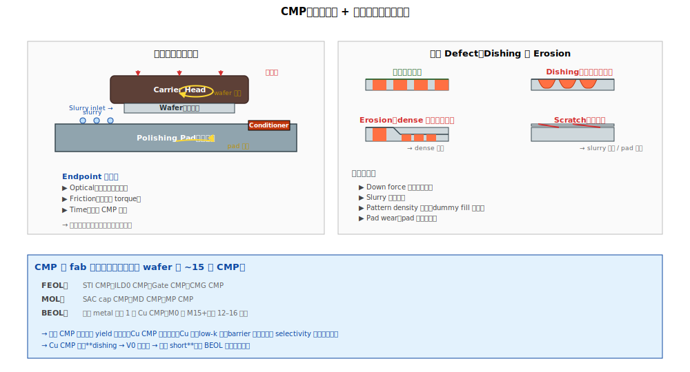

# Chapter 5 — CMP Tools

## 5.1 本章內容

- CMP 的物理：化學 + 機械的微妙平衡
- 關鍵控制參數
- Tool fingerprint
- 好發 defect（dishing、erosion、scratch）

## 5.2 機台基本原理



**CMP（Chemical Mechanical Polishing，化學機械研磨）**：把 wafer 表面**磨平**，停在指定厚度。

```
   Wafer 朝下放在 carrier head
        ↓ 加壓
   接觸到 polishing pad
        ↓
   兩者旋轉（wafer 自轉 + pad 公轉）
        ↓
   slurry（含磨料 + 化學品）流入
        ↓
   化學軟化 + 機械磨削，達到 polishing
        ↓
   Endpoint detection 偵測「該停了」
```

CMP **不是純機械**：化學軟化 + 機械磨除是耦合的。化學作用是把表面氧化變脆，機械再把它打掉。

## 5.3 CMP 的應用範圍

CMP 在 fab 內**極為普遍**：

| 製程模組 | CMP 應用 |
|---|---|
| FEOL Ch 2 | STI CMP |
| FEOL Ch 7 | ILD0 CMP |
| FEOL Ch 8 | Gate CMP |
| FEOL Ch 9 | CMG CMP |
| FEOL Ch 1 (MOL) | SAC cap CMP |
| MOL Ch 2-4 | MD / MP CMP |
| BEOL 每層 metal | Cu CMP |

→ 一片 wafer 整個流程要做 **15 次以上 CMP**。每次 CMP 都是一次風險。

## 5.4 關鍵控制參數

### Mechanical

| 參數 | 影響 |
|---|---|
| **Down force** | 磨削速率、dishing/erosion |
| **Pad rotation speed** | 速率 + 均勻度 |
| **Wafer rotation speed** | 與 pad 速度比影響均勻度 |
| **Pad type** | 硬度、粗糙度 |
| **Pad conditioning** | 維持 pad 表面狀態 |

### Chemical

| 參數 | 影響 |
|---|---|
| **Slurry chemistry** | 化學選擇性（不同材料的 polish rate） |
| **Slurry abrasive** | 顆粒大小、形狀（Si氧化、Ce氧化）|
| **pH** | 化學反應速率 |
| **Temperature** | 反應速率 |

### Endpoint

- 摩擦力（torque）變化
- 光學反射訊號變化
- 時間（time-based 用於非關鍵 CMP）

## 5.5 Tool Fingerprint

| Signature | 機制 |
|---|---|
| **同心圓 center-to-edge** | Down force 不均、pad 邊緣磨耗、wafer 旋轉不均 |
| **Edge ring 厚一圈** | Edge 不接觸 pad 完全 |
| **Slot-correlated** | Multi-head CMP 之單 head |
| **Lot drift** | Pad wear、slurry 老化 |
| **Random scratch** | Slurry 異物、pad 顆粒 |

→ **CMP 是「同心圓 fingerprint 最常見」** 的機台之一。

## 5.6 好發 Defect

| Defect | 物理樣貌 | 機制 |
|---|---|---|
| **Dishing** | 軟材料區凹陷 | 軟材料 polish 比硬周圍快 |
| **Erosion** | 大面積 dense pattern 整體被磨低 | Pattern density 影響 |
| **Scratch** | 線狀刮痕 | Slurry 顆粒過大、pad 雜質、機械振動 |
| **Particle 殘留** | Slurry 顆粒沒洗乾淨 | Post-CMP clean 不足 |
| **Smearing** | 軟金屬被「塗抹」到鄰近 | 軟金屬（Cu、Co）+ 不適合的 slurry |
| **Over-polishing** | 磨太多 | Endpoint 太晚、down force 太大 |
| **Under-polishing** | 殘留高低差 | Endpoint 太早、down force 太小 |
| **Pad wear induced drift** | Pad 老化使 polish rate 漸減 | Pad 累積使用次數 |

## 5.7 Pattern-density Effect

CMP 對 pattern density 極敏感。

```
   Sparse 區（少 pattern）：
   ────────────
   軟材料覆蓋少，磨削阻力大 → polish rate 慢
   
   Dense 區（多 pattern）：
   ████████████████
   軟材料多 → polish rate 快
   
   結果：sparse 與 dense 區的最終高度不同 → erosion / step
```

對策：**dummy fill**（在 layout 上加假 pattern 讓密度均勻）。

## 5.8 PM / Maintenance 議題

| 議題 | 內容 |
|---|---|
| **Pad 換** | 累積處理一定 wafer 數後換新（具體數值因 pad 材質、施加壓力、recipe 而異，依 fab maintenance system） |
| **Pad conditioning** | 維持 pad 表面狀態的修整動作，頻率取決於 pad 磨耗速率 |
| **Slurry 過濾器** | 定期換，防止異物進入 |
| **DI water 純度** | post-CMP rinse 用純水 |
| **Carrier head 校正** | 確保下壓平均 |

## 5.9 Cu CMP 特別議題

Cu CMP 是 BEOL 每層都要做的關鍵 CMP，特別敏感：

```
   挑戰：
   - Cu 軟（易 dishing）
   - 周圍是 low-k（脆，易 crack）
   - 還有 TaN barrier（硬）
   - 三種材料 selectivity 要平衡
   - 漿料化學要溫和（不能傷 low-k）
```

→ Cu CMP 是 BEOL yield 的「**單一最大風險點**」（per-layer）。每層 BEOL 做 12–16 層，每層 Cu CMP 都是風險。

## 5.10 RCA 起手式

```
   觀察：dishing / erosion / scratch / 厚度不均
        ↓
   先看：哪個 CMP？哪個 head？
        ├─ Wafer signature → 同心圓？slot？
        └─ Lot history → 跑哪個 CMP / head
        ↓
   進階：
        ├─ Pad 使用次數（接近壽命？）
        ├─ Slurry batch 變動
        ├─ PM / conditioning 紀錄
        └─ Pattern density 是否異常
```

## 5.11 站點對應

| 站名 | 涵義 |
|---|---|
| STICMP | STI CMP |
| ILD0CMP | ILD0 CMP |
| GCMP / GATECMP | Gate CMP |
| CMGCMP | Cut Metal Gate CMP |
| MDCMP / MPCMP | MD / MP CMP |
| CUCMP | Cu damascene CMP |

## 5.12 接下來

下一章 [Chapter 6: Thermal & Implant](./06-thermal-implant.md) 把熱處理與離子佈植兩個機台家族合併講解 —— 都涉及高能量輸入到 wafer，物理機制相關。
