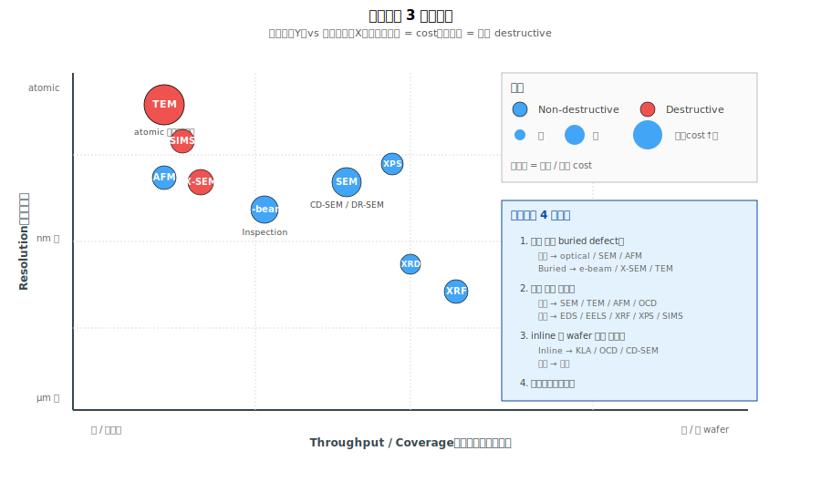

# Chapter 0 — Overview

## 0.1 本章內容

- 為什麼需要多種檢測工具
- 檢測工具的分類學
- 解析度 / 對比 / 速度三軸
- 後續章節地圖

## 0.2 為什麼一種工具不夠

Yield 工作中遇到的 defect 大小、材料、深度都不同：

| Defect | 尺寸 | 位置 |
|---|---|---|
| Particle | 0.05–10 µm | 表面 |
| Pattern fail | 1–100 nm | 表面 |
| Profile 異常 | 1–100 nm | 截面 |
| Buried defect（cu void、HK pinhole） | < 10 nm | 埋藏內部 |
| 化學組成異常 | atomic | 任意位置 |

→ **沒有單一工具能涵蓋所有需求**。需要多種工具配合。

## 0.3 檢測工具的物理分類

| 物理機制 | 代表工具 | 看什麼 |
|---|---|---|
| **光學散射** | KLA Brightfield/Darkfield、OCD | 表面形貌、particle |
| **電子束** | SEM、TEM、E-beam Inspection | 高解析形貌、組成、電性 |
| **原子力** | AFM | 表面 topology |
| **X 射線** | XRD、XRF | 結晶結構、元素組成 |
| **質譜** | SIMS | 元素深度剖面 |
| **光電子** | XPS | 化學狀態 |

每種物理機制有解析度、對比、速度的權衡。

## 0.4 三軸分析：選擇工具的框架




```
            Resolution（解析度）
                ↑ atomic
                │
                │   ● TEM
                │
                │   ● SEM
                │   ● AFM
                │   ● XPS
                │   ● SIMS（深度方向）
                │
                │       ● OCD
                │           ● Optical KLA
   nm ─────────●──────────────────────→ Throughput / Coverage
              E-beam            cm²/min     m²/min
              Inspection
```

**選擇邏輯**：
- 全 wafer 監控 → optical（速度 + 範圍）
- 確認 defect 形貌 → SEM（解析度 + 速度平衡）
- atomic 級分析 → TEM（最高解析度，但慢且 destructive）
- 表面 topology → AFM
- 元素 / 化學 → SIMS / XPS / EDS

## 0.5 三大實務考量

### 1. Destructive vs Non-destructive

| 工具 | 是否 destructive |
|---|---|
| Optical KLA | No |
| OCD | No |
| CD-SEM | No |
| Defect Review SEM | No |
| AFM | No |
| X-SEM | **Yes**（要切片） |
| TEM | **Yes**（要切超薄） |
| SIMS | **Yes**（材料消耗） |
| XPS / XRD | No |

→ **inline 監控優先用 non-destructive 工具**（不損傷 wafer 才能持續生產）。**RCA 在驗證假說階段**，當 non-destructive 工具看不到關鍵細節時（例如要看 buried defect、atomic 級結構、化學狀態），會選用 destructive 工具（X-SEM、TEM、SIMS）取樣分析。

> **Note：「RCA」不等於「destructive sampling」**。RCA 的核心是「**從現有資料提出 root cause 假說 + 設計方法驗證假說**」（見 [Vol 7](../07-rca/00-overview.md)）。Destructive 工具只是驗證手段之一，許多假說可以用 non-destructive 工具（OCD、CD-SEM、AFM、E-beam Inspection）驗證。

### 2. Throughput

| 工具 | 速度量級 |
|---|---|
| Optical KLA | 整 wafer / 數分鐘 |
| OCD | 整 wafer / 數分鐘 |
| CD-SEM | 數十點 / 小時 |
| Defect Review SEM | 數百個 defects / 小時 |
| X-SEM | 1 sample / 小時（含 prep） |
| TEM | 1 sample / 數小時（含 prep） |

→ **fab 內每天產生數 TB 資料，多數來自 inline KLA + OCD**。

### 3. Cost

從幾百萬美元（SEM）到上千萬（TEM）一台。**每張 sample 的成本**從數美元（KLA 自動掃描）到數千美元（TEM cross-section + analysis）。

→ TEM 不是日常工具，是「**最後一招**」。

## 0.6 後續章節地圖

| Ch | 主題 | 適用情境 |
|---|---|---|
| 1 Optical | KLA Brightfield/Darkfield | 整 wafer particle / pattern monitoring |
| 2 OCD | Scatterometry | 整 wafer 3D 形貌、CD、k value |
| 3 SEM Inline | CD-SEM、DR-SEM | inline CD 量測、defect review |
| 4 SEM Cross-section | X-SEM、FIB-SEM | 確認 trench / fin 形貌 |
| 5 TEM | Atomic 結構 | 最高解析度確認 |
| 6 AFM | 表面 topology | 量 step height、surface roughness |
| 7 E-beam Inspection | 電性 defect | Buried、electrical |
| 8 Other Specialty | XRD/XRF/XPS/SIMS | 結晶 / 組成 / 化學 |
| 9 Tool Selection + Summary | 整合應用 | 對照表 + Q&A |

## 0.7 一個值得記住的觀念

**「**用對工具看對 defect**」 比 「**買最貴的工具**」 重要**。

- Buried Cu void 用 SEM 看不到 → 要用 TEM
- 整 wafer particle monitoring 用 TEM 太慢 → 要用 KLA
- CD 量測用 OCD 比 CD-SEM 快 100×

→ **工程師的核心能力**：知道每個工具的「**強項與盲點**」，根據 defect 性質選工具。

## 0.8 接下來

下一章 [Chapter 1: Optical Inspection](./01-optical.md) 從 fab 內**最大宗、最常用**的工具開始 —— KLA brightfield 與 darkfield optical inspection。
