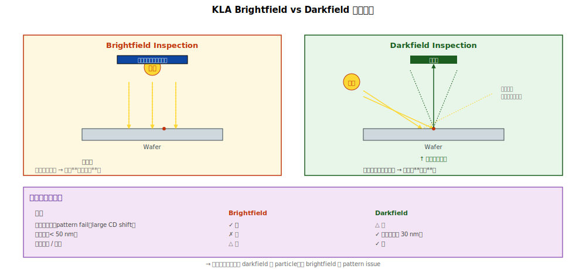

# Chapter 1 — Optical Inspection（KLA Brightfield / Darkfield）

## 1.1 本章內容

- Brightfield vs Darkfield 的物理原理
- 解析度與敏感度
- 能看到 / 看不到什麼
- 實務操作要點
- 對 yield 工作的角色

## 1.2 為什麼是「KLA」

「KLA」原為公司名（KLA-Tencor，現 KLA Corporation），在半導體業界已成 optical inspection 的代名詞，類似「**Xerox**」之於影印機。其他 vendor（Applied Materials、Hitachi）也做類似工具，但業界對話常用 KLA 統稱。

## 1.3 Brightfield Inspection 物理




```
            光源（白光或單波長）
                ↓ 垂直入射
       ┌────────────────┐
       │   Wafer 表面    │
       └────────────────┘
                ↑ 鏡面反射
                ↓ 收進偵測器
                ↓
       將整 wafer 的反射圖
       與「**參考圖**」（無缺陷模板）對比
                ↓
       找出差異 → 標為 defect
```

**對比機制**：缺陷會改變反射，造成「**亮度差異**」。
- 大形貌變化 → 強反射差異 → 易偵測
- 小顆粒（< 50 nm）→ 反射變化不大 → 難偵測
- 透明材料缺陷 → 折射率差小 → 難偵測

### 解析度

理論解析度受限於 Abbe diffraction limit：

```
   d_min ≈ 0.61 × λ / NA
```

對 λ = 365 nm（i-line UV）+ NA = 0.95：d_min ≈ 235 nm。

→ 但 KLA 用「**比對**」找 defect，不需要直接解析 defect 形狀。所以可以偵測 ~50 nm 的 defect（解析度的 1/5）。

### 強項

- **Pattern fail / missing pattern** 偵測
- **CD shift**（部分對比可顯）
- **大型 particle**（> 100 nm）

### 弱項

- **小 particle**（< 50 nm）
- **透明缺陷**（如 organic residue）
- **Buried defect**（埋在下層的）
- **無對比變化的 chemical defect**

## 1.4 Darkfield Inspection 物理

```
            光源
              ╲
               ╲ 斜射入射
                ↓
       ┌────────────────┐
       │   Wafer 表面    │
       └────────────────┘
              ↑↗  ←─ 鏡面反射避開偵測器
              ╱
        ↗ ↗ ↗
       ↗ 散射光
        ↗
   偵測器（只接收散射光）
```

**對比機制**：
- 平整表面 → 鏡面反射 → 偵測器接收 0
- 缺陷 → 散射 → 偵測器看到亮點

### 強項

- **小 particle 極敏感**（可達 < 30 nm）
- **表面異物 / contamination**
- 速度與 brightfield 相當

### 弱項

- **大形貌變化**（鏡面反射變動量大，會干擾散射訊號）
- **Pattern fail**（pattern 本身會散射，淹沒 defect 訊號）
- **Buried defect**

## 1.5 兩者互補

實務上 fab 同時跑 brightfield + darkfield：

| 用途 | Brightfield | Darkfield |
|---|---|---|
| Pattern 缺陷 | ✓ 強 | ✗ |
| 大形貌變化 | ✓ 強 | △ |
| 小顆粒 | ✗ | ✓ 強 |
| Particle monitoring | △ | ✓ 強 |
| Pattern wafer | ✓ | △ |
| Bare wafer | △ | ✓ 強 |

→ **Inline 流程通常先 darkfield 抓 particle，再 brightfield 抓 pattern issue**。

## 1.6 KLA 的輸出：Defect Map + Bin Code

```
   KLA 自動掃描整片 wafer
        ↓
   產生 defect map：每個 defect 的 (x, y) 座標 + 大小
        ↓
   自動分類成 bin code（rule-based 或 AI）
        ↓
   報告：top-10 defect cluster + signature
```

**Defect Bin Code 範例**：
- Particle (small / large)
- Pattern fail
- Scratch
- Cluster
- Edge
- Unknown

→ Bin code 是 yield Pareto 的入口（[Vol 7 Ch 1](../07-rca/01-data-pareto.md)）。

## 1.7 解析度極限與「Sensitivity」

工程實務上不只看「**最小可偵測 size**」，還看「**敏感度**」（sensitivity）：

```
   敏感度 = 對某種 defect 的偵測機率
   
   例：對 50 nm particle，sensitivity = 90%
   → 100 個 50 nm particle 中，KLA 抓到 90 個
```

→ Sensitivity 隨 defect type 變動。每年 fab 會 calibrate 一次，確認對 critical defect 的 sensitivity。

## 1.8 實務操作要點

### Recipe Setting

每種產品 / 製程站要建立專屬的 KLA recipe：
- Reference image（無缺陷的 wafer）
- 偵測敏感度（過高會 false alarm，過低會漏）
- Defect classification 規則

### Inline Sampling

不是每片都做 KLA（成本太高）：
- Process 站後抽 1–5 片 / lot
- Critical 站抽更多
- Particle monitor 站做 100% inspection

### False Alarm Management

KLA 抓到的不全是真 defect：
- **Nuisance**（false alarm）比例 5–30%
- 過度 nuisance → 訊號淹沒
- 工程師要定期 review、調整 recipe

## 1.9 對 yield 工作的角色

| 用途 | 重要性 |
|---|---|
| **Inline particle monitoring** | ⭐⭐⭐ 主力 |
| **Pattern fail 早期偵測** | ⭐⭐⭐ |
| **Wafer signature 建立** | ⭐⭐⭐ 是 [Vol 4 Ch 1](../04-defect/01-map-signatures.md) 的資料來源 |
| **Defect Pareto 分類** | ⭐⭐ 大部分 fab 自動做 |
| **PM 後 chamber 驗證** | ⭐⭐ chamber clean 完先 KLA 確認 |

## 1.10 KLA 看不到的 defect 後續工具

```
   KLA 找到一個 defect
        ↓
   Brightfield 看像是 pattern 異常
   Darkfield 看像是表面異物
        ↓
   進階確認：
       ├─ SEM Review（Ch 3）：高解析度看形貌
       ├─ TEM（Ch 5）：atomic 級確認
       └─ EDS（Ch 5）：元素組成
```

→ KLA 是「**第一線快篩**」，後續確認靠 SEM / TEM。

## 1.11 接下來

下一章 [Chapter 2: Scatterometry / OCD](./02-ocd.md) 講與 KLA 互補的另一種光學工具 —— 不找 defect，**直接量整 wafer 的 3D 形貌**。
