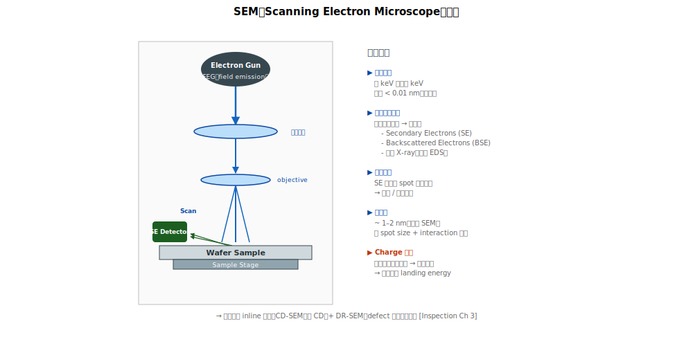

# Chapter 3 — SEM Inline（CD-SEM、Defect Review SEM）

## 3.1 本章內容

- SEM 的物理原理
- CD-SEM 與 DR-SEM 的差異
- 解析度與量測精度
- Charge 議題與對策
- 對 yield 工作的角色

## 3.2 SEM 的物理基本



**SEM（Scanning Electron Microscope）**：用聚焦的電子束掃描 wafer 表面，量測**反射 / 散射 / secondary electrons** 形成影像。

```
   電子槍（field emission gun）
        ↓ 電子束加速到 keV 級
   電磁透鏡聚焦
        ↓
   電子束 spot（直徑幾 nm）
        ↓ 掃描 wafer
   表面被打出 Secondary Electrons（SE）
        ↓
   偵測 SE 強度 → 形成影像
```

**為什麼用電子束**：電子束波長極短（< 0.01 nm），解析度遠超光學（光學受 λ ~ 200 nm 限制）。

### 解析度

- **Resolution**：典型 1–2 nm
- **Pixel size**：< 1 nm
- **Field of View**：10 nm 到 100 µm（可調）

→ 比 optical 高 100×，但比 TEM 低 10×。

## 3.3 兩種主流 inline SEM

### CD-SEM（Critical Dimension SEM）

**用途**：量 CD（線寬、開口寬度）。

**特性**：
- Top-down 視角（從上往下看）
- 高重複性（同一點重複量誤差小）
- 自動化（recipe 跑、自動找 feature、自動量）
- Inline 用，每天跑數萬點

### Defect Review SEM（DR-SEM）

**用途**：對 KLA 找到的 defect 一個個拍高解析度照片，分類確認。

**特性**：
- 接收 KLA 的 defect map → 自動移到該位置 → 拍照
- 速度比 CD-SEM 慢（每張要看 ~1 秒）
- 能看到 KLA 看不清楚的細節
- 配合 defect classification AI

**通常的工作流程**：
```
   KLA 掃描（找出 1000 個 defect）
        ↓
   抽樣（取 100 個 critical defect）
        ↓
   DR-SEM 拍照
        ↓
   人工 / AI 分類
        ↓
   Defect Pareto
```

## 3.4 Top-down 量測的限制

SEM 是「**從上面看**」：

```
   ┌─────────┐ ← 看到這個面
   │         │
   │ Trench  │
   │         │
   └─────────┘
```

→ 不知道：
- Trench 底部寬度（bottom CD）
- Sidewall 角度
- 3D 形貌

要看這些 → cross-section（Ch 4）。

## 3.5 Charge 議題

電子束打到 wafer 後，wafer 表面累積負電荷。對絕緣材料特別嚴重：

```
   Resist / oxide 上累積負電
        ↓
   排斥後續電子束 → 影像扭曲
        ↓
   也可能 ESD → device damage
```

### 對策

- **Beam landing energy 調整**：用低能量，產生 SE 比反射多 → 平衡電荷
- **Reference sample 量測前 charge neutralization**：用 plasma 中和
- **快速掃描**：減少累積時間

## 3.6 強項

| 用途 | 為什麼強 |
|---|---|
| **CD 量測** | 高精度、自動化 |
| **Defect 形貌確認** | 高解析度 |
| **Pattern fail 細節** | 看清楚實際印出的 pattern |
| **Inline 監控** | 速度足夠 |
| **Sub-pixel 量測** | < 1 nm 重複性 |

## 3.7 弱項

| 限制 | 原因 |
|---|---|
| Top-down 視角 | 看不到 sidewall、bottom CD |
| Charge | 對絕緣材料困難 |
| Damage | 高 dose 會 damage 敏感結構 |
| 速度 | 比 OCD 慢 100× |
| Cost | 機台貴、操作複雜 |

## 3.8 SEM Image 的 contrast 機制

不同位置產生不同 SE 量：

| Contrast 來源 | 機制 |
|---|---|
| **Material contrast** | 不同元素的 SE yield 不同 |
| **Topography contrast** | 凸起 / 凹陷產生不同 SE |
| **Edge contrast** | 邊緣 SE 強（最常用於 CD 量測） |
| **Voltage contrast** | 帶電 vs 接地的差異（用於 e-beam inspection） |

## 3.9 量測精度與重複性

CD-SEM 的關鍵 metric：

| 指標 | 典型值 |
|---|---|
| **重複性**（同一點同一次量多次） | < 0.5 nm 3σ |
| **再現性**（同點不同 sessions） | < 1 nm 3σ |
| **Tool match**（不同 SEM 之間） | 1–2 nm 3σ |

→ 量到 0.1 nm 級的精度時，工具 match 變成關鍵議題。

## 3.10 對 yield 工作的角色

| 應用 | 重要性 |
|---|---|
| **Inline CD SPC** | ⭐⭐⭐ 主力 |
| **Defect 分類確認** | ⭐⭐⭐ 配合 KLA |
| **Pattern fail 細節** | ⭐⭐ |
| **新 recipe DOE 量測** | ⭐⭐ |

## 3.11 SEM 看不到時用什麼

| SEM 看不到 | 用什麼 |
|---|---|
| Sidewall 形貌、bottom CD | X-SEM（[Ch 4](./04-sem-xsem.md)） |
| Atomic 級結構 | TEM（[Ch 5](./05-tem.md)） |
| Buried defect | E-beam Inspection（[Ch 7](./07-ebeam.md)）或 X-SEM |
| Surface roughness | AFM（[Ch 6](./06-afm.md)） |
| 元素組成 | EDS / SIMS（[Ch 5 / 8](./05-tem.md)） |

## 3.12 接下來

下一章 [Chapter 4: SEM Cross-section](./04-sem-xsem.md) 處理 SEM 看不到的「**側面**」 —— 切片後從側面看 trench 形貌。
