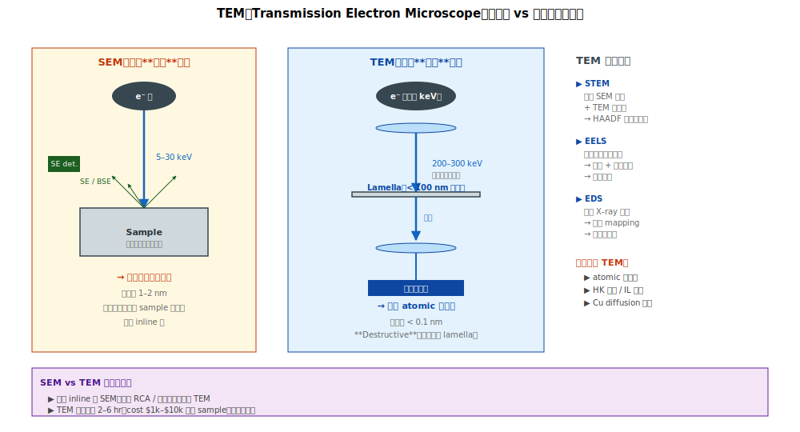

# Chapter 5 — TEM（含 STEM、EELS、EDS）

## 5.1 本章內容

- TEM vs SEM 物理差異
- STEM（Scanning TEM）的角色
- EELS 與 EDS 元素分析
- Atomic-level 解析度的工程意義
- 樣品製備的挑戰

## 5.2 TEM 物理基本



**TEM（Transmission Electron Microscope）**：電子束**穿透**超薄樣品（< 100 nm），偵測穿透後的電子產生影像。

```
   電子槍（200–300 kV，比 SEM 高很多）
        ↓
   超薄樣品（< 100 nm）
        ↓
   電子穿透 → 干涉 → 形成影像
        ↓
   投影到偵測器
```

**核心特性**：
- 解析度 **< 0.1 nm**（atomic 級）
- 必須超薄樣品
- 高加速電壓（避免電子被樣品吸收）

## 5.3 為什麼比 SEM 解析度高

### SEM
- 看樣品**表面 SE / 反射**
- 解析度受 spot size + 表面 interaction 限制
- 典型 1–2 nm

### TEM
- 看**穿透**樣品的電子
- 解析度受波長（極短）+ 像差限制
- 典型 < 0.1 nm（可看到單原子）

## 5.4 STEM（Scanning TEM）

混合 SEM 與 TEM 的優點：

```
   STEM：
   - TEM 的高解析度（穿透樣品）
   - SEM 的掃描方式（spot 掃描樣品）
   - 配合多種偵測器（BF、DF、HAADF、EELS、EDS）
```

**HAADF（High-Angle Annular Dark Field）**：
- 只收高角度散射的電子
- **質量對比強**（重元素 vs 輕元素，亮度差很多）
- 看 metal stack（Cu / TaN / Ti / Si 介面）超清楚

→ 現代 fab 的 atomic 級分析 **多用 STEM-HAADF**。

## 5.5 EELS：化學狀態 + 元素

**EELS（Electron Energy Loss Spectroscopy）**：分析穿透電子失去多少能量，反推樣品的元素 + 化學狀態。

```
   電子穿透樣品
        ↓
   有些電子被原子激發 → 損失能量
        ↓
   損失的能量 = 原子能階 fingerprint
        ↓
   判斷：哪種元素？什麼化學環境？
```

**強項**：
- 量輕元素（C、N、O 等，EDS 量不準）
- 看化學鍵狀態（如 -CH3 vs -OH）
- High-k 中 Hf-O 鍵的細節

## 5.6 EDS（Energy-Dispersive X-ray Spectroscopy）

**EDS / EDX**：電子打到原子，原子發出特徵 X 射線，分析這些 X 射線的能量得知元素。

```
   電子打中原子 inner shell electron
        ↓
   Inner shell 空位
        ↓
   外殼 electron 填回 → 釋放 X-ray
        ↓
   X-ray 能量 = 原子 fingerprint
        ↓
   元素分析
```

**強項**：
- 元素組成 mapping（哪個位置有哪種元素）
- 對重元素準確
- 速度快

**弱項**：
- 對輕元素（B、C）不準
- 化學狀態看不出

→ **EDS = 元素 mapping**；**EELS = 化學狀態 + 輕元素**。兩者互補。

## 5.7 應用情境

### 情境 1：High-k Stack 分析

```
   問題：HfO2 介電 EOT 異常
        ↓
   TEM cross-section
        ↓
   IL 厚度量測（~0.5 nm 級，TEM 才看得清）
        ↓
   EELS 看 Hf-O 鍵狀態（是否 crystallized）
        ↓
   EDS mapping 看 Hf 分布是否均勻
        ↓
   結論：IL 過厚 / HK 局部 crystallized
```

### 情境 2：Cu Diffusion 確認

```
   問題：BEOL TDDB stress fail
   嫌疑：Cu 擴散到 low-k
        ↓
   TEM cross-section + EDS Cu mapping
        ↓
   Cu 訊號是否在 low-k 區內？
        ↓
   確認嫌疑
```

### 情境 3：Silicide 介面分析

```
   問題：silicide 沒長 / piping
        ↓
   TEM 看 silicide / Si 介面
        ↓
   EDS 量 Ti / Si 比例
        ↓
   STEM-HAADF 看晶體相
        ↓
   確認 silicide phase（C49 vs C54 for TiSi2 等）
```

### 情境 4：Atomic-level 缺陷

```
   問題：Vt 異常 random scatter
   嫌疑：晶體缺陷
        ↓
   TEM 看 fin Si 是否有 dislocation
   STEM-HAADF 看是否有 misalignment
        ↓
   確認晶體缺陷密度
```

## 5.8 樣品製備：FIB Lamella

TEM 樣品必須**超薄**（< 100 nm），主流方法 **FIB lift-out**：

```
   1. FIB 在 wafer 表面切出方塊（含目標 feature）
   2. 焊在 TEM 用的 grid 上
   3. FIB 進一步 thin down 到 < 100 nm
   4. 進 TEM 觀測
```

每個 lamella 製備：
- 時間：2–6 小時
- 成本：$1,000–$10,000（取決於精度）

→ **TEM 不是日常工具**。只在最關鍵 RCA 或新製程驗證時用。

## 5.9 強項

| 用途 | TEM 強在哪 |
|---|---|
| **Atomic 級結構** | 唯一能看到原子級的工具 |
| **Multi-layer stack 介面** | 解析度足夠看每一層 |
| **High-k thickness** | 唯一能準量 0.5 nm 級厚度 |
| **化學狀態** | EELS 看 bonding |
| **元素 mapping** | EDS / EELS 都能 |
| **晶體缺陷** | 看 dislocation、stacking fault |

## 5.10 弱項

| 限制 | 原因 |
|---|---|
| **Sample preparation 困難** | < 100 nm lamella 難做 |
| **時間 / cost 高** | 每樣品數千美元、數小時 |
| **Throughput 低** | 不適合 inline |
| **Sample 範圍小** | 一個 lamella 看 < 1 µm² |
| **Beam damage** | 高能電子可能 damage 樣品 |

## 5.11 對 yield 工作的角色

| 應用 | 重要性 |
|---|---|
| **關鍵 RCA 確認** | ⭐⭐⭐ 最後一招 |
| **新製程驗證** | ⭐⭐⭐ |
| **High-k / IL stack 量測** | ⭐⭐ 唯一工具 |
| **Reliability fail 物理** | ⭐⭐ |
| **Inline 監控** | ✗ |

→ **TEM 不是 daily tool**。一週做 1–5 個 sample 是常態。

## 5.12 TEM 看不到的時候

雖然 TEM 解析度最高，但仍有盲點：
- **大範圍 statistics**（單 lamella 範圍小）→ 用 OCD / SEM
- **Buried 電性 defect**（需要電性 active 才能看出）→ 用 e-beam inspection
- **化學深度剖面（µm 級）**→ 用 SIMS

## 5.13 接下來

下一章 [Chapter 6: AFM](./06-afm.md) 處理另一種 atomic 級工具 —— 不用電子，用**原子力**機械式探測表面。
