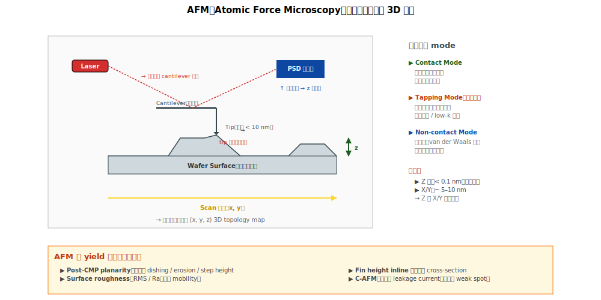

# Chapter 6 — AFM（Atomic Force Microscopy）

## 6.1 本章內容

- AFM 物理原理
- 三種主要操作模式
- AFM 在 yield 工作的特殊用途
- 限制與對策

## 6.2 物理原理



**AFM**：用一根**極尖的探針（tip）**接觸或接近 wafer 表面，量測探針與表面之間的「**原子力**」變化，掃描整個區域形成 3D 表面圖。

```
                            探針（tip，半徑 < 10 nm）
                                  │
   Cantilever 懸臂 ──────────────●
                                  │
                                  ↕ 表面凸起 → cantilever 偏轉
                                  ↕ 表面凹陷 → cantilever 鬆弛
                                  
   ┌─────────────────────────────────┐
   │           Wafer 表面             │
   └─────────────────────────────────┘
   
   雷射照在 cantilever 反射 → 偵測偏轉量 → 換算高度
```

**核心優勢**：直接得到**3D topology**（高度 = z 軸資訊）。SEM / TEM 看不到絕對高度，AFM 能。

## 6.3 三種操作模式

### Contact Mode

探針一直接觸表面。
- **優點**：訊號強、解析度高
- **缺點**：可能損傷軟材料、磨耗探針

### Tapping Mode（最常用）

探針以高頻振動接近表面，間歇性接觸。
- **優點**：對樣品損傷小、適合軟材料
- **缺點**：訊號比 contact 弱

### Non-contact Mode

探針從不接觸樣品（用 van der Waals 力）。
- **優點**：完全不損傷
- **缺點**：訊號弱、解析度較低

## 6.4 AFM 量得到什麼

### 1. 表面 Topology

直接的高度 map（每點 (x, y, z) 的 z）：
- **Roughness**（表面粗糙度）：RMS、Ra
- **Step height**：層與層之間的高度差
- **Trench depth / fin height**：直接量

→ 對「**post-CMP 表面平整度**」、「**fin height 變動**」等議題是**唯一直接量到的工具**。

### 2. 機械性質

進階模式可量：
- **Stiffness**（硬度）
- **Adhesion**（黏附力）
- **Friction**（摩擦力）

→ 對 low-k 機械性質量測有用。

### 3. 電性 / 磁性（特殊探針）

- **C-AFM（Conductive AFM）**：量電流 → 找 leakage path
- **KPFM**：量 surface potential → 找帶電區

## 6.5 解析度

| 維度 | 解析度 |
|---|---|
| Lateral（X, Y）| ~ 5–10 nm（受探針 tip size 限制） |
| Vertical（Z）| < 0.1 nm（次原子級！） |

→ AFM 的**Z 方向解析度比 X/Y 還高**，這是它最特殊的地方。

## 6.6 AFM vs SEM 的差異

| 維度 | AFM | SEM |
|---|---|---|
| 訊號 | 機械接觸 / 力 | 電子訊號 |
| 看到 | 3D topology | 2D 影像（投影） |
| Z 方向資訊 | ✓ 直接量 | ✗ 推估 |
| Lateral 解析度 | 中 | 高 |
| Z 解析度 | 極高 | 不直接量 |
| 速度 | 慢（µm/sec） | 快 |
| 樣品 prep | 通常 minimal | 一般 minimal、有時 charge 處理 |

## 6.7 強項

| 用途 | 為什麼強 |
|---|---|
| **Surface roughness** | 直接量 RMS、Ra |
| **Step height** | 多層結構的高度差 |
| **Post-CMP planarity** | dishing / erosion 量化 |
| **Fin height** | 量 fin 從 STI top 突出多少 |
| **Leakage path 找尋**（C-AFM） | 找介電中的導電通路 |

## 6.8 弱項

| 限制 | 原因 |
|---|---|
| **速度慢** | 點接觸掃描，整 wafer 要數小時 |
| **覆蓋範圍小** | 一次量幾十 µm² |
| **探針磨耗** | 用幾百個樣品就要換 |
| **無元素資訊** | 不知道是什麼材料，只知道形狀 |
| **侷限表面** | 只能看到表面、不能 buried |

## 6.9 在 fab 內的角色

AFM 在 fab 中**不是日常工具**，但是**特定議題的標配**：

| 議題 | 為什麼用 AFM |
|---|---|
| Post-CMP planarity 量化 | 直接量 dishing / erosion |
| Fin height 量測 | 不需要 cross-section |
| Surface roughness（mobility 影響） | LER、表面平滑度 |
| Reliability fail 找 leakage（C-AFM） | 找介電 weak spot |

→ Inline 用得不多。**當 RCA 需驗證「表面 topology / step height」類假說**（例如「**post-CMP dishing 是不是這個 issue 的 root cause**」）時，AFM 是首選工具之一。

## 6.10 一個常見誤解

「AFM 解析度比 SEM 低，所以不重要。」

→ **錯**。AFM 的**Z 軸**解析度比 SEM 高很多。**特定問題上 AFM 是唯一答案**。

例：CMP dishing 量化。SEM 看不到，OCD model 不準確，AFM 直接掃出 height map。

## 6.11 接下來

下一章 [Chapter 7: E-beam Inspection](./07-ebeam.md) 處理「**buried 電性 defect**」 —— 表面看不到、需要電性訊號才能找到的缺陷。
