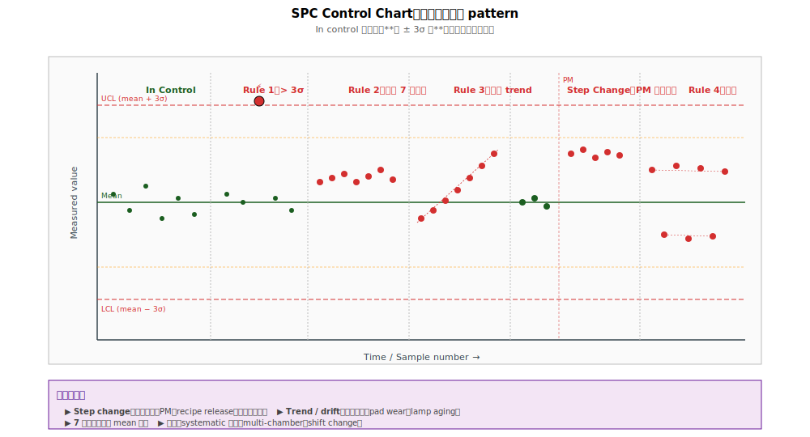

# Chapter 2 — SPC（Statistical Process Control）

## 2.1 你會在這章學到什麼

- SPC 在 RCA 中的**正確角色**（不是入口）
- Control chart 的三大元素：mean、UCL/LCL、樣本點
- Cpk（製程能力指數）的意義與解讀
- SPC 警報規則（Western Electric / Nelson rules）
- 用 SPC 找事件時間軸、驗證 fix 效果
- SPC 的常見誤用與限制

## 2.2 為什麼這章一開始就要澄清：SPC 不是 RCA 入口

學完統計教科書的人常以為「**yield 工作就是看 SPC chart 找異常點**」。實際 fab 工作流不是這樣：

```
   學院派想像：
   SPC alert → 進 RCA → 找 root cause

   實際 fab 工作：
   KLA inline 異常 → trigger 卡站 → 工程師立即 RCA → 決定停線
   （SPC 通常還沒觸發，因為 SPC 看的是時間累積趨勢）
```

→ **SPC 反應比 KLA 慢一個數量級**。等 SPC 觸發時，已經有大量 wafer 跑完整製程才暴露問題。

但這不代表 SPC 沒用。SPC 在 RCA 中有三個**正確角色**：

| 角色 | 描述 |
|---|---|
| **A. 背景穩定度監控** | 定義什麼是「正常」、設 control limit、提供 baseline |
| **B. 找事件時間軸** | KLA 警報後回頭看 SPC chart，找拐點對應到的事件 |
| **C. 驗證 fix 效果** | 修正後監控 SPC 是否回 in-control，確認 root cause 真的對 |

→ 本章後續展開這三個角色。

## 2.3 SPC 的基本原理

**SPC（Statistical Process Control）** 用統計方法**監控製程是否穩定**。

核心概念：「**製程在 control 中時，量測值會落在統計可預測的範圍內**」。當量測值跑出範圍 → 觸發警報 → 工程師介入。

```
   一個典型的 control chart：

   量測值（如 fin width）
        ↑
   UCL  │ ─────────────────── ← 上控制限
        │       ●
        │   ●     ●
   mean │ ●─────●───● ────── ← 平均
        │    ●         ●
        │       ●   ●
   LCL  │ ─────────────────── ← 下控制限
        │
        └────────────────────→ 時間

   → 點都在 UCL/LCL 之間 = in control
   → 跑出去 = out of control，警報
```

## 2.4 Control Chart 的元素

### Mean（平均）

過程歷史平均值，代表「**製程的中心**」。

### Standard Deviation σ（標準差）

過程的自然變異程度。

### UCL / LCL（上下控制限）

通常設在 **mean ± 3σ**。物理意義：99.73% 的點應落在 UCL/LCL 之間（假設常態分布）。

→ 「±3σ 是 SPC 的標準警戒線」。

### Spec Limits（規格上下限）

由設計指定的「**可接受範圍**」，通常**比 UCL/LCL 寬**（spec ⊃ control limits）。

關鍵區別：

- **Control limits**：製程的「**穩定性**」邊界（從歷史資料算出）
- **Spec limits**：產品的「**可用性**」邊界（從設計需求得到）

## 2.5 Cpk（製程能力指數）

**Cpk** 衡量製程平均與 spec 邊界的距離，用 σ 為單位。

```
   Cpk = min(USL - mean, mean - LSL) / (3σ)
```

**Cpk 解讀**：

| Cpk | 意義 | 是否可接受 |
|---|---|---|
| < 1.0 | 製程窄度與 spec 接近，常出 spec | ✗ 必須改善 |
| 1.0–1.33 | 勉強可接受 | △ 有風險 |
| 1.33–1.67 | 良好 | ✓ 一般工業標準 |
| 1.67–2.0 | 優秀 | ✓✓ |
| > 2.0 | 卓越 | ✓✓✓（六標準差等級） |

→ 業界目標 Cpk > 1.33；先進製程許多關鍵 metric 要求 Cpk > 1.5。

## 2.6 SPC 警報規則



「**out of control**」不只看 ±3σ。常用的是 **Western Electric / Nelson rules**：

| 規則 | 內容 | 物理意義 |
|---|---|---|
| **Rule 1** | 一個點超過 ±3σ | 異常突發事件 |
| **Rule 2** | 連續 7 點在 mean 同一側 | 製程平均偏移 |
| **Rule 3** | 連續 7 點呈單調上升 / 下降 | 漸進式飄移 |
| **Rule 4** | 連續 7 點呈交替（鋸齒） | 系統性振盪 |
| **Rule 5** | 2/3 連續點超過 ±2σ | 統計上異常頻繁 |

→ 規則目的：**在「明顯 out of spec」之前提前預警**。但「提前」是相對 spec，不是相對 KLA。**KLA 比這些規則都更早**。

## 2.7 SPC 角色 A：背景穩定度監控

最基本的功能：**定義 baseline**。

- 每站關鍵 metric（CD、厚度、temperature、pressure）都跑 SPC chart
- 跑完一段穩定期 → 計算 mean / σ / UCL / LCL
- 之後新進來的點都對照這條 baseline

**對 RCA 的價值**：

當 KLA 抓到異常，工程師回頭看 SPC，能快速判斷：

| SPC 狀態 | 含義 |
|---|---|
| 全綠（in control） | 製程量測值都正常 → fail 來源在 SPC 監控範圍外（特殊缺陷、layout 相依、cross-contamination） |
| 已飄一段時間 | 慢性問題終於累積到 KLA 抓到 |
| 剛好在拐點 | 高度嫌疑：拐點對應的事件就是 root cause |

## 2.8 SPC 角色 B：找事件時間軸（KLA 之後的回溯）

KLA 警報已觸發後，回頭看 SPC trend chart 找拐點：

```
   Yield trend：
        ↑
   95% │ ●●●●●●●●●●●     ← stable
   93% │              ●●  ← 突然 step change
   90% │                ●●●●●●● ← 持續低
        │
        └────────────→
                  ↑
              拐點：什麼時候開始？什麼變了？
```

**RCA 上的拐點分析**：

1. **找精準時間點**：到天 / 班別 / lot 級
2. **拉那一天的所有變動**：機台 PM、化學品換批、recipe release、operator 變動、environment 變動
3. **逐項排除**：每個變動有多大可能造成這個 metric 飄？

→ 如果拐點剛好只有「pad 換批次」這一件事發生，**強烈嫌疑就是 pad**。

### 兩種典型 trend pattern

**Step Change（階梯式）**：

```
   ●●●●●●●●  step    ●●●●●●●●
              ↓
              ●●●●●●
```

- 物理：突發事件（PM、recipe 改、化學品換）
- 對應 RCA：找拐點對應的單一事件

**Gradual Drift（漸進式）**：

```
                       ●
                    ●
                 ●
   ●●●●●●●●●● ●
```

- 物理：累積性老化（pad wear、lamp aging、chamber polymer）
- 對應 RCA：看耗材使用週期、PM cycle

## 2.9 SPC 角色 C：驗證 Fix 效果

工程師依 KLA 警報做了停線決策、執行修正後（換 chamber part、調 recipe、PM），下一步是**驗證 fix 真的對**。

```
   Fix 前：SPC 持續超 UCL
        ↓
   Fix 上線
        ↓
   Fix 後：SPC 回到 in control
        ↓
   ✓ Fix 確認有效，可解除停線
```

如果 fix 後 SPC **沒回正常**，代表：

- Root cause 假設錯誤
- 還有第二個 root cause
- Fix 雖對但措施不夠

→ **這是 SPC 在 RCA 流程中最關鍵的功能：閉環驗證**。沒有 SPC 確認，「fix 有效」只是工程師的主觀判斷。

## 2.10 SPC 的常見誤用

### 誤用 1：把 spec limit 當 control limit

❌ 「只要在 spec 內就 OK」 —— 但 spec 內也可能 out of control（持續單側偏移、漸進式漂移）。

✓ Control limit 比 spec limit 嚴，必須**先**達到 in control，**再**才能討論 spec。

### 誤用 2：用單點判斷異常

❌ 看到一個點突然偏低 → 立刻警報。

✓ **單點不算異常**（統計噪音）。看 Nelson rules 的多點 pattern 才有意義。

### 誤用 3：忽略樣本大小

❌ 每天只量 1 點，連續 7 點 = 一週才能觸發 trend rule。

✓ **量測頻率**與**樣本大小**要與 SPC 規則設計配合。

### 誤用 4：靜態 control limit

❌ Control limit 設定一次後不再更新。

✓ 製程隨時間自然會緩慢演化，**control limit 應該定期重新計算**（rolling 12 weeks）。

### 誤用 5：把 SPC 當 RCA 入口

❌ 等 SPC 觸發再開始查問題。

✓ **KLA inline 比 SPC 早抓到 90% 的問題**。SPC 是輔助監控，不是入口。

## 2.11 多變量 SPC（advanced）

實務上一個製程有上百個 metric。逐個看 SPC chart 不可行。進階工具：

- **PCA-based SPC（Principal Component Analysis）**：把多 metric 合成主要變異方向，找出整體 out of control
- **Hotelling's T² control chart**：多變量版本的 control chart
- **Multivariate SPC software**：自動化監控所有 metric

→ 這些是 fab 內部統計工具的標配。深入需要統計專書（如 Montgomery, *Statistical Quality Control*）。

## 2.12 接下來

當 KLA 警報 + SPC 拐點都指向某個嫌疑因子，需要進一步用統計方法**確認**這個因子在 fail vs pass wafer 之間真的有區別。下一章 [Chapter 3: Commonality Analysis](./03-commonality.md) 處理「找共因」這件事 —— 包括為什麼 raw commonality 共因太多無法聚焦、以及 fab 內部如何用特化的統計手法解決這個問題。
