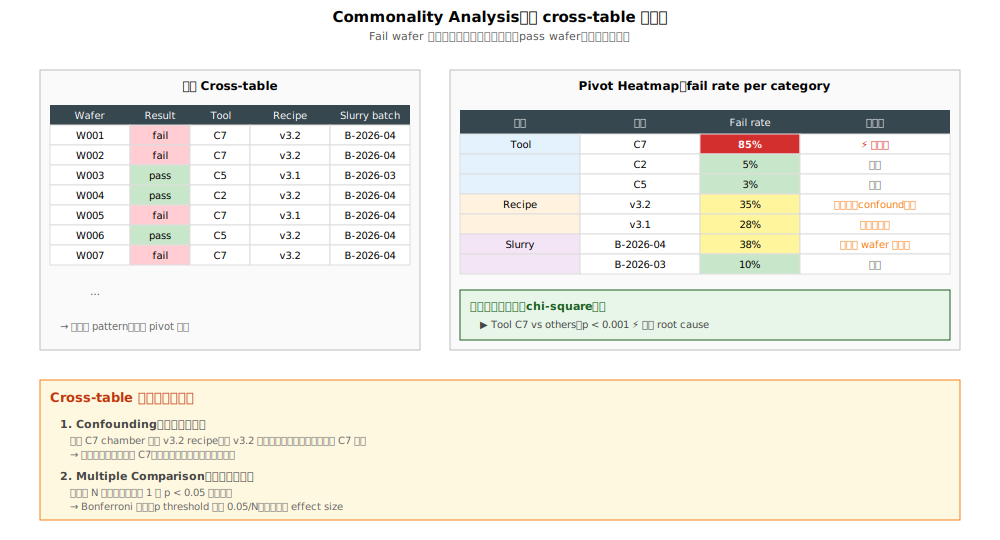

# Chapter 3 — Commonality Analysis

## 3.1 你會在這章學到什麼

- Commonality analysis 的核心概念（為什麼是 RCA 的核心方法）
- 標準 commonality cross-table 的建立方式
- 為什麼 **raw commonality 在實務上幾乎無法直接用**——共因太多無法聚焦
- Fab 內部為什麼要開發 **in-house tuned 統計手法** 來特化 commonality
- 「特化」可能涉及哪些方向（概念層級，不展開公式）
- 從 commonality 結果到具體決策

## 3.2 Commonality 的核心觀念

**Commonality analysis（共同性分析）**：把所有 fail 的 wafer / lot 列出來，找出它們**「共享什麼處理因子」**。

直覺：**如果某因子是 root cause，那所有 fail wafer 都會跟這個因子有交集**。

```
   Fail wafer 列表：
   ├─ Wafer A：跑了 chamber-7、recipe v3.2、operator 王、slurry batch 2026-04
   ├─ Wafer B：跑了 chamber-7、recipe v3.2、operator 李、slurry batch 2026-04
   ├─ Wafer C：跑了 chamber-7、recipe v3.1、operator 陳、slurry batch 2026-04
   └─ Wafer D：跑了 chamber-7、recipe v3.2、operator 張、slurry batch 2026-04

   找共同因子：
   ├─ chamber-7：100% （所有 fail 都跑過）⚡ 強嫌疑
   ├─ recipe v3.2：75% （3/4）
   ├─ slurry batch 2026-04：100% ⚡ 強嫌疑
   └─ operator：分散 → 排除
```

→ 「**100% 共享**」的因子是強嫌疑。但這只是 raw 算法，實務問題比這複雜。

## 3.3 對照組是必要的

光看 fail wafer 共享什麼還不夠。要對照**好 wafer**：

```
   假設 fail wafer 都跑了 chamber-7：

   ❓ 但 pass wafer 是不是也都跑了 chamber-7？

   情況 A：所有 wafer（pass + fail）都跑 chamber-7
        → chamber-7 不是區別因子，是 fab 內共用機台

   情況 B：fail wafer 100% 跑 chamber-7，pass wafer 只 30% 跑 chamber-7
        → chamber-7 對 fail 有強相關 → 真嫌疑
```

→ **「fail 共享 X、且 pass 不共享 X」** 才是 commonality 的真正信號。

## 3.4 標準 Commonality Cross-Table



標準的 cross-table 結構：

| Wafer ID | 結果 | Chamber | Recipe | Operator | Chemistry batch | Reticle | ... |
|---|---|---|---|---|---|---|---|
| W001 | fail | C7 | v3.2 | 王 | B-2026-04 | R-AB | ... |
| W002 | fail | C7 | v3.2 | 李 | B-2026-04 | R-AB | ... |
| W003 | pass | C5 | v3.1 | 陳 | B-2026-03 | R-CD | ... |
| W004 | pass | C7 | v3.2 | 張 | B-2026-04 | R-AB | ... |
| W005 | fail | C7 | v3.1 | 王 | B-2026-04 | R-EF | ... |

**標準分析步驟**：

1. 對每個維度，計算「**fail rate per category**」
2. 找出哪個維度的 categories 之間 fail rate 差異最大
3. 對最大差異做統計顯著性檢定（chi-square、Fisher's exact）
4. 排除巧合，鎖定真嫌疑因子

## 3.5 七個常見 Commonality 維度

| 維度 | 內容 | 來源 |
|---|---|---|
| **1. Tool / Chamber** | 跑過哪台機 / 哪個 chamber | Fab 內 logging system |
| **2. Recipe / Recipe Revision** | 用什麼配方 / 第幾版 | Recipe management |
| **3. Raw Material Lot** | 化學品 / 漿料 / 光阻批次 | Material trace database |
| **4. Operator / Shift** | 哪個人 / 哪一班 | Personnel logs |
| **5. Wafer Slot in Batch** | 在 25 片中第幾位 | Batch records |
| **6. Reticle / Mask** | 哪片光罩 | Reticle tracking |
| **7. Lot History Sequence** | 經過站序的特殊組合 | Lot history database |

→ 每個 fab 還有自己的 fab-specific 維度（lot priority、product family、wafer supplier）。

## 3.6 為什麼 Raw Commonality 在實務上不夠用

3.4 節描述的「標準分析步驟」在教科書上看起來很合理。**但在真實 fab 環境，幾乎無法直接得到可用結論**。原因有幾個：

### 原因 1：共同因子數量爆炸

一片 wafer 從進廠到出廠經過數百站、數十台不同 tool、上千個 recipe step。**任意一群 fail wafer 都會「共享」上百個處理因子**：

```
   Fail wafer 共享：
   ├─ Tool A → 同 ✓
   ├─ Tool B → 同 ✓
   ├─ Tool C → 同 ✓ 
   ├─ Recipe r1 → 同 ✓
   ├─ Recipe r2 → 同 ✓
   ├─ ... （上百個都「共享」）
   └─ 但其中只有 1–2 個真的是 root cause
```

→ raw commonality 給出的 100% 共因清單**長到完全無法行動**。

### 原因 2：基準效應（Base Rate）混淆訊號

很多「100% 共享」的因子，其實是因為 fab 內**所有 wafer**都會經過。例如：

- 全 fab 只有一台 stepper 跑某個 critical layer → 所有 wafer 都跑這台 → 「100% 共享」毫無資訊
- 某個 recipe 全 fab 強制使用 → 所有 wafer 都共享 → 同上

→ raw commonality 不會區分「**因為是 root cause 所以共享**」vs「**因為是必經之路所以共享**」。

### 原因 3：Confounding（混雜變數）

兩個因子高度相關時，commonality 會把它們**一起列為嫌疑**，無法區分哪個才是真原因：

- 某 chamber 只跑某 recipe → 兩者完全 confounded
- 某 reticle 只在某幾台 stepper 上用 → 兩者部分 confounded

→ raw commonality 沒有去除 confounding 的機制。

### 原因 4：訊號太弱、雜訊太強

當 fail rate 只是稍微升高（例 yield 從 95% → 92%），訊號淹沒在 fab 自然變異中。標準 chi-square 在這種小 effect、大樣本的場景，容易給出「**統計顯著但 effect size 微小**」的誤導結論。

### 原因 5：Multiple Comparison

同時測 100+ 個維度，**至少有幾個**會純運氣達到 p < 0.05。Bonferroni 修正會把門檻拉到極嚴，但又會漏掉真的 root cause。

→ **Raw commonality 在實務 fab 環境，等同於「給工程師一張 100 行的嫌疑清單，每行都不確定」**。沒有辦法快速做停線決策。

## 3.7 Fab 內部的 In-House Tuned 統計手法

正因為 raw commonality 的限制，fab 內部會開發**特化過的統計手法**來提升訊噪比。**核心想法不變**——還是要找 fail vs pass 之間有區別力的因子——但具體的算法針對 fab 環境做了調校。

> 本節只描述方向與概念，不展開具體公式或內部 IP。具體實作會因 fab 而異，且通常是內部秘方。

### 特化方向 1：去除「全 fab 必經」因子

針對 base rate 接近 100% 的因子，把它們先排除或降權，避免 commonality 表被「共用機台 / 共用 recipe」這類無資訊因子塞滿。

### 特化方向 2：用更貼近 fab 實際分布的虛無假設（null hypothesis）

標準 chi-square 假設因子在 wafer 上獨立隨機分配。但 fab 內 lot 路徑高度結構化（同一 lot 的 wafer 往往跑同一台 tool），獨立性假設本來就錯。特化方法用 fab 真實 lot dispatch 模式作為 null，重新算 p-value。

### 特化方向 3：分層去除 Confounding

把已知強 confounding 的維度組合（例如 tool × recipe）做分層比較：在固定 tool 下比 recipe、在固定 recipe 下比 tool，藉此分離哪個才是真的有區別力。

### 特化方向 4：對訊號加權

不同來源的因子權重不同。歷史上 chamber-level fingerprint 很常成為 root cause、operator 很少 → 在排序時提高 chamber 維度的權重，降低 operator。

### 特化方向 5：結合 wafer signature 與 commonality

把「**fail 的空間 signature**」與「**處理因子**」聯合分析。例：fail 集中在 wafer edge + 某 tool → 比單看 commonality 更有區別力。

### 特化方向 6：時間衰減

近期事件權重高、遠期事件權重低（避免被太久前的歷史資料稀釋當前訊號）。

→ **這些方向的共通點**：把 fab 工程知識（lot dispatch 規則、tool fingerprint 經驗、signature 物理）**注入到統計算法本身**，讓算法輸出的嫌疑清單從「100 行模糊」變成「3–5 行可行動」。

## 3.8 從 Commonality 結果到行動

當（特化過的）commonality 鎖定到「最有嫌疑的因子」（例：chamber-7）：

```
[1] 對嫌疑因子做更深入的分析
    ├─ 機台：拉 SPC、PM 紀錄、recipe history
    ├─ 化學品：批次表、impurity 報告
    └─ Layout：對應的 layout features

[2] 進入 Tool Match（Ch 4）
    └─ 用統計方法量化「chamber-7 vs 其他 chamber」是否真有差異

[3] 採取行動：依 Ch 1 決策樹判斷停線範圍
    ├─ 停 chamber：chamber-7 標記、做 PM、conditioning
    ├─ 停 tool：整台機卡住、wafer 改派
    └─ 停 recipe：跨 tool 的 recipe lock

[4] 確認效果（Ch 2 SPC 角色 C）
    └─ Fix 後 SPC 回 in control → 確認 root cause
```

## 3.9 實務技巧

### 技巧 1：依嫌疑優先序展開維度

實務上不會 7 個維度全部一次跑，會依嫌疑優先序逐步展開。一個常見的展開順序：

- 先看 **tool / chamber**（reactive case 最常見的 root cause 種類）
- 沒收斂再看 **recipe / recipe revision**（特別是近期有 release 的情況）
- 接著看 **material / chemistry batch**（化學品 / slurry / target 換批）
- 必要時看 **layout / reticle**（cluster signature 或 hot pattern 嫌疑）
- 最後才看 **operator / shift / time-of-day**（最少見，但也最容易誤判為相關）

各維度的相對「中標率」因 fab、製程節點、產品而異，本書不列具體百分比。實際使用時，依自己 fab 的歷史 RCA case 統計排優先序，比依外部數字更可靠。

### 技巧 2：「2 維交叉」找隱藏因子

單一維度看不出來時，做 2 維交叉：

| | Chamber-A | Chamber-B |
|---|---|---|
| Recipe v3.1 | OK | OK |
| Recipe v3.2 | OK | **fail** |

→ 「**Chamber B + Recipe v3.2 的特殊組合**」才會 fail。

### 技巧 3：可視化 cross-table

直接看數字表很累。用熱圖（heatmap）顯示 fail rate：

```
            Chamber-A  Chamber-B  Chamber-C
   Recipe v3.1    1%       2%        3%
   Recipe v3.2    2%       45%       1%   ← 突出
   Recipe v3.3    1%       3%        2%
```

→ Excel pivot table + conditional formatting 是入門工具。fab 進階有專屬的 commonality engine。

### 技巧 4：時間維度結合

把 fail wafer 按時間排序，看 chamber 使用順序：

```
   Time:      W001   W002   W003   W004   W005
   Chamber:   C7     C7     C5     C7     C7
   Result:    fail   fail   pass   fail   fail
```

→ 連續 fail 集中在 chamber-7 的時間段，**配 PM 紀錄看是不是 PM 後沒 conditioning 好**。

## 3.10 小結

- Commonality 的**概念**很簡單：找 fail 共享、pass 不共享的因子。
- Commonality 的**實作**很困難：raw 方法給出的嫌疑清單太長、太雜、太多 confounding。
- Fab 內部會用**特化過的統計手法**處理這個 gap。具體手法因 fab 而異，但共通方向是「**注入工程知識到統計算法**」。
- 工程師日常使用的不是教科書上的 chi-square，而是 fab 內部已經調校過的 commonality engine。教科書概念是入門，內部工具是日常。

## 3.11 接下來

Commonality 把假說範圍縮到「最嫌疑的因子」（通常是某 chamber 或某 recipe）。下一章 [Chapter 4: Tool Match](./04-tool-match.md) 進一步用統計方法**驗證**「這個 chamber 是不是真的不一樣」，並提供量化證據支援停線決策。
